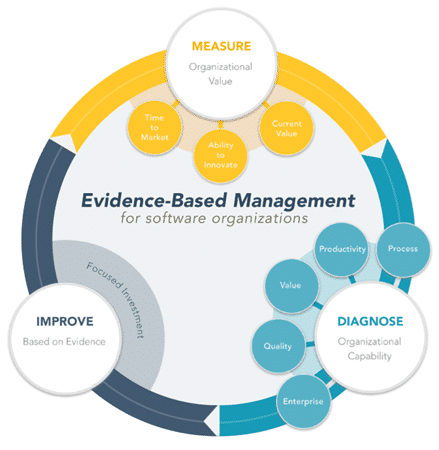
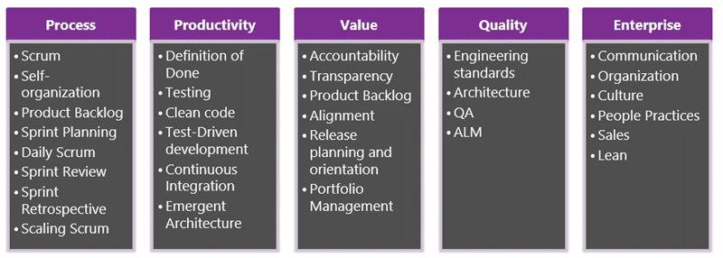

Other scaled agile frameworks employ a cookie-cutter approach to organisational agility. While I accept that they may have worked somewhere once, the likelihood that the same approach will work in your organisation is small. They were created to get a unique company from their existing state to their personal vision of where they wanted to be. To increase the likelihood of success you need a framework that guides you to change your organisation in an incremental and custom fashion towards your own vision. Cookie-cutter approaches will not work for you.

## TL;DR

If we accept that our path to agility is unique and will always differ from others we can leverage the [Agility Guide to Evidence-based Change](https://nkdagility.com/the-agility-guide-to-evidence-based-change-using-scrum-to-transform-your-enterprise/) to help guide us to a greater degree of organisational and business agility. We can use the same ideas that have created so much product value with Scrum and leverage them to create organisational value as well.

Create your Organisational Change Backlog and Organisational Change Team and create your own path to agility. Then train everyone in your organisation and have them identify, as only those that do the work can, the impediments to value delivery that you have in your organisation.

## Create your own path to Organisational Agility

Every organisation, and indeed every department, is a little bit different and you need to tailor your approach to suit the culture that you have. A clear vision and an incremental drive is the starting point to enact improvements.

I have been working with a few companies in the last year to move them towards a greater realisation of their ALM and DevOps visions. In my world, DevOps is made up of your Processes, Practices, and Tools that you use to deliver on your products vision and achieve some amount of business agility. The greater degree of agility that your organisation can attain the larger the competitive advantage that you will have over your competitors. In today's marketplace, there is no room for inefficient and wasteful organisations that are slow to change. As long as you are building software that your business uses to make money this is indubitably true. It really does not matter if you are selling that software, or that software runs the warehouse that allows you to deliver goods to customers. You rely on the function and features of that software to do business.

The first step to creating a direction for improvement is to [create an organisational improvement vision](https://nkdagility.com/professional-organisational-change-ghana-police-service/). Think about where you would like to be and write it down. And don’t just think of the short or medium term, this will be a living vision of your end goal. Try to think of the 'whats' and 'whys' that you want to achieve rather than the 'hows'. You want to set direction and not constrain the ingenuity of those working towards the vision. This vision then needs to be communicated to everyone in your organisation. Everyone needs to understand that you stand behind that vision and plan to enact it.

> "The greatest resistance to moving towards the culture and process that you want is the culture and process that you have"

You also need to communicate, and often accept, that it takes time to change. Especially in Enterprise where the greatest resistance to moving towards the culture and process that you want is the culture and process that you have. Indeed if you are being truly iterative in achieving your vision the route to get there will likely change many times as your organisational culture adapts to the changes. The time it takes to reach your vision is directly related to the amount of support that you get in pursuing it. Bottom-up support is not all that is required to enact the type of organisational change that reaching towards business agility needs. You need full executive buy-in for the initiative and not just the usual lip service. They need to act in the change process, after all, it's their company and if they are not interested in being more efficient and beating competitors then why should you?

If you get that top-down involvement you can often accelerate the move to a greater degree of business agility by short-circuiting some of the usual resistance. Public buy-in at every level removes a lot of the vision backchat that often accompanies chaotic change.

> "Scrum is proven to deliver twice the features in half the time"  
> \-Jeff Sutherland, [Scrum: The art of doing twice the work in half the time](http://nkdalm.net/Scrum-TwiceTheWork)

Now that we have our vision we need to be able to enact it. Time and again Scrum has proven, worldwide and consistently, to deliver on the 'twice the features in half the time', promise and it can be used not only for delivering a product but also for delivering change within your organisation.

{ .post-img }

In order to enact our vision, we need a continuous improvement cycle where we:

1. measure the organisational value that we are getting using common metrics that we may need to tailor to our organisation
2. diagnose our organisation's capability and determine areas for improvement
3. Improve based on the direct evidence combined with the organisational capability

This process allows us to create an organisational improvement backlog while leaving room to change dynamically as we create more organisational value. We can easily switch focus to other areas that will provide more value for less investment. You should focus only on your first few steps towards your vision to maintain your ability to change for as long as possible.

## The Organisational Change Team - the guiding coalition

At this point you should read the [Agility Guide for Evidence-based Change](https://nkdagility.com/the-agility-guide-to-evidence-based-change-using-scrum-to-transform-your-enterprise/) if you have not already as an understanding of the concepts in this document is necessary to understanding this approach. You need to understand that your engineering practices will need to keep pace with your cultural and process changes. You can't leave any of these three pillars to lag or your pace of change will slow and may stall.

Key to moving forward at a sustainable and consistent pace is a guiding coalition that comprises senior representatives of engineering, commercialisation, and portfolio groups. This guiding coalition is the Change Team that will work through the organisational change backlog. You organisational change backlog should reflect the difference between where you are now and the vision that you want to achieve and the guiding coalition would be responsible for working through that backlog and showing improvements within the organisation to the change owner. These roles and accountabilities, just like for a Scrum Team, are key to being successful.

**Guiding Coalition -** The group of people that are going to take your organisation forward and enact the change.

- **Change Owner**: The individual who is accountable and responsible for the Organisational Change Backlog. Might be the CEO or senior Product Owner.
- **Change Team**: The Team responsible for delivering against the Organisational Change Backlog. This team should have everyone they need to activate the items that they take on.
- **Process Manager**: The person responsible for making sure that everyone is effective within the bounds of the framework.

If your organisation is large then we may want to break our guiding coalition along the lines of the below Practice Domains and have a separate and relevant guiding collision that is accountable for that domain and for working together with the other domains to achieve the vision.

{ .post-img }

When you have a large enterprise or even just a large part of that enterprise, it is essential to make sure that you make progress in each of the practice domain identified above. Sometimes that will mean that you need to have a separate and focused guiding coalition for each of the diagnostic practice domains. This will enable progress, in parallel, across each of the disciplines.

- **Process** - Process is typically owned by your Scrum Masters which may be part of your traditional PMO and should contain all of the key drivers for implementing the Scrum framework with your teams.
- **Productivity** - Your engineering teams would be the most relevant and effective members of this domain.
- **Value** - Value is a key factor of your Product Owners and as such their organisation should be the leading members of this guiding coalition.
- **Quality** - Your commercialisation teams may be a key participant here, and with engineering practices high on the list of activities involvement from engineering would also make sense.
- **Enterprise** - This domain should be owned by your leadership and sales teams. This is where you focus on the high-level organisational culture shifts that need to happen.

The ideas above for membership and accountability of the domains is by no means strict and should just be taken as a suggestion. In this process, we are accepting that every organisation is different and we will need to adapt the way we implement this organisational change framework to suit.

Each of the organisational change teams would be accountable and responsible for the delivery of measurable improvements to your organisation on a monthly cadence. While it may seem insurmountable it's about scale and focus. Break those large changes down into things that are achievable and show valuable improvements. The change backlog will help us focus on, and monitor, the pace of improvements.

As we move towards our vision, after each step, we may need to improve, refactor, or completely redo our organisational change backlog as necessary to maximise achievable organisational value. Another practice that helps with this is communities of practice. Having an organised group of engineers share their knowledge across your teams will help each team assimilate the changes and improve their engineering practices in step with the changes. If you give dedicated time to these communities you should see a marked improvement in everyone's knowledge and skills.

## Avoid sabotage and train all your stakeholders

You should not underestimate the ability of the uneducated members of your organisation, at whatever level, to undermine and often derail the change process. All of your employees are your [stakeholders](https://nkdagility.com/training/audiences/stakeholders/) to any organisational change, and it's hard to do anything without the support of your [stakeholders](https://nkdagility.com/training/audiences/stakeholders/). On top of this one of your greatest challenges will be making sure that your message, and the agile message, does not get diluted with every telling. While at the executive level there may be a keen understanding of agile and lean and how to implement them the reality is that the further away the message must pass the less likely the message is to remain intact. Think of something as simple as the telephone game; how easily can the message get distorted. Then think of how complex your message of change is.

If you have a core message, like Scrum, that you can have told the same worldwide you can cut through the human need to change the message to one they want to hear. So instead of focusing on posters and booklets, it is far more valuable to spend time in workshops all learning the same thing. Especially if you can get a wide variety of people into those classes.

The most effective agile transformations I have encountered have all got consistent and broad-based training in common. Wither you train with an internally created course or through professional training there is value in everyone having the same understanding of the agile principals and the Scrum framework. When I have done this for organisations it has visibly empowered and exited the folks that work there and kick-started the move towards agility. That is why the Professional Scrum Foundations class was created, for brawed training at all levels throughout the organization. I have had everyone from the guy that drives the forklift in the warehouse, to the CEO of the company in the same room, working on teams to deliver working software. The understanding of empiricism and the complexity of software development that this provides is invaluable for getting folks moving in the right direction.

## Get your stakeholders to create Organisational Change Backlog Items

The other outcome of the Professional Scrum Foundations class is as a feeder into the organisational change backlog. Who better than the people that are actually doing the work, at all levels, and who have just learned about Scrum, to create Backlog Items? With the learnings of Scrum fresh in their mind, they are eminently perfect for identifying the Impediments in your current organisation to moving towards the new model. The last few hours of the class is dedicated to a workshop that gets all of your [stakeholders](https://nkdagility.com/training/audiences/stakeholders/) thinking about what needs to change to move to the new way.

How do you create Backlog Items for your Organisational Change Backlog when every employee is a stakeholder?

