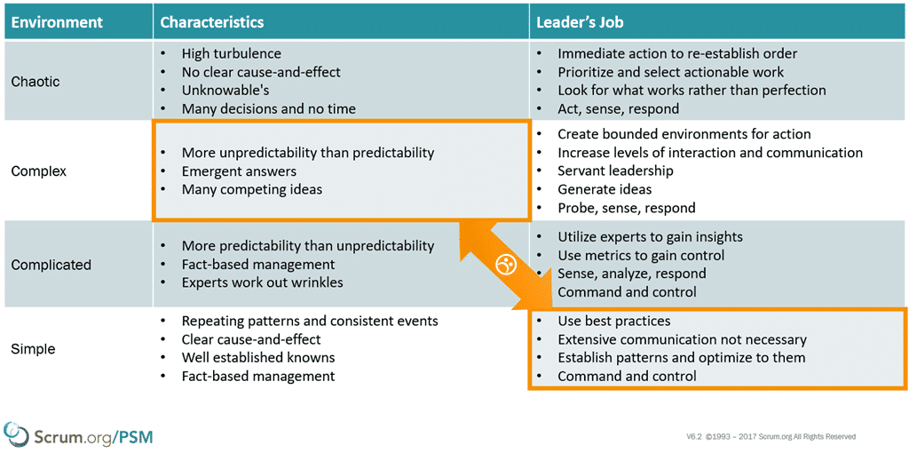

Recently I worked with a new customer in Denver to help them move towards a greater degree of Scrum in their software development. The idea that Scrum is for everyone in your organisation is kind of new, but it reflects the modern understanding of the way people work, and the rejection of Taylorism and command and control. You [cant use someone else approaches to get to agility](https://nkdagility.com/organisational-change-create-path/), but you can learn from it.

Healthgrades have been doing Scrum for about 8 years but has recognised that they are struggling to [organise around the delivery of working software](https://nkdagility.com/professional-scrum-teams-build-software-works/). Like every other company, once you have something as complex as software to work on, and knowledge workers to do it, [the old management styles of the 20th century](https://nkdagility.com/professional-organisational-change-ghana-police-service/) are just like pouring water on a fat fire…

{ .post-img }

This is a common problem that I train Scrum Masters to respond to in the [Professional Scrum Master (PSM)](https://nkdagility.com/training/courses/professional-scrum-foundations/) class, but the fundamental understanding of why this is wrong takes both practical and theoretical knowledge grounded in actual experience. This is why the Professional Scrum Foundation (PSF) class [requires that students work in teams to build working software](https://nkdagility.com/professional-scrum-training-ghana-police-service/).

The real struggle of implementing agile is that of the [old ways, Taylorism, the illusion of command and control, and the belief in magic](https://nkdagility.com/professional-organisational-change-ghana-police-service/).

## Professional Scrum is for everyone in your organisation

Armed with previous experience with Scrum.org, the [PSF](https://nkdagility.com/training/courses/professional-scrum-foundations/) class, and me; the CIO, CJ Singh, asked me to come along and train as many people as we could in the time that we had available. Turns out that looked like 147 people from the engineering department, and my did we had a lot of fun. While they have been constantly moving towards a greater degree of value delivery there were a lot of misconceptions built up about Scrum over the last 8 years… those misconceptions were creating a glass ceiling and inhibiting the flow of value to the business.

https://youtu.be/Fm24oKNN--w

This is the second time that I have worked with CJ, and again he excelled at helping his team understand that it is the makers that are the ones that get things done. They are the [ingenuity that delivers the value that is needed by the business](https://nkdagility.com/backlog-not-refined-wrong/) and they are the ones that need to be nurtured. Without the makers coming up with ideas there would be no company, and there would be no ideas; no backlog.

I previously worked with CJ at Backcountry in Utah where I trained everyone in the company. I still get emails from folks from Backcountry, even 5 years later, and many folks considered the experience of going through the [PSF](https://nkdagility.com/training/courses/professional-scrum-foundations/) class as "a game changer" for them.

The purpose of the [PSF](https://nkdagility.com/training/courses/professional-scrum-foundations/) class is to not only to level set everyone on Scrum but to give them a very real understanding of what is required to get significant value from it. If, like at Backcountry (Utah), Healthgrades (Colorado), Fraedom (England), Teleplan (Norway), and HESA, I can get everyone in the organisation to participate something then interesting happens. There is enough of a catalyst, a tipping point, that starts the snowball of change rolling.

## Conversations and discussion is the point

The conversations that take place over the 2-day class are ones that don’t normally take place and all of the [Professional Scrum](https://nkdagility.com/training/scrum-training/) classes are designed to get people talking about their issues and what experiments might be useful to find the right way.

At Backcountry I had everyone from the CTO to the guy that drove the forklift in the warehouse. That’s right, everyone… including the CEO's assistant… Because everyone in your organisation has good ideas, many are direct stakeholders. Getting them to feel that they are empowered to make suggestions and to have ideas is part of Agility. Getting the CEO to hear all of the questions, and discussion, around why things are not running as smoothly as they could be, and what would need to change to make that happen is invaluable. Getting the Stakeholders to understand what it takes to build software opens their eyes to the involvement they need to have in the process. Getting the developers to hear the business realities that create the pressures again changes the conversation.  How can you possibly hope to change your organisation unless everyone is on board and going in the same direction?

https://youtu.be/F8a6gtXxLe0

As with all courses where one trains everyone there are usually many dissenters. Folks that don’t want to be there because they think that they know everything or they just don’t think it will be valuable. David was in the "were doing Scrum already so why bother" category, but it only took 4 hours of the class for him to realise how much his understanding had deviated from core Scrum. The fundamental understanding of how Scrum implements empiricism is something that not only do we need to know, but it's nice to have a reset every so often so that we remember the reasons why.

## Creating a bounded environment for change

So many teams I work with across the world forget, or never knew in the first place, why we have things in Scrum. They forget that we need the transparency of the past provided by the Increment of Working Software. They forget that without the Product Backlog we get no transparency on what we are doing next, and without the Sprint Backlog, we have no visibility into what we are doing now. They forget that without that transparency there can be no meaningful inspection of what is going on at each of the Events and no meaningful change to the way that things happen.

https://youtu.be/XMLdLH6f4N8

Many attendees of the Professional Scrum Foundations at all of the companies I have done it for, regardless of their existing knowledge level, come away with a new appreciation for Scrum, its Artefacts, its Events, and its Rolls. Even experienced Scrum Masters like Katherine has something to learn and find value in the reset. Its easy to become complacent with the organisational dysfunctions that are the "way that things are done here". I worked closely with Katherine to make sure each of the 6 class that we ran went smoothly and facilitated the right discussions.

Just as Scrum creates a bounded environment so that we can all be going in the same direction in our work, so the Professional Scrum classes create a guided environment for discussion and revelation.

## Iteratively tailored training not content

Each instance of the PSF class I learned new things about the organisation, its employees, and how it operated that helped me guide the classes to a better understanding of Scrum. I use the same material as every other accredited Scrum.org trainer worldwide, and I tailored the path. I learned which things we can skip over, and which we need to dive headlong into. Some of the experiences were traumatic, and the discussions heated, and by the end, there was not a single detractor from agility or Scrum in those that went through the classes.

**Healthgrades now has 147 people are the pioneers, evangelists, and change agents that now feel empowered to make meaningful change.**

One of the outcomes of the Professional Scrum Foundations, along with the new knowledge and excitement, is an organisational change backlog. One that has been created by those that are doing the work and understand the constraints and challenges of the work. The hope is that management then uses the [Agility Guide for Evidence-based Management](https://www.scrum.org/resources/agility-guide-evidence-based-change) to facilitate changes in the organisation to get rid of those pesky impediments to value delivery that are out with the control of the teams.

**Healthgrades now has a Backlog of things that need to change in order to facilitate meaningful change.**

With these two things, agile torchbearers who feel empowered and a list of changes, I am hoping that Healthgrades can change their organisation and increase their ability to take advantage of market opportunities as they arise, and out-manoeuvre their competitors with ease. Refine backlog facilitate meaningful change.
