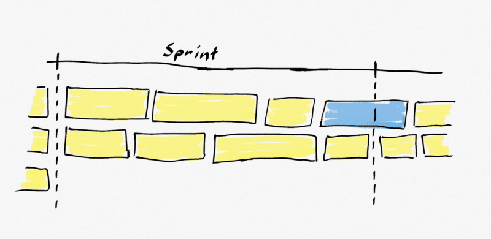

There is nothing in the Scrum Guide that says that you can't have workflow across the Sprint boundary. I'm going to suggest that not only can you, but you should as long as you don't endanger the Sprint Goal.

**UPDATE: To find out how to allow work to flow across the Sprint boundary you can read the** **[Kanban Guide for Scrum Teams](https://www.scrum.org/resources/kanban-guide-scrum-teams)\*\***, and schedule a\*\* **[Professional Scrum with Kanban](https://nkdagility.com/training/courses/professional-scrum-with-kanban-psk/)** **class.**

## TL;DR;

The [definition of Done](https://nkdagility.com/getting-started-definition-done-dod/) is an instrumental part of maintaining Transparency of the past work and is not optional. The Sprint Goal provides focus and direction. In order to maintain flow we need to be able to reduce the batch size of the work, thus we must allow for work to flow across the Sprint boundary. If you have a Professional Scrum Team that is adept at creating [Done increments of working software](https://nkdagility.com/professional-scrum-teams-build-software-works/) then introducing flow can improve the value delivered by increasing the throughput of the team.

## 

{ .post-img }

Always remember that the Sprint is a container for Planning and not always for Delivery. Just like you can do Continuous Delivery in Scrum, so you can also introduce flow and Kanban. Less skilled teams can also benefit as long as you make sure that you meet the Sprint Goal and Done Increments are created to provide transparency of the past and build trust for the future.

## Starting Work that the Development Team knows that it can't finish

Although you will not find anything in the Scrum Guide that prevents you from flowing work across Sprints you should consider it an advanced technique. Most teams that I work with are not even at the point where they have Working Software at the end of the Sprint and they are often only just achieving their Sprint Goal.

I also believed the myth that we could not flow work across the Sprint boundary. It took a long conversation with Steve and Daniel to kindle a different idea, and long discussions over a beer to make it concrete. My argument went; "If you have to be Done by the end of the Sprint then how can you have any unfinished work?" My argument was wrong! I was confusing the need to have a Done Increment with all of the PBI's being finished.

If you as a Development Team are practising Continuous Delivery (CD) then they always have working software. I would expect that a team doing CD would have every single element of their Definition of Done (DOD) automated and every Checkin/Pull Request meets the DOD. If that's true, then when you get to your Sprint Review you just show the work that you have finished.

**If you want Flow then** **[CD is no longer optional for a Software Team let along a Professional Scrum Team](https://nkdagility.com/continuous-deliver-sprint/)\*\***.\*\*

## Shipping software with Unfinished work can still be Scrum

There are a number of Engineering consideration that a Development Team will need to take into account if they want to focus on Flow. With CD comes the need to validate early and often, with automation, so that you don’t have to stop and check everything manually. There are a number of practices that can help:

- **Feature Flags** - Often referred to as Feature Toggles this is a way to insert a switch into the code so that something is visible or not to the customer based on a switch. Advanced toggles might support "controlled Exposure" to customers, as well as A/B testing, and other features. Regardless it is generally accepted that you can't leave all of your toggles in the code indefinitely. Once you have completed the PBI / Feature or tested your hypothesis you need to remove the flag through Refactoring.
- **Refactoring** - The act of restructuring or rewriting code for clarity of purpose and future maintenance. One would never write a book or article and then just published it. You would normally do your first pass… re-read it and update for clarity. Maybe get someone else to take a look, and incorporate feedback. Same for code…
- **Test Driven Development (TDD)** - Part of the general Test First movement TDD allows an engineer to prove that the code that they wrote fulfils some pre-defined purpose. It’s the only way that a coder can prove that code does at least what they intended. This practice also supports refactoring since I can continue to prove that the code after I change it, does what was originally intended.
- **Many more**…

All of these are optional complementary practices that help you achieve CD but it is not an exhaustive list. There are many other practices that will help, try them and see what works for your team.

While the Scrum Guide does not say that you need to do CD let alone the practices I have listed above, it does require that you create an Increment of Working Software at least once per Sprint. Anything less and you have no transparency of what was done. With no transparency, you lose your empirical process control, and without empiricism, you are not doing Scrum.

**Unfinished Backlog Items are not the same as Undone work.**

## How does this impact Scrum elements?

Within the bounds of the Scrum Framework, you are allowed to flow work from one Sprint to another. The Result is still Scrum if we have working software, and we meet the Sprint Goal.

- **Sprint Review** - the purpose of the Sprint Review is to inspect what was just created, review and analysis it, and update the Product Backlog to be an accurate reflection of future work based on this new Increment. At the Sprint Review, we show the work that was completed and discuss what was not completed. It's not a failure if the team did not finish something, software development is complex and that will happen, often. As long as we have an Increment of Done work we have fulfilled our obligation to Empirical process control.
- **Sprint Planning** - The purpose of the Sprint Planning event is to inspect the Product Backlog and create a Sprint Goal, Forecast, and Sprint Backlog for this Sprint. Nothing prevents Stories flowing over into the next Sprint unless it prevents the team cresting a Done Increment, or endangers the Sprint Goal.
- **Sprint Goal** - The Sprint Goal provides purpose and direction for the team. And that does not mean that we can't have work outside that Sprint Goal inside of the Sprint. We may have production issues, leftover work, or just something super important to the Product Owner that turns up. As long as the team believes that they can achieve the Sprint Goal they can take on any additional work that makes sense.

I have found that reading the Scrum Guide carefully, turns up all sorts of miss conceptions that we all have as we interpret and use Scrum. If you are not sure, re-read the Scrum Guide, maintain the Scrum Values, focus on empirical process control and maintain transparency.

At the end of every Sprint, you should have working Software that meets your definition of Done and you should have met your Sprint Goal.

**UPDATE: To find out how to allow work to flow across the Sprint boundary you can read the** **[Kanban Guide for Scrum Teams](https://www.scrum.org/resources/kanban-guide-scrum-teams)\*\***, and schedule a\*\* **[Professional Scrum with Kanban](https://nkdagility.com/training/courses/professional-scrum-with-kanban-psk/)** **class.**

