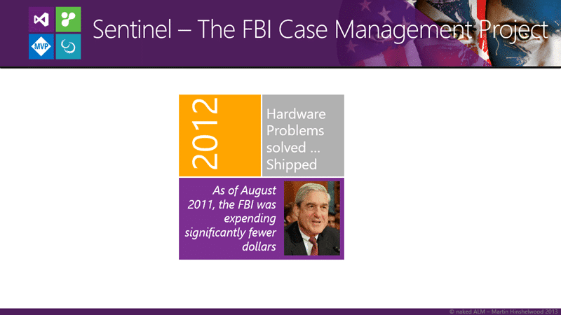

Did you know that the DOD has made it illegal to do waterfall? Well, kind of... For the first time in many years, the Department of Defence (DOD) in the United States had made a major update to its procurement rules. They can no longer be held accountable for holding up our industry, and being culpable for its inability to move towards agility. The last vestiges of the old ways are gone.

## TL;DR;

The benefits of working in an iterative agile process are now painfully obvious to both the FBI as a result of Sentinel and partly as a result to the US DOD.

- **Higher success rate** – you are three times more likely to be successful with agile
- **Cost Effective** – As you always have working software you can stop at any time without waste
- **Low Risk** – You only ever have one short iteration of risk at a time.

In the UK we have government-wide lean-agile initiatives that are producing awesome results already and in the USA lean-agile has effectively become the law.

> - **Deliver Early and Often** - This principle is aimed at changing the culture from one that is focused typically on a single delivery to a new model that comprises multiple deliveries to establish an environment that supports deployed capabilities every 12 to 18 months.
> - **Incremental and Iterative Development and Testing** - This principle embraces the concept that incremental and iterative development and testing, including the use of prototyping, yield better outcomes than trying to deploy large complex IT network systems in one "Big Bang."
> - **Rationalized Requirements** - User involvement is critical to the ultimate success of any IT implementation, and user needs must be met. However, this principle also recognizes the need for users and requirements developers to embrace an enterprise focus across a portfolio of capabilities with established standards and open modular platforms vice customized solutions to ensure interoperability and seamless integration.
> - **Flexible/Tailored Processes** - The Department's IT needs range from modernizing nuclear command and control systems to updating word processing systems on office computers. This principle acknowledges unique types of IT acquisition and embraces flexible and tailored-and risk-appropriate-IT paths based on the characteristics of the proposed IT acquisition.
>
> [A new approach for delivering Information Technology capabilities in the Department of Defence](http://www.afei.org/WorkingGroups/section804tf/Documents/OSD_Sec_804_Report.pdf)

So with the radical change in approach from two western governments, these positive messages should filter down through anyone who does business with them. The tides are changing…

## The changing state of agility in defence

You may be thinking “But who gives a crap what the DOD does?”. In the USA the Department of Defence employs over 1.2 million people, and that's not counting contractors. This means that, unfortunately,  everything in IT revolves around how the DOD develop software and work with vendors. If you are a vendor that works even third-hand with the DOD you used to be bound by law (the DOD procurement rules) to create software and work in a stage-gated and distinctly waterfall manner. Oh, many teams tried to do agile anyway. However they could only do this within each stage and this is the situation and source of Scrumfall, Agilefall, WaterScrumFall and all of the other "pretending to be agile" processes out there.

The DOD has influenced Universities by requiring that they create engineers that work within their model and by providing and creating jobs that function this way. How can one learn to be agile in a world governed by waterfall. Indeed our own Ministry of Defence (MOD) has had the same influence, maybe from their own rules but also as a result of working with the Americans and within their rules; like how airports in Europe require you to take your shoes off or go through those big scanners even though you are not flying to the USA.

> (2) be designed to include—
>
> (A) early and continual involvement of the user;
>
> (B) multiple, rapidly executed increments or releases of capability;
>
> (C) early, successive prototyping to support an evolutionary approach; and
>
> (D) a modular, open-systems approach.
>
> [804: Implementation of new acquisition process for information technology systems](http://www.afei.org/news/Documents/2010%20NDAA%20Section%20804.pdf)

With the new rules, there is now freedom to deliver more frequently and iteratively throughout the western world and this effect can be seen in recent UK projects as well as in the US.  There is no better government site than [http://gov.uk](http://gov.uk)! It is quickly becoming the envy of other governments in its simplicity and ones ability to quickly and easily find the information you need.

One of the defining projects of the last 10 years that has resulted in this change in the USA was the resounding and public failure of the Sentinel project buy the FBI.

## The impact of the Sentinal project failure, and success

I created this presentation based on work that I have done with Scrum.org and I use it at organisations that have a little more inflexibility and stubbornness than most. Usually, at these customers I hear phrases like “You cant do that here.” and “We are not a software company.” Thus looking at the FBI is a good one as it is not software and government. If the government can do agile then by golly everyone can.

{ .post-img }

I always like to start a presentation by looking at some data. For good reasons have we moved to agility from waterfall and above you can see that as of 2011 we are three times as likely to succeed doing agile as we were under a waterfall.

- **Succeed** – Project was on time and on budget
- **Challenged** – Project was delivered but not on time or on budget
- **Failed** – Project was not delivered

Although we still have a lot of challenged projects we can vastly reduce the failure of them. In addition one would hope that an agile project that fails, fails only a few short iterations into the project so the costs are a lot less. Waterfall projects tend to fail near the end as it is not clear what will be delivered, or not delivered until at least testing commences.

{ .post-img }

Can you imagine a green screen terminal application delivered in 1995? Just to put it in perspective, Windows 95 was available. Hell, my Atari has a graphical UI. Well the FBI launched their obsolete criminal records system in1995 and used technology that was museum quality at launch. This is all to common with projects that take many years to complete and even more so on government projects.

So what happened next?

{ .post-img }

At first all was well and the FBI Director commissioned a 3 year project with a budget of $390 million but very quickly things start to drift and he had to go, cap in hand, to congress and ask for more money. As this is typical government fair he obviously got it but in 2005 there was still nothing delivered. Not a single piece of working functionality existed after 4 years and an extra $170 mullion. How would your boss react if you had nothing to show for 4 weeks… let alone 4 years?

Would you still have a job?

In this case obviously the best idea would be to throw away the last 4 years work and start again with a new vendor. Yes… that’s it…now we can really deliver.

{ .post-img }

Obviously having already spent over $400 million on vaporware the new vendor just needs more time and more money. It obviously also makes sense to pick not only a large defence contractor, co they have a good record of delivering high quality on time and budget, but also not a software company. The rational for this I do not know but that is just what the FBI did. However after 4 years not even a third of the work was complete and almost 90% of the budget had been spent. Indeed rough estimates to complete the project was another 6 years (10 years total) and another $351million (grand total of $772 million.)

So with over 400 people working on the project the total waste so far is over $700 million and the project is 9 years in. Remember that the out-of-date green screen terminal application has now been in place for 15 years and Windows 7 is just around the corner. We already have the iPhone and iPad so what the hell are these muppets playing at! Its time for a different tack…

{ .post-img }

The new tack was an agile one and for these guys it was more of a jibe. They created a Scrum Studio in the basement of the hover building and found the 40 best folks that they could to run with the new format. This being the second reset with so many years and dollars under it there needed to be results and quick. Not only did they deliver incrementally but they were code complete with only one year of work and $30 million spent. That’s right… I am not missing a zero.

Unfortunately the project had taken so long that the hardware that had been bought by the previous attempts was vastly out-dated and needed to be replaced as obsolete.

{ .post-img }

In early 2012 the FBI shipped to production on the new refreshed hardware and saw significant improvements for a much lower cost.
