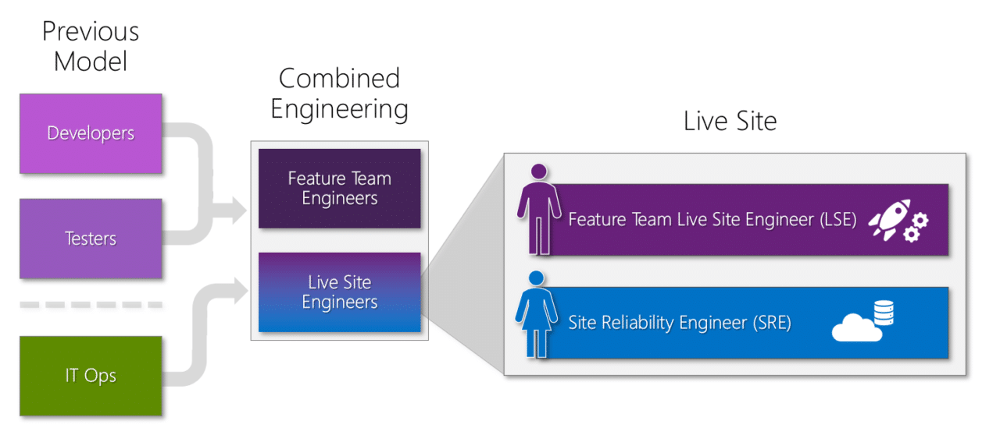

As more and more organisations move towards a higher degree of agility, they inevitably also move towards [DevOps]() practices like [Continuous Delivery]() to facilitate shortening the feedback loops.

> **Firms today experience a much higher velocity of business change. Market opportunities appear or dissolve in months or weeks instead of years.**
>
> Diego Lo Giudice and Dave West, Forrester  
> February 2011  
> Transforming Application Delivery

Shortening the feedback loop is imperative to remaining competitive in this new world of customer-centric realities and that in turn requires a radical shift in practices. This shift towards getting things in front of your customers as quickly as possible to find out if you are even doing the right thing means that we are no longer deploying our products every 2 years. We are doing it every day. Microsoft, for example, has gone from one or two major releases a year to over a hundred-sixty-thousand deployment a day. Thats more than the number of engineers that they have. The same practices that worked before will not work today. We need to be faster, better, and more secure than ever before. Everything must be done within the sprint loop and all responsibility needs to lie with those doing the work.

> “In the long history of humankind (and animal-kind, too) those who learned to collaborate and improvise most effectively have prevailed. ”
>
> \-Charles Darwin

In order to sustain this new way we must be able to maintian the resonsabilities of high quality with the operational needs of the busienss while continiously delivering awesome features that delight our customers.

<figure>

{ .post-img }

<figcaption>

Combined Engineering Model of the [Azure DevOps]() Product Team at Microsoft

</figcaption>

</figure>

The Combined Engineering model adopted by the Azure DevOps Product Team at Microsoft is an example of how one group of about 650 engineers in 3 main locations around the world has evolved to be able to cope with these new realities.

The following presentation represents mearly a point in time of their evolution that may serve to give you some ideas of where to start, and maybe an intial goal to achieve. This infortmation reflects this teams structure and thought in 2018 and they have continued to evolve since this content was created.

https://youtu.be/5bgcpPqcGlw

Presentation: [https://nkdagility.net/3edOLPi](https://nkdagility.net/3edOLPi)
