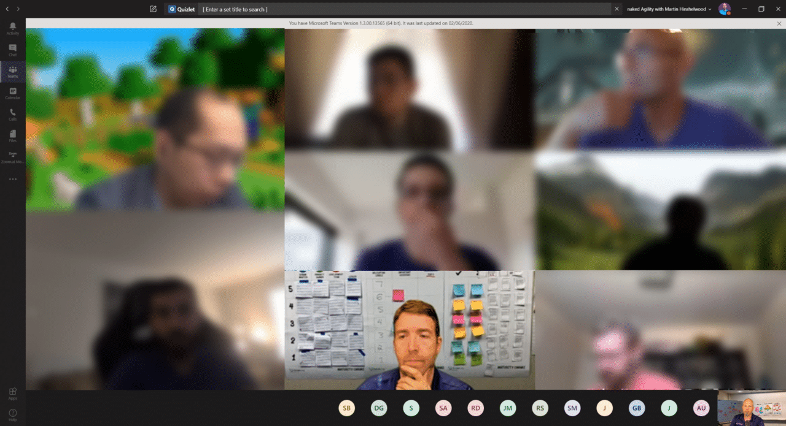
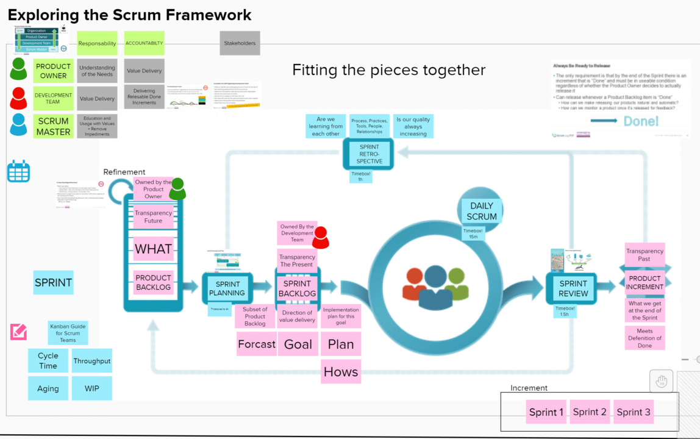
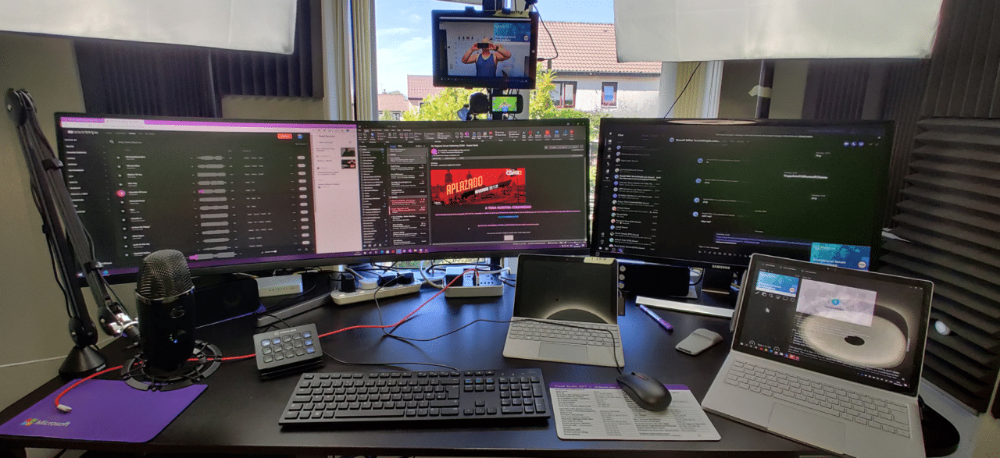

With the change in business model in the current crisis, many training organizations have had to do the unthinkable and move to Live Virtual training options. Existing wisdom was that training online, just as running teams virtually would be a disaster and reduce the student's experience.

**We were Wrong!**

> In-person pass rates are slightly higher 6% looking only at students from 2020.
>
> Scrum.org Assessment Result

When Scrum and Agile were first conceptualized the idea of colocation meant that we had to have everyone in the same place in order to get that extra 80% of communication that is non-verbal.

<figure>

{ .post-img }

<figcaption>

Live Virtual Co-located Professional Scrum Foundations class

</figcaption>

</figure>

However today this limitation does not exist for much of the world. With modern and secure video conferencing systems like Microsoft Teams, Google Meet, & Webex we can create an almost perfect approximation of co-location while being distributed.

**Timezone becomes the inhibitor rather than physical presence.**

I, along with almost all of my collogues at Scrum.org, have been running all of our classes as Live Virtual Classrooms using a verity of technologies and we have found that the experience for students is as good as, if not better than an in-person class. The trick is that we judiciously use breakout rooms and structured exercises with only a small amount of lecture to facilitate the greatest amount of learning.

{ .post-img }

I for one have found that it is much easier to create interactive experiences in the virtual world, and have found that participation is just as high as in in-person classes. In a physical room, it is hard to get 20 people to participate in a big-wall exercise without jostling, crowding, and taking turns. In the virtual space, we can make the wall as big as we like.

**The New World of Virtual Delivery**

Wow, it is now so much easier to run a class. I don't have to worry about flying, hotels, and transport, and neither do my students. It is better for the environment and its better for our sanity and family life. While it will take a little time for folks to spin up their home office this seems to be the new normal. I'm not sure many folks want to go back to many hours of commuting, and seasonal sickness, among other issues.

{ .post-img }

I think this especially makes sense for the world of product delivery. Why go to the same place just to all work at a desk, in a cube, while all participating in the virtual world of our computer.

**Welcome the New Normal**

I am sure that an extrovert might have a different opinion initially, however, once we are out of lockdown and able to socialize in-person again I am sure that they can find their fix. For those of us in the knowledge industry, this is a new era. Embrace it, adapt to it, or it may just leave you behind!
