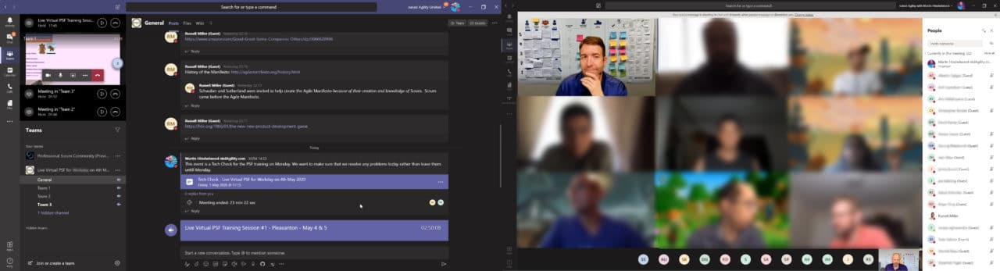
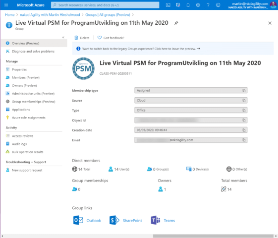
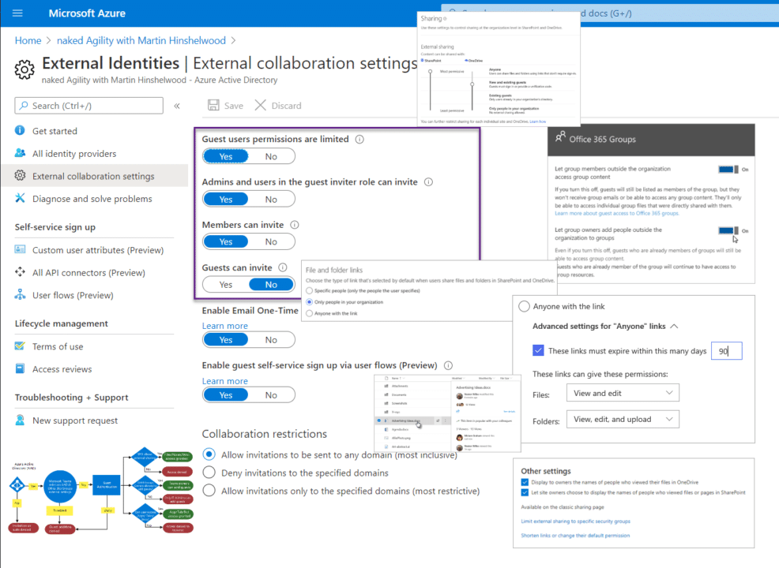
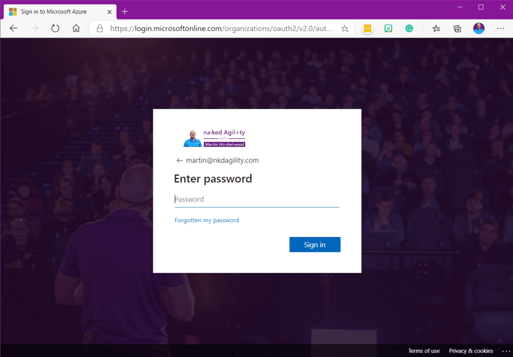

Like most tools, if you want to run successful training in Microsoft Teams you need to do some homework and some configuration before your class. You can just jump in and wing it, but that will not provide a good experience for your students. Currently, I have run more than 6 Live Virtual Training in Microsoft Teams and in a few hours, my 7th will start. I have also recently had to set up Microsoft Teams for my good friend and colleague [Russell Miller](https://nkdagility.com/training/trainers/russell-miller/) so that he can also run classes on the platform.

To date, I have facilitated a couple of Live Virtual F2F for the other trainers at Scrum.org to show them how it works, but we did not go into the configuration. This article will lead any Professional Scrum Trainer that wants to [Deliver Live Virtual Classes in Microsoft Teams](https://nkdagility.com/blog/delivering-live-virtual-classes-in-microsoft-teams-and-mural/) through the configuration required to do so.

<figure>

{ .post-img }

<figcaption>

Professional Scrum Foundations for 20 Guests in Microsoft Teams

</figcaption>

</figure>

One of the common misconceptions in Teams is that you need a login to be able to participate in a meeting. This is incorrect and you can invite anyone you like to a meeting. For example, I am hosting a public event in Teams on Wednesday for Future of Work Scotland. No authentication required, except joining the meetup to get the URL just like Zoom or Webex.

<figure>

https://www.meetup.com/the-future-of-work-in-Scotland/

<figcaption>

Future of Work Scotland

</figcaption>

</figure>

However, if you want access to Files, Chat, Channels, Breakout Rooms, Tabs, and Apps then participants need to be authenticated. They need to be a member and not just an external guest.

For that we need:

- Azure Active Directory Tennant
- Microsoft 365 Subscription
- Guest Access Enabled
- Gold Plating for a Professional Scrum Class Experience

## Creating your Azure AD

The name that Microsoft gives to the container in all of its services for a specific entity is called a Tennant. Each Tennant has a unique ID, it has root authentication, and it has a bunch of services that use it.

You as a member of Tennant1 can be a guest in Tennant2. This means that you use your corporate credential (assuming that Tennant1 is your employer), to access another corporate system. This is called [Azure AD B2B](https://docs.microsoft.com/en-us/azure/active-directory/b2b/what-is-b2b) and is the basis upon which we invite Guests to access our Team.

Just like Google Apps, this creates your security construct. You can have this created for you when you buy a subscription for Microsoft 365, but I always prefer to be explicit. Understanding how things go together will help you administer this in the future.

#### **TASK 1: Create Azure AD Tennant**

The First Step is to create an Azure AD Tennant. This is free and will be the foundation of all the rest of the setup.

- [Create your first Active Directory](https://azure.microsoft.com/en-gb/services/active-directory/)
- [Administer your existing Active Directory](https://portal.azure.com/#blade/Microsoft_AAD_IAM/ActiveDirectoryMenuBlade)

## Getting Setup with a Microsoft 365 Subscription

Since Teams is part of Microsoft 365 and relies on a bunch of underlying services you first need to get a Subscription.

The lowest subscription to Microsoft 365 that includes Teams is "**[Microsoft 365 Business Basic](https://www.microsoft.com/en-gb/microsoft-365/business/microsoft-365-business-basic)**" and at $5/user/month it gives you unlimited Guests which is the bit we care about, as well as the services that back Teams:

- **Exchange** \- This gives you a domain and email address. I run my business on this service so martin\[at\]nkdagility.com is my main account, and it is a full exchange server hosted by Microsoft. Teams are built on Groups, and Groups are in Exchange. Since they are backed by Azure AD they can be used for Security, Membership, and distribution.
- **OneDrive** \- OneDrive provides the storage for all of the services in Microsofts world, and that also means Sharepoint. When you shave a file onto SharePoint it ends up in OneDrive. One of the really powerful features is that both you and your guests can sync the files locally using OneDrvie and edit them locally with dynamic collaboration to the cloud. OneDrive provides that storage, and collaborative editing capability.
- **SharePoint** \- Sharepoint has been much maligned the past, and rightly so. I had to install and administer Sharepoint 2007, and Sharepoint 2010 back in the day and it traumatized me so much that I don't even put it on my CV. However, Sharepoint Online is a totally different beast. It's fast and powerful, and provide a web view to your Group with web access to files, calendar, OneNote, and other features. Very Nice.
- **Teams** \- Teams is the icing on the cake and provides a space similar to Slack, but with all of the features above combine to give you an unbelievable amount of power. On top of it, you can add apps from both Microsoft, and 3rd parties, like Zoom, that add more.

These things together as a single package give you the ability to create Groups that have all of the features that your Students need to collaborate.

<figure>

{ .post-img }

<figcaption>

Class Group in Azure AD

</figcaption>

</figure>

Its really important to note that once you pick the name of your Microsoft 365 Organisation the URL can no longer be changed. I have changed the name of my business from nakedALM to nkdAgility to naked Agility and still have nakedalm.sharepoint.com as my core URL. At some point Microsoft will fix this, but at the moment... not so much. So choose wisely!

You will end up with "yourname.onmicrosoft.com" and the "yourname" part will be appended to SharePoint permanently.

#### **TASK 2: Add Microsoft 365 Subscription**

In order to get set up the first task is to head over to the Microsoft 365 Portal and purchase a subscription. You can also peruse the other subscription levels and their contents as well.

- [Create a Microsoft 365 Business Basic Subscription](https://www.microsoft.com/en-gb/microsoft-365/business/microsoft-365-business-basic)
- [Administer your existing Microsoft 365](https://admin.microsoft.com)

## Enabling Guest Access

Before you get started in Microsoft Teams for Live Virtual Classrooms you need to [Authorize guest access in Microsoft Teams](https://docs.microsoft.com/en-us/microsoftteams/teams-dependencies). This has a lot of moving parts as you change the default security stance from "internal only" to "Allow Guests" for all of the services that Guests need to interact with as part of a Teams Team.

{ .post-img }

This is by far the most complex part of this to set up as there are options in many parts of the system. The link below leads you through how to [Authorize Guest access in Microsoft Teams](https://docs.microsoft.com/en-us/microsoftteams/teams-dependencies) and start adding guests. Please note that there is currently a 24h hiatus between enabling guests and it is available in Teams. This is due to the extra load that everyone working from home has added.

#### **TASK 3: Enable Guest Access**

In order to get set up the first task is to head over to the Microsoft 365 Portal and purchase a subscription. You can also peruse the other subscription levels and their contents as well.

- [Authorize Guest access in Microsoft Teams](https://docs.microsoft.com/en-us/microsoftteams/teams-dependencies)
- [Manage sharing settings in Sharepoint](https://docs.microsoft.com/en-us/sharepoint/turn-external-sharing-on-or-off)

## Enable External Identities

In the past everyone connecting to a Team (not merely a meeting) required to have either an Azure AD (corporate identity) or a Microsoft Account (personal identity) in order to get access. If your email had neither then you were prompted to configure a Microsoft Account.

However recently Microsoft have made this a lot easier with the ability to enable folks to sign in with their existing [Google Credentials](https://docs.microsoft.com/en-gb/azure/active-directory/b2b/google-federation) (G Suite or Personal) which covers a very large amount of the guest that I may be adding. But what if the email you add has none of those identities?

There is a feature that is currently in preview called [one-time passcode authentication](https://docs.microsoft.com/en-gb/azure/active-directory/b2b/one-time-passcode) that replaces the default flow of being prompted to create a Microsoft Account with a simple passcode.

If a guest has not accepted the invitation when they hit one of your authenticated URL's, for example, the Team URL, then they are instead sent a one-time passcode to their email address and they can use that to log in for 30 minutes. After which they will automatically be sent a new passcode. Simples!

> One-time passcodes are valid for 30 minutes. After 30 minutes, that specific one-time passcode is no longer valid, and the user must request a new one. User sessions expire after 24 hours.
>
> [one-time passcode authentication](https://docs.microsoft.com/en-gb/azure/active-directory/b2b/one-time-passcode)

When one of your guests try's to use either the invitation link that was sent to them or the link to the secure resource and:

- They do not have an Azure AD account
- They do not have a Microsoft account
- The inviting tenant did not set up Google federation for @gmail.com and @googlemail.com users

Then the fall-back authentication method will be the one-time passcode.

#### **TASK 4: Enable External Identities**

This is fantastic and vastly simplifies the experience for students accessing your training class. Both Google and one-time passcode are a must to configure!

- [Add Google as an identity provider for B2B guest users](https://docs.microsoft.com/en-gb/azure/active-directory/b2b/google-federation)
- [Email one-time passcode authentication](https://docs.microsoft.com/en-gb/azure/active-directory/b2b/one-time-passcode)

## Gold Plating for a Professional Scrum Class Experience

While you are now good to go for running Professional Scrum classes there is some cream that you can use to create a more professional experience for your students:

<figure>

{ .post-img }

<figcaption>

Branding and Custom Domain in action

</figcaption>

</figure>

- [Add branding to your organization's Azure Active Directory sign-in page](https://docs.microsoft.com/en-us/azure/active-directory/fundamentals/customize-branding)
- [Add a domain to Microsoft 365](https://docs.microsoft.com/en-us/microsoft-365/admin/setup/add-domain?view=o365-worldwide)
- [Get new Features Earlier](https://docs.microsoft.com/en-us/microsoft-365/admin/manage/release-options-in-office-365?view=o365-worldwide)

## Conclusion to Configuring Microsoft Teams for Live Virtual Training

While there is a lot of setup and configuration before you can run your first class the holistic experience for students is far better than any of the other platforms that I have used or participated in.
