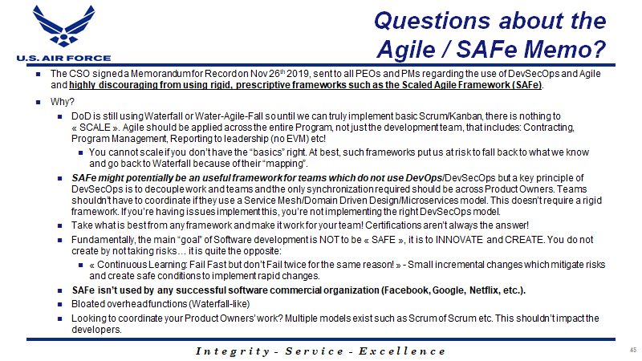

These Sirens take advantage of the lack of understanding of what business agility is trying to change and lures unsuspecting C-suite executives into parting with their cash for what is effectively someone else's business process. They are changing their entire organisation, not because of a business challenge, but because they are told to.

<figure>

{ .post-img }

<figcaption>

The Siren song of SAFe

</figcaption>

</figure>

The lure is strong! They can spend a few million dollars and pow, their organisation is agile, and our business is saved. They make sweeping changes to their lexicon and organisations of their business. We have installed agility!

<figure>

{ .post-img }

<figcaption>

SAFe is a fictitious beast that looks cute, but is really dangerous and deadly.

</figcaption>

</figure>

I'm not saying that SAFe did not work, or that some organisations don't get value from it. Just like traditional tayloristic practices, many organisations were able to thrive in spite of the choices that they made.

<figure>

{ .post-img }

<figcaption>

Even the US Airforce thinks of SAFE as rigid and prescriptive framework

</figcaption>

</figure>

Many [large organisations are waking up to this reality and are evolving](https://nkdagility.com/blog/live-webcast-the-tyranny-of-taylorism-and-how-to-detect-agile-bs/) instead of transforming. Transformation implies an end, a final stage, and the reality of today's businesses is that nothing stays still for long.

Organisations have a lot in common with the animal kingdom. Animals evolve to fill a niche and thrive until that niche changes and they can either evolve again or die. In the past evolution of companies and the changing ecosystem of niches were slow, giving even the largest organisations time to adapt. However, those days are gone now.

The world is changing faster and faster and your organisation needs to embrace evolution. You need to be able to change to take advantage of new business opportunities as they arise and to do that you need a level of business agility that may astound you.

> Fundamentally, the main “goal” of Software development is NOT to be « SAFE », it is to INNOVATE and CREATE. You do not create by not taking risks…

## Scaled Agile Framework is just Taylorism with an Agile lexicon

I talk often of the [tyranny of Taylorism](https://nkdagility.com/blog/live-webcast-the-tyranny-of-taylorism-and-how-to-detect-agile-bs/) and the rigidity that it has instilled over many generations and constant bombardment of this is the way this should be done. This rigidity of the "best practice" or "we always do it that way", or "we can't do that here" is a symptom of that old thinking that was designed to manage disengaged factory workers.

<figure>

{ .post-img }

<figcaption>

SAFe® for Lean Enterprises 5.0

</figcaption>

</figure>

SAFe does not change the thinking in the organisation, in fact, it solidifies rigidity by saying "this is how you do agile". Thats the very antithesis of the intent behind the agile movement. You cant take someone else's framework that worked in their organisation, like SAFe or Spotify, and install it in your organisation. You end up with fake agile, false security that you are embracing change while enshrining in the bureaucracy of the "way that we do things here".

**Scaled Agile Framework is just replacing one bureaucracy with another. Meet the new boss, same as the old boss.**
