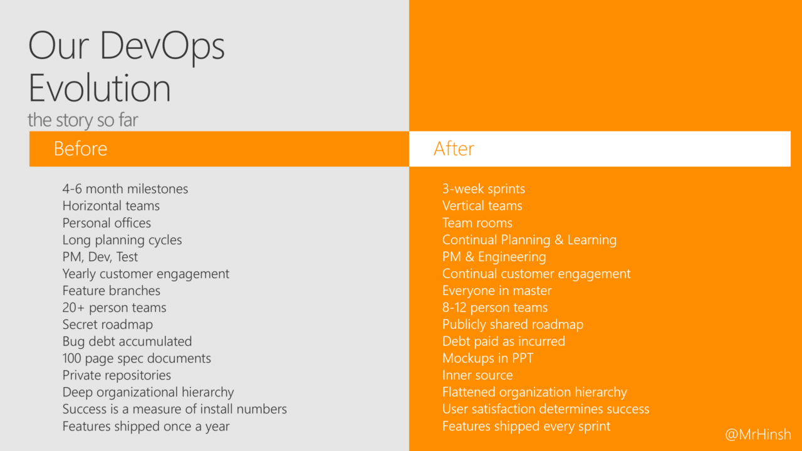

In our [Professional Agile Leadership training](https://nkdagility.com/training/courses/professional-agile-leadership-essentials-training/), we talk about changing your organisations hiring practices to hire more of the right sort of people to create the company that you want, not the company that you have. Hire the right people also implies that you will have to, within your cultural constraints, de-hire the wrong people.

<figure>

{ .post-img }

<figcaption>

Early Luddites destroying machines during the industrial revolution

</figcaption>

</figure>

> ##### Luddite
>
> #####
>
> **"a person opposed to new technology or ways of working."**
>
> _"a small-minded Luddite resisting progress" · "I'm not a Luddite, after all I work with the internet for my job"_

One of the reasons that your organisation is the way that it is, and that it is so hard to change, is its culture. The culture of an organisation is just a reflection of people that make up the organisation and the way that they do things.

As you transition from the [traditional tayloristic model](https://nkdagility.com/blog/the-tyranny-of-taylorism/) of departments and hierarchy to an empirical model of cross-functional delivery teams that suits the modern world of business you need to make sure that you have the right people or you will encounter friction at every turn. You may even find that some folks try to actively undermine the change.

> “To be a leader in this company, your job is to find the rose petals in a field of shit.”
>
> ― **Satya Nadella,** [Hit Refresh](https://www.goodreads.com/work/quotes/51432387)

These are the Luddites!

## Luddites are an anchor to your nimbleness

As you move down your chosen [agile evolutionary](https://nkdagility.com/blog/agile-evolution) path there are many common changes that you will make, but there is a reason I use the phrase Evolution and not Transformation. An agile business is one that can adapt to changing circumstances effectively, quickly, and without panic, as the world changed around them.

<figure>

{ .post-img }

<figcaption>

What changed at Microsoft as of 2017

</figcaption>

</figure>

Microsoft is the poster-child of what can be accomplished with the judicious application of leadership. With the servent-leadership and strategic vision of **Satya Nadella,** it has [evolved from a traditional organisational model 10 years ago (2010) towards independent delivery teams](https://www.forbes.com/sites/stevedenning/2015/10/27/surprise-microsoft-is-agile/) of today.

> “Every person, organization, and even society reaches a point at which they owe it to themselves to hit refresh—to reenergize, renew, reframe, and rethink their purpose.”
>
> ― **Satya Nadella,** [Hit Refresh](https://www.goodreads.com/work/quotes/51432387)

If you go into Microsoft today and ask them what has changed since they were a traditional organisation, they will say "everything"! The list above is a point-in-time snapshot taken in 2017 from their evolution. Most things on that list have changed since then.

The world operates at a much higher frequency than it ever did before and a [lack of learning, innovation, and evolution of our processes, practices, and tools](https://nkdagility.com/blog/bureaucracy-is-the-enemy-of-agility/) is the realm of the Luddite.

**Luddites have no place in the modern organisation #daretochange. Don't be a Luddite!**
