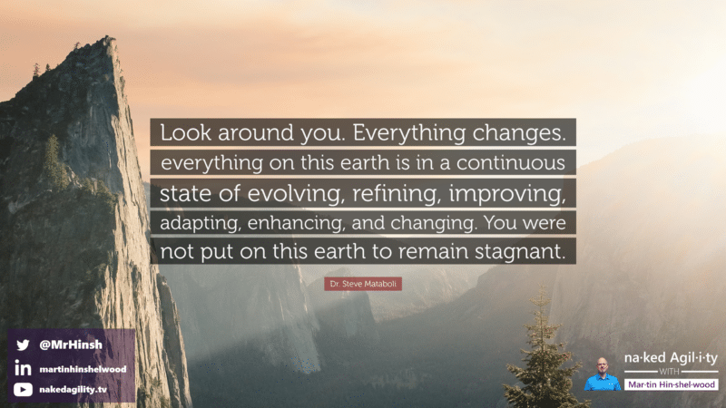
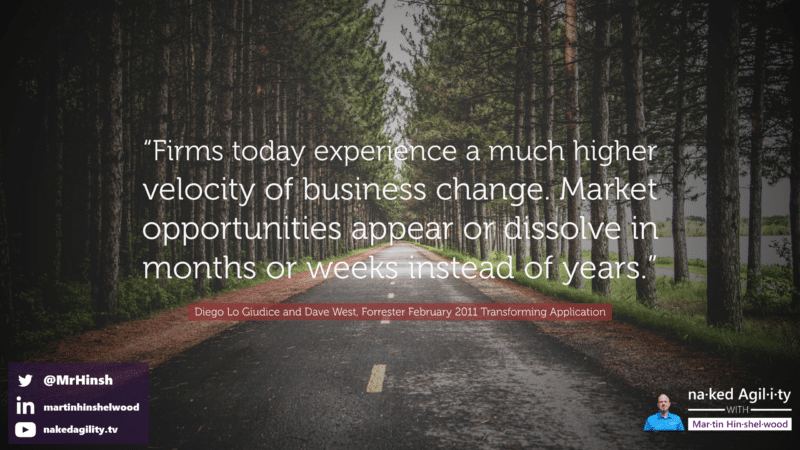
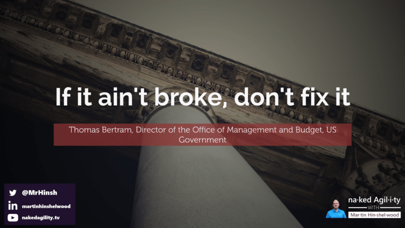
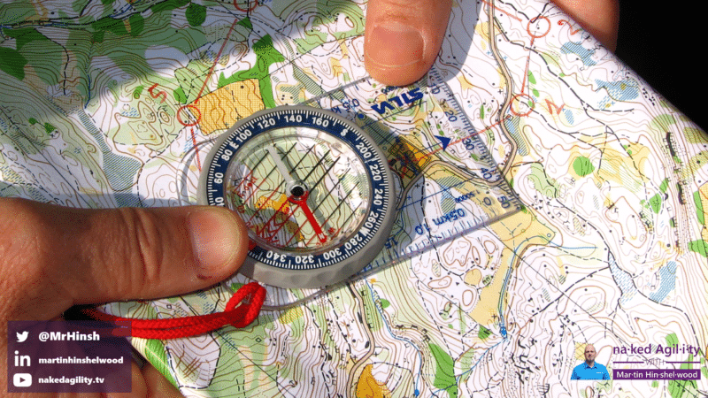
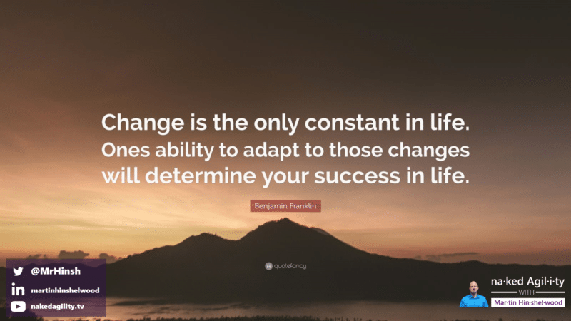

There is no such thing as an Agile Transformation, Digital Transformation, DevOps Transformation, or any of the Whatever Transformation that you can think of or have been sold. You can’t buy agility, and you certainly can't install it. There is no end state, no optimal outcome, No best practices. [We are no longer factory workers](https://nkdagility.com/blog/live-webcast-the-tyranny-of-taylorism-and-how-to-detect-agile-bs/).

Instead, you have to grow, nurture, and prune agility as it grows organically inside your organization and eventually, you too will be able to take advantage of business opportunities as they arise in the ever-changing marketplace. This is continuous change…

**Its an Evolution, not a transformation.**

NOTE: Prefer to watch instead? I presented this post as a talk at Agile in Nigeria 2020, I added it to this post at the bottom :)

<figure>

{ .post-img }

<figcaption>

"Look around you. Everything changes. Everything on earth is in a continuous state of evolving, refining, improving, adapting, enhancing, and changing."

</figcaption>

</figure>

Due to the long timelines, it is easy to see the change that happens over a long period of time as a transformation, as a caterpillar transforms into the butterfly. The idea of a [defigned start and end state is an illusion that lures us from the realities](https://nkdagility.com/blog/many-organisations-are-lured-to-safe-by-the-song-of-the-sirens/) of how things successfully change; through a continuous set of experiments. The successful experiments succeed and do well in a niche, the unsuccessful ones fail and die. The more experiments that you run, the more likely you are to find something that fits a niche better or opens up a new niche.

During the Industrial Revolution, when traditional management practices were developed, the ebb and flow of niches was a slow and deliberate endeavour, usually driven by a single educated visionary. The pace of change was much slower, both communication systems and education systems were weak, and niches that companies found were long-lived, often tens if not hundreds of years; they only needed to adapt once, and then optimise for the current state. The change was no longer necessary, and the competition was weak and slow to disrupt markets. A company, once established, could own a niche, seemingly forever. Bureaucracy was born as a way to solidify the newly found market and optimise the product delivery with best practices. We could own that space!

<figure>

{ .post-img }

<figcaption>

"**Firms today experience a much higher velocity of business change. Market opportunities appear or dissolve in months or weeks instead of years**"

</figcaption>

</figure>

Today the world flows faster; due to the increase in education levels and the advancement of technologies, and it's not slowing down. As things flow faster so our need to react to this new pace of development increases. Thus a virtuous cycle of increasing change perpetuates. Many organisations, rather than embracing this new reality, incorporate change in large and expensive fits and starts, rather than as a continuous flow. They only change when they feel threatened, and just change one bureaucratic system for another just as static. This inability to evolve in a continuous flow means that many organisations die; Where is Blockbuster, or Kodak.

As yourself, [would your organisation would have survived COVID](https://nkdagility.com/blog/live-virtual-classrooms-and-the-new-normal/) 20 years ago, or even 10. With 100% of your employees working from home, how has your infrastructure cooped? If you are still operating on a traditional "employees must be controlled" management mindset then you were likely still operating centralised VPN, which could not cope with the new load. You had neither the bandwidth nor the licences to support 100% remote workforce. However if over the last 10 years you had adopted cloud services then you likely felt less of a pinch. Your employees likely felt that speeds were faster as they no longer needed to share the finite office bandwidth with their colleagues. That change you made from on-premises to the cloud may have saved your business, but did you adopt it by evolution or transformation?

<figure>

{ .post-img }

<figcaption>

"If it ain't broke, don't fix it"

</figcaption>

</figure>

I often hear "if it ain't broke, don't fix it", but this is a phrase of the past. Today the pace of change in the world means that we need a new mantra, one not steeped in traditional management practices or weighed down by the baggage of the past. We need to embrace change, and that means accepting a higher degree of risk, [mitigated by a higher degree of competence](https://nkdagility.com/blog/luddites-have-no-place-in-the-modern-organisation/). Evolution is about embracing that risk and learning from its failures. Success is the result of continuous experimentation at a sustainable pace that is able to take advantage of current business opportunities as they arise.

**This is the Inevitability of change.**

## Orienteering towards your intended outcome

The best analogy for this continuous state of evolving, refining, improving, adapting, enhancing, and changing that I have encountered is Orienteering. Orienteering is a technique for map reading and direction-finding that developed by the military to train soldiers to find their way. Today it is a sport, and is often taught in schools; at least, it was in mine.

<figure>

{ .post-img }

<figcaption>

Orienteering towards a goal with continuous refinement of direction as impediments are removed

</figcaption>

</figure>

In Orienteering, like with any corporate endeavour, you should have some kind of vision or intended goal in mind. This is your current destination. You then use a compass and a map to figure out which direction, next steps, you need to take to get closer to that destination. As you take each step you may encounter obstacles or impediments that challenge you, and that you have to figure a way around. You may need to take a large detour in order to traverse an obstacle or impediment, so you need to reassess your next steps by consulting the map and compass.

The bit where I feel that orienteering as a sport does not fit is that it generally has a fixed route with prescribed checkpoints along the way. This is a little more analogous to traditional project management rather than modern practices. However, orienteering in its original military context would have been a lot more fluid, with changing tactical realities as you progress towards your vision, and this is exactly what we are looking for. Your end goal will evolve over time as the business conditions change and you may have to reassess your tactical direction and doctrine as you discover more.

<figure>

{ .post-img }

<figcaption>

Change is the only constant in life. Ones ability to adapt to those changes will determine your success in life.

</figcaption>

</figure>

Always remember that this is your business, your organisation, your people, and their livelihood. You are accountable for your organisation's success or failure. In order to change it effectively, you need to create leaders inside your organisation that understand these modern management techniques and know why we need to change.

To do that you, not some external coach or consultant, need to be in the driver's seat, making the decisions that are necessary to evolve your organisation. External people can help you learn these new techniques and coach you and your leadership team towards dismantling the bureaucracy that has built up over many years. They can help facilitate new interactions and fuel engagement and enthusiasm for the new practices and techniques, but you need to own them. You as a leader need to embody evolutionary practices with your organisation and foster it internally.

While there are some well-known practices, like self-organising teams, that help almost everyone, many of the practices you create will be your own. The difficulty is creating an environment within your organisation where these new techniques don't become the new bureaucracy, but instead create a continuous state of evolving, refining, improving, adapting, enhancing, and changing processes, practices, and tools that help you succeed.

You as leaders need to understand why you are making each decision, and what you expect the outcomes for the organisations to be.

**You!**

<figure>

{ .post-img }

<figcaption>

"I have not failed. I've just found 10,000 ways that won't work."

</figcaption>

</figure>

As you take each step you may realise that you were wrong, that this direction leads not to your intended outcome, but somewhere else. Decide if that somewhere else is a better place than you envisaged, and then figure out where you need to go next. Be free to experiment, accept that any processes and practices will be imperfectly defined, and adapt to what you discover along the way.

## Checkpoints: Known outcomes that indicate progress towards agility

I mentioned that there are some common known checkpoints along the way that that you can use to orientate yourself. Here are a few to get you started:

- **Are Teams delivering a working product to real users every iteration including the first and gathering feedback?**

- **Is there a clear product vision laying out the strategic goals and do all team members understand how they contribute?**

- **Is feedback from real users turned into concrete work items for delivery teams on timelines shorter than 1 month?**

- **Are Teams empowered to change their process based on what they learn?**

- **Are Teams empowered to change the requirements based on user feedback?**

- **Is the full ecosystem of your project agile; Agile Teams followed by bureaucratic, linear, delivery is a failure.** I have has some feedback that this is overly critical, that many organisations get value even within "bureaucratic, linear, delivery". I don't disagree that they have gotten value, I just disagree that it is agility. One of the key tenants of agility is feedback, and the sudo-feedback of pre-production is no substitute for real feedback from real users that are using your system for production activities.

I stole and adapted this initial list from the [Department of Defence white paper Detecting Agile BS](https://media.defense.gov/2018/Oct/09/2002049591/-1/-1/0/DIB_DETECTING_AGILE_BS_2018.10.05.PDF) that was sent out to all of their procurement officers to help them spend their $800+ billion budget more effectively.

## Conclusion

I want to be clear that in the new state of modern practices that continuously adapt to change everything will change. Every business process you currently have is built on the bureaucratic ideas of the past! They are impediments to being able to effectively take advantage of market opportunities as they arise. This type of change is not something that you can buy-in from the outside, it take time, focus, and effort. It must be organically and iteratively grown from the inside. You may hire many consultants, or coaches, or trainers along the way, but they must be driving your vision and work for you.

You as the leaders in your organisation need to come up with your vision for the future, some checkpoints that would indicate progress towards that vision and lead your organisation forwards. Along the way you need to continuously inspect your vision and checkpoints for validity and adapt as needed.

Inside out is the only effective way to change. It can not be imposed from the outside by folks that don't understand your culture or your people.

**#leadership** **#agileleadership** #daretochange

<figure>

https://youtu.be/p9OhFJ5Ojy4

<figcaption>

Agile in Nigeria 2020: The Inevitability of change

</figcaption>

</figure>
