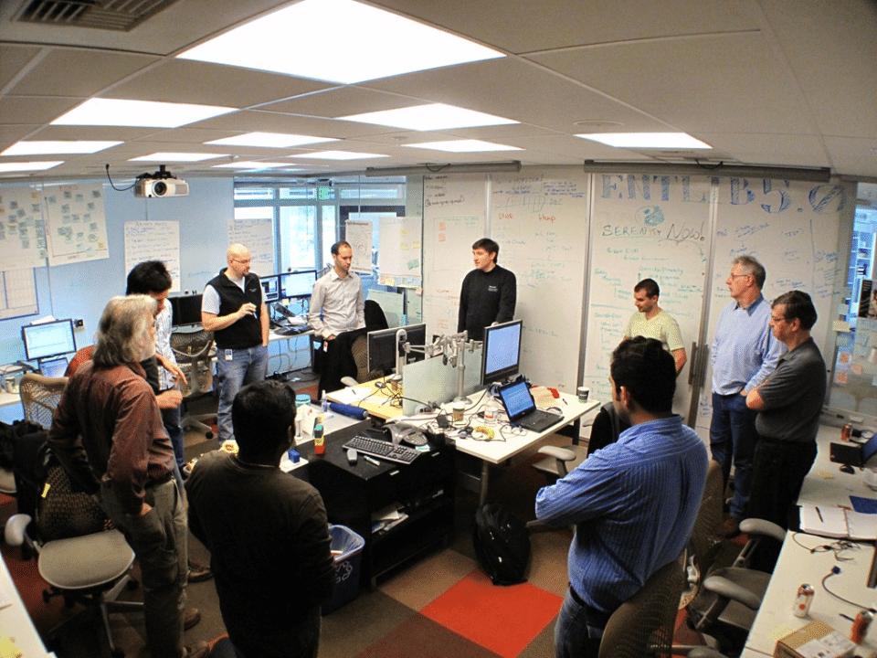
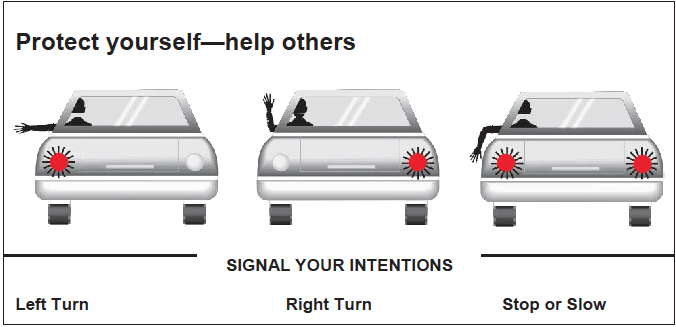
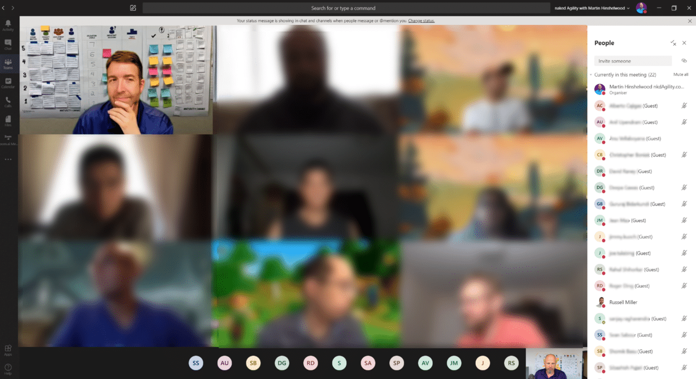

In light of the [new normal](https://nkdagility.com/blog/live-virtual-classrooms-and-the-new-normal/) and the last 20 years of technological progress, we need to [re-define co-location](https://nkdagility.com/blog/what-is-your-perspective-on-collocation/) as we no longer need to be in the same room as each other to get the [80% of communication that is non-verbal](https://journals.lww.com/thehearingjournal/Fulltext/2016/05000/The_Art_of_Nonverbal_Communication_in_Practice.5.aspx). If we are participating in an online event, we should try our best to keep our cameras on so that we can all read those non-verbal queues.

<figure>

{ .post-img }

<figcaption>

49 People in Microsoft Teams

</figcaption>

</figure>

**TLDR; If you are participating in an online event you should be transparent and commit to being open & respectful by having** _**your camera on**_ **and engaging the topics and outcomes at hand as best as you are able**. **While we show commitment to our fellow participants by keeping our camera on, we should in turn respect a participants need to sometimes turn their cameras off.**

**Just as you would not take a phone call in a meeting and disrupt everyone, the same social conventions for meetings should be respected. Let folks know in the chat, turn your camera and mic off, return when you can focus again.** **If you are unable to use the camera due to bandwidth it may be better to attend an in-person event**.

_Note: Rules are for the guidance of wise people and the obedience of fools._

## Co-location defined

The idea behind co-location is that with 80% of communication being non-verbal we need to be able to be in the same room, space, to be able to read each others body language and facial expressions.

<figure>

{ .post-img }

<figcaption>

Physical Team Room

</figcaption>

</figure>

Have you ever been able to tell exactly what the car in front of you will do next when you are driving?

> When I was a teenager I was in the car with my grandfather and he said: "You need to keep your eyes on all of the cars so that you know what they are going to do". I scoffed at that idea, but then he said: "See that car, it's going to change lane". I scoffed again, but then looked on in incredulous wonder as the car moved. I could not understand how my grandfather knew, but now that I am a drive I do the same all of the time.
>
> \-Jessica Baez Calderin, Strategic Director, naked Agility with Martin Hinshelwood

When we are driving we have a learned understanding of driver intent that is built over years of driving experience so that we know when the car in front is going to change lane even before the signal, and especially when they don't.

<figure>

{ .post-img }

<figcaption>

Car visual indications

</figcaption>

</figure>

We look for micro-changes in the driver's seated position, the road position of their car, and the other cars around them. Maybe we also get some official and standard notifications thorough the brake lights and indicators; if they work. You unconsciously take no account the apparent age of the driver and the age and condition of the car. We process all of this together and as individual drivers, we partake in an intricate non-verbal dance of lanes, signals, and speed that take us safely to our destination.

Another example is my wife's family is in Cancun, Mexico City, and Puerto Rico, as well as elsewhere. Every Sunday they have a family video conference with between 20 and 35 people participating all with video and chatting away. Technology is awesome.

This is like a physical team room, except we can also add the other 20% with verbal communication as we engage in our activities. Awesome! Right.

Well, it would be if many agile practitioners were not suffering from cognitive bias and stuck in the thinking that co-location means in-person. Yes, the Irony is not lost on me! This definition of co-location is over 20 years old and technology has changed a lot in that time.

## Co-location re-defined

Its been 25 (1995) years since the first [Scrum]() project and the average internet speed was 56kbps! Here is a list of the important dates since then and the average internet speed in brackets:

- 1995 - First Scrum project (56kbps)

- 2000 - First video Conferencing (280kbps)

- 2001 - Agile manifesto signed (280kbps)

- 2005 - First HD video (980kbps)

- 2020 - COVID (26Mbps)

Today I, along with most folks in the technology industry, have internet speed in excess of 200Mbs. Today it is generally no problem to have both kids on Netflix/Xbox, and both parents in full HD video conferencing at the same time. What a world we live in.

While we need to re-define co-located for the general usage of the word I have always used the following:

> **Co-Location:**  
> Co-location is a complimentary agile practice where all members of the same [Scrum Team]() work daily in the same room, within visual sight of each other.
>
> \-[Martin Hinshelwood: What is your perspective on collocation?](https://nkdagility.com/blog/what-is-your-perspective-on-collocation/)

This definition encompasses both in-person and virtual events as long as we can see everyone. We need to see folks express and posture in order to gain a greater degree of [transparency]() over what they are thinking, how they are absorbing the information and how we need to adapt the material to increase understanding. How do you expect the facilitator to understand what you as a participant get or don't without being able to see you?

<figure>

{ .post-img }

<figcaption>

9 people in the same room who can all see each other in Microsoft Teams

</figcaption>

</figure>

For 2020 I would like to update my own definition of co-location to be more inclusive of the virtual world that is part of the new normal.

> **Co-Location:**  
> Every member of the team can see every other member of the team's posture and expression.
>
> \-Martin Hinshelwood, 2020

## Participation requires Presence

For any online event, you should be just as present as you would be in person, and to do that you should have your camera on as much as possible. This provides feedback for both other participants and the speaker.

<figure>

{ .post-img }

<figcaption>

Online Event with only the presenter with Camera

</figcaption>

</figure>

Do you believe that this group is focused? How would you know? As a participant do you feel empowered to call upon ML? Will they reply? Are they even there?

These are all questions that can be easily answered by enabling the visual presence that is your camera. If you are uncomfortable with your camera then there are options available. I have used FaceRig which gives at least some of the 80% that is non-verbal while hiding your bad hair.

<figure>

{ .post-img }

<figcaption>

£6 for FaceRig used to hide my home and bad hair

</figcaption>

</figure>

If you are going to be participating in an organized event that will be held online then you should consider being somewhere with good bandwidth, with a usable background.

Presence can also be fun!

## Conclusion

With the advancement in video-conferencing, camera quality, and internet speed over the last 20 years since agility became a named thing, there is very little excuse for not having video-enabled, and to participate with your team, or any other group.

Having your camera on enables as much as 80% more knowledge transfer between you and the other participants. Having it off inhibits high bandwidth communication.

So if you are participating in a video conference:

- Be respectful, and open with other participants, and use your camera.

- Give the event your full focus and commitment and pay attention or leave.

- Have the courage to participate and speak up.

All of this together will create the transparency required by your host and co-participants to see your participation, how you are reacting, and modify the event to make it better.

If you don't want or can't have your camera on it would be better for you and the facilitator that you attend an in-person event.
