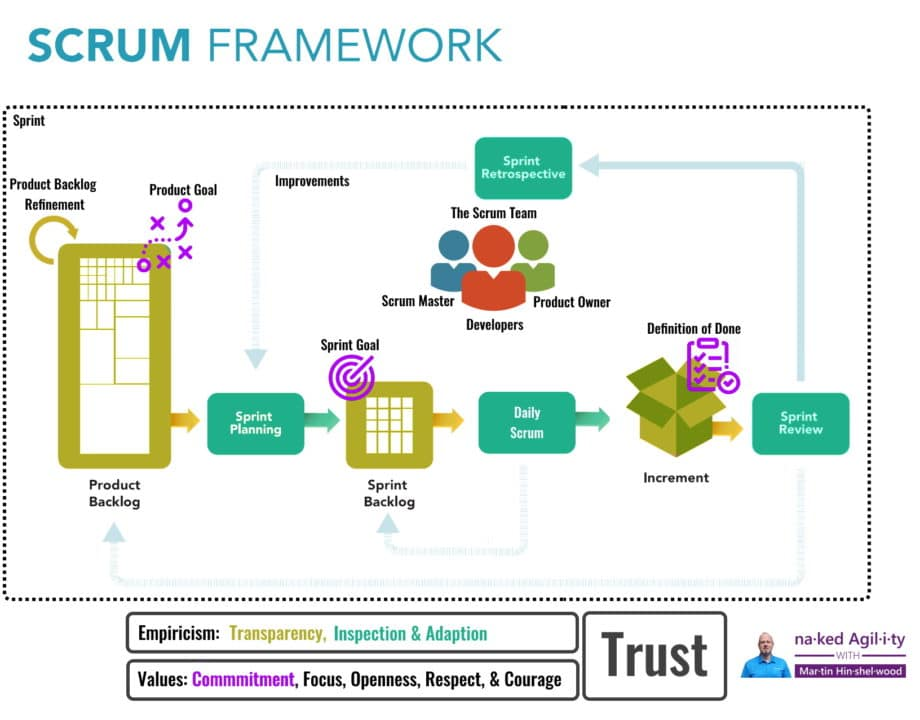

It has been 25 years since Scrum was first created by Ken Schwaber and Jeff Sutherland and it has gone through many revisions. The last major revision was in 2017 and this update represents a simplification for 2020.

[The 2020 Scrum Guide](https://nkdagility.com/the-2020-scrum-guide/)

[The 2017 Scrum Guide](https://nkdagility.com/the-2017-scrum-guide/)

> New updates include simplified language, less prescriptive and emphasis on the Scrum Team and its need to be self-managing

It's very clear that Scrum has not changed! Ken & Jeff have just found better ways to describe Scrum to simplify the story as well as reduce the cognitive load of interpreting it.

{ .post-img }

There are lots of awesome changes so let's see if I can highlight the things I noticed the most:

- [Scrum Teams are self-managing](https://nkdagility.com/the-2020-scrum-guide/#scrum-team) - Scrum Teams are cross-functional, meaning the members have all the skills necessary to create value each Sprint. They are also self-managing, meaning they internally decide who does what, when, and how.
- [Scrum Team is accountable for creating a valuable](https://nkdagility.com/the-2020-scrum-guide/#scrum-team) - The entire Scrum Team is accountable for creating a valuable, useful Increment every Sprint. Scrum defines three specific accountabilities within the Scrum Team: the Developers, the Product Owner, and the Scrum Master.
- [The Product Goal is a commitment for the Product Backlog](https://nkdagility.com/the-2020-scrum-guide/#commitment-product-goal) - The Product Goal describes a future state of the product which can serve as a target for the Scrum Team to plan against. The Product Goal is in the Product Backlog. The rest of the Product Backlog emerges to define “what” will fulfill the Product Goal.
- [The Sprint Goal is a commitment for the Sprint Backlog](https://nkdagility.com/the-2020-scrum-guide/#commitment-sprint-goal) - The Sprint Goal is the single objective for the Sprint. Although the Sprint Goal is a commitment by the Developers, it provides flexibility in terms of the exact work needed to achieve it. The Sprint Goal also creates coherence and focus, encouraging the Scrum Team to work together rather than on separate initiatives.
- [Definition of Done is a commitment for the Increment](https://nkdagility.com/the-2020-scrum-guide/#commitment-definition-of-done) \- The Definition of Done is a formal description of the state of the Increment when it meets the quality measures required for the product. The moment a Product Backlog item meets the Definition of Done, an Increment is born.
- [The What, the Why, and the How of Sprint Planning](https://nkdagility.com/the-2020-scrum-guide/#sprint-planning) - The Product Owner ensures that attendees are prepared to discuss the most important Product Backlog items and how they map to the Product Goal. The Scrum Team may also invite other people to attend Sprint Planning to provide advice.

I hope that that get as much from this new revision of the Scrum Guide as I have.

Get your copy of the **[new version of the Scrum Guide](https://nkdagility.com/the-2020-scrum-guide/)**!
