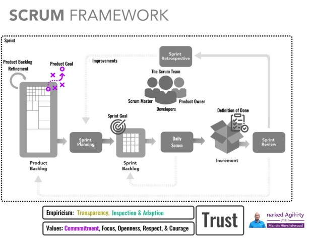

In [the 2020 Scrum Guide](https://nkdagility.com/the-2020-scrum-guide/) Ken and Jeff introduces the idea of the [Product Goal](https://nkdagility.com/the-2020-scrum-guide/#commitment-product-goal). The [Product Goal](https://nkdagility.com/the-2020-scrum-guide/#commitment-product-goal) is a commitment to ensure transparency and focus against progress.

> The Product Goal describes a future state of the product which can serve as a target for the Scrum Team to plan against. The Product Goal is in the Product Backlog. The rest of the Product Backlog emerges to define “what” will fulfil the Product Goal.  
> A product is a vehicle to deliver value. It has a clear boundary, known stakeholders, well-defined users or customers. A product could be a service, a physical product, or something more abstract.  
> The Product Goal is the long-term objective for the Scrum Team. They must fulfil (or abandon) one objective before taking on the next.
>
> [The 2020 Scrum Guide](https://nkdagility.com/the-2020-scrum-guide/#commitment-product-goal)

The Product Goal is an objective to try and meet rather than a guarantee. We may start on the journey towards the Product Goal and discover that there is a better place to go. While the Product Goal is there to give the Scrum Team focus towards an overall objective, it is also important to realise that it is not immutable. If the Scrum Team realise that the Goal is no longer valuable, or that some other goal becomes more valuable then they should change it.

{ .post-img }

Some Good Examples of a Product Goal:

- "Reach 10,000 new users in 6 months"
- "Improve the customer experience by improving the NPS over the next year"

The [Product Goal](https://nkdagility.com/the-2020-scrum-guide/#commitment-product-goal) should be a singular Goal that each Sprint Goal can be crafted towards. It should be short, measurable, and easy to understand. Everyone on the Scrum Team and the wider organisation should understand it and how the work that they are doing contributes to it. It is similar to the Visionary Goal that a Business Doctor I engaged helped me create for my business. Every product, every project, and every business should have a Visionary Goal. In Scrum, we call it the [Product Goal](https://nkdagility.com/the-2020-scrum-guide/#commitment-product-goal).

Do you have a Product Goal?
