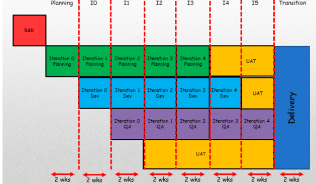

There is a better way than staggered iterations for delivery that will keep you on the path to agility. Staggered iterations lead to more technical debt and lower quality software.

[Updated to reflect the 2020 Scrum Guide!](https://nkdagility.com/the-2020-scrum-guide/)

## TL;DR;

The expected result of staggered iterations would be an increase in rework and in technical debt. If you are moving from a 4-year iterative process to a 4-month one you will see the value, but your process will be opaque and will only reduce your ability to deliver working software.

> Yes, your cycle time will be reduced, but you can do so much better. Move all requirements for shipping your software into your Sprint. If you need testing then it needs to be inside of the Sprint. A general rule is that: If you need to validate something outside of the Sprint; User Acceptance, Security audit, regulatory approval; Then you need to make sure that all of the work required to pass that outside validation is doing inside of the Sprint, with no further work required from the development team.
>
> \-[Martin Hinshelwood](https://nkdagility.com/company/about-us/)

For example, this means that if you have 6 weeks of animal trials, followed by 6 weeks of human trials to validate that your pacemaker firmware is good, you can't have those things happen inside of every 2 weeks Sprint. Instead, focus on what you can do to make those things pass. If they don't pass then do a full route-cause-analysis and bring that new information to your Sprint Retrospective and make sure you put measures in place to make sure it does not happen again.

## A better way than staggered iterations for delivery

I have seen many companies that are trying to move towards greater agility get trapped in the past by creating artificial silos based on skills. They believe that by creating a timbox for planning, development and testing that we can get closer to agility and move away from our traditional models. Unfortunately, the actual result is to enshrine that traditional staged model and step sideways on the path to agility, not forwards. In many cases, it can be a significant step backwards that will take many painful years to rectify.

<figure>

{ .post-img }

<figcaption>

staggered-iterations-for-delivery

</figcaption>

</figure>

I have heard this called many things. Water-Scrum-fall or maybe Scrummerfall but whatever you call it the reality is that this is just small waterfalls and in the case above not really that small at all. This is often how organisations respond when they are told to "do agile" and they end up figuring out how to not really change, and do the same thing that they have always done.

This is not the action of a [Professional Scrum Team](/the-2020-scrum-guide/#scrum-team), but that of, at best amateurs and at worst cowboys.

## The problem with staggered iterations for delivery

In the diagram above we have an 18-week cycle from inception to delivery. That’s more than 4 months between ideation and delivery with a lag of 2 months to even get feedback with a 2 month lag for all subsequent feedback. Worse this is the most expensive kind of feedback as the Coding and Testing teams have already moved on from the thing that is getting feedback and the result of that feedback will be more expensive to implement. Indeed worse yet if QA finds something that needs fixed we have maximised not only the cost to fix but the meantime to repair as the developers have moved on. And what do they do with that feedback? How is it prioritised? Do they quit what they are doing immediately and fix the previous iteration or do they wait until after they deliver this one? What if they are blocking QA? Does QA sit around till the end of the iteration after the one they reported the problem in?

## The solutions to staggered iterations for delivery

We need to foster teams over individuals and make those teams responsible for the delivery of working software. To get that we need cross-functional teams that can turn ideas into that working software. And we need to do it often.

- **Cross-functional teams** – We need to have everyone on the [Developers](/the-2020-scrum-guide/#developers) that is required to turn the Backlog Item into working software. If you were a property developer you would have access to joiners, plumbers, plasterers and electricians. You would create a team of individuals that was sufficient to complete the daily work on-site with experts on hand as needed. This is the same process for [Developers](https://nkdagility.com/the-2020-scrum-guide/#developers). You should have all of the skills that you require on each team to turn the forecast backlog items into working software each and every iteration. Have experts on hand for those tricky items but minimise the dependency that you have on them.
- **Asynchronous development** -  Ideally you want all of the disciplines that you need to complete each backlog item to work together to deliver the software. This is more than handing off between disciplines but moving towards everyone always working at any point in time. This is a hard one to achieve but is the responsibility of the team to figure out how; [To achieve asynchronous development you will need a modern source control system](https://nkdagility.com/getting-started-with-modern-source-control-system-and-devops/).
- **Test first** – Test first is about not doing any work unless there is a measurable test that elicits that work. Creating tests from acceptance criteria will make sure that your team is working on and understands the next most relevant thing to be worked on and that you have built what the customer wants. Additionally, creating unit tests before code will make sure that your coders are working on the most relevant problem, and that each line of code that they complete does exactly what they intended. The long term benefit of this is that we now have an executable specification that will result in an error if a future change breaks existing functionality. [You are doing it wrong if you are not using test first.](https://nkdagility.com/you-are-doing-it-wrong-if-you-are-not-using-test-first/)
- **Working software each iteration** – If you don’t create working software at the end of each iteration you have no way of knowing what really needs to be done to create a working increment. If you do four iterations of two weeks before you think about creating a working increment, how much work (re-work really) is left that you need to complete to really be done? To really have shippable quality? If you don’t have working software at the end of each iteration you are making sure that your business can’t ship out of band, no matter how much it wants to; [Professional Scrum Teams build software that works](https://nkdagility.com/professional-scrum-teams-build-software-works/).
- **Quality Assurance requires no testing** – If you consider that all testing is done as part of the sprint, then the only thing that needs to be done as part of the QA gate is to review the test results and coverage and determine the sufficiency of those results and coverage. If you are taking more than four hours to QA two weeks of development then I would suggest that the [Developers](https://nkdagility.com/the-2020-scrum-guide/#developers) work is not sufficient.

These things will all individually help and if you are doing all of them together your value delivery and quality should start to increase over time. Make sure that you focus on automating everything from the moment a Software Engineer checks in code, to it being [continuously delivered to production](https://nkdagility.com/continuous-deliver-sprint/). In the age of agility giving you a competitive advantage in whatever marketplace you are in, any manual work is a risk.
