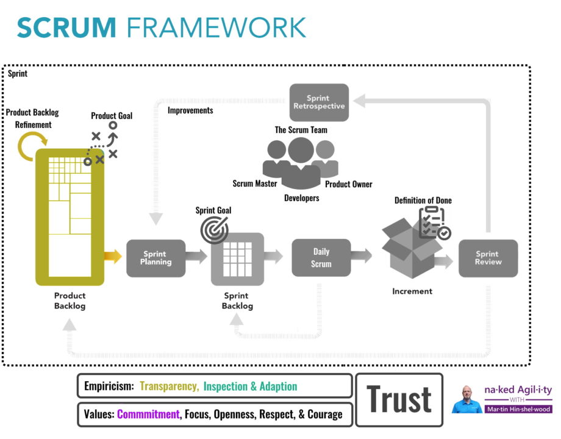

Most [Scrum Teams](/the-2020-scrum-guide/#scrum-team) that I encounter don’t do refinement of their [Product Backlog](/the-2020-scrum-guide/#product-backlog) and try to work on things that they don’t understand correctly. However, if you get to the Sprint Planning event and your backlog is not ready, then you are doing it wrong. If what you build is not of good quality then you should [read about Defenition of Done](/blog/getting-started-definition-done-dod/).

[Updated to reflect the 2020 Scrum Guide!](https://nkdagility.com/the-2020-scrum-guide/)

## TL;DR

If you get to the [Sprint Planning](/the-2020-scrum-guide/#sprint-planning) event and your Product Backlog Items for the next Sprint are not already of a size that can fit into the Sprint and fully understood by the [Developers](/the-2020-scrum-guide/#developers), then you are doing it wrong. You are heading for the rocks from the start, and you have no map of the shallows to prevent it.

Although the [Scrum Guide](/the-2020-scrum-guide/) does not define Refinement as an event, you should be doing it. You can come up with your Refinement event(s), or refine ad-hoc. Whatever you chose there is a simple measure of success. If your [Developers](/the-2020-scrum-guide/#developers) looks at something within the next 2 Sprints on the backlog and they don’t understand it, then you have work to do.

{ .post-img }

If you find that you can't quite get things to fit and [have to stagger iterations](/blog/a-better-way-than-staggered-iterations-for-delivery/), or you are just not able to deliver at all, then a lack of refinement is usually at fault.

## What does ready mean for a Product Backlog?

If the [Developers](/the-2020-scrum-guide/#developers) does not understand the things that they are being asked to do how could they possibly agree that the items can fit in a Sprint? You will often find teams that don’t do refinement confused as to why they can't get everything done in a Sprint. While we accept that in an empirical process like Scrum that we, know less upfront than we discover as we go, merely taking a guess and hoping for the best is decidedly unprofessional.

> "Selecting how much can be completed within a Sprint may be challenging. However, the more the [Developers](/the-2020-scrum-guide/#developers) know about their past performance, their upcoming capacity, and their Definition of Done, the more confident they will be in their Sprint forecasts."  
> \-ScrumGuides.org

While we don’t need a definition of ready, we do need a working agreement between the [Product Owner](/the-2020-scrum-guide/#product-owner) and the [Developers](/the-2020-scrum-guide/#developers). In Scrum, the [Developers](/the-2020-scrum-guide/#developers) are the ones selecting work for the Sprint, and they are the only ones that can decide what they can do. [Developers](/the-2020-scrum-guide/#developers) should be empowered to refuse to take items from the backlog that either they do not understand, or are too big to be completed in a single sprint. In general, I would expect that a [team](/the-2020-scrum-guide/#scrum-team) take many items into their Sprint, so they need to be sized appropriately.

Ready Backlog just means that the [Developers](/the-2020-scrum-guide/#developers) can select it with confidence.

## How do you refine your backlog?

Refinement is not an explicit event in the [Scrum Guide](/the-2020-scrum-guide/) because it is something that can be different depending on the Product, Domain, or Technology. If you were to ask how much refinement you should do then the answer is "as much as you need and no more". Too much refinement is waste, as it too little.

> "Product Backlog refinement is the act of breaking down and further defining Product Backlog items into smaller more precise items. This is an ongoing activity to add details, such as a description, order, and size. Attributes often vary with the domain of work."
>
> \-[The 2020 Scrum Guide](/the-2020-scrum-guide/)

The amount of time that [Developers](/the-2020-scrum-guide/#developers) spend on refinement is based on the need. However, this need for refinement will vary over the life of the product and you should be spending as much time as your need while maximizing focus on the realisation of value. I have found that many teams that were not doing refinement in the past may need considerably more time to get their backlog into some semblance of order. Once it is in order, you are generally only maintaining a rolling Sprint projection, based on your effective planning horizon, of what you might achieve.

I usually run at least the first refinement as a guided workshop. By running one before a Sprint Planning most teams will see the value of it by the end of the next Sprint. For the workshop, I get the [Scrum Team](/the-2020-scrum-guide/#scrum-team) ([Product Owner](/the-2020-scrum-guide/#product-owner), [Developers](/the-2020-scrum-guide/#developers), & [Scrum Master](/the-2020-scrum-guide/#scrum-master)) into a room with any necessary subject matter experts and we merely open the existing backlog and review it. Start at the top and ask the [Product Owner](/the-2020-scrum-guide/#product-owner) if this is the next most important thing? If not, find something that is. Then have the [Product Owner](/the-2020-scrum-guide/#product-owner) read and explain it, then discuss and add details.

Any time the [Product Owner](/the-2020-scrum-guide/#product-owner) deviates from the text that is in the Backlog Item, or adds more information, stop and have someone add that info to the Backlog Item. Ask the [Developers](/the-2020-scrum-guide/#developers) to estimate the item, "Does this look like it can fit with many other friends into a single Sprint?". If the answer is no, then you get to work breaking it down, reordering in the [Product Backlog](/the-2020-scrum-guide/#product-backlog), and start refining again. You continue this process until the [Developers](/the-2020-scrum-guide/#developers) agrees that there is enough backlog refined for the next 2 Sprints.

This enables your [Product Owner to be able to plan future releases](/blog/release-planning-and-predictable-delivery/) and your [Developers](/the-2020-scrum-guide/#developers) to create an implementation plan for the current one.

## How do you monitor your refinement effectiveness?

During the [Sprint Planning](/the-2020-scrum-guide/#sprint-planning) event, your [Developers](/the-2020-scrum-guide/#developers) should be able to quickly select many Product Backlog Items that go towards the chosen [Sprint Goal](/the-2020-scrum-guide/#commitment-sprint-goal) and agree that they fit. If you can do this, and most of the time you get most (not all) of the Items delivered, then you are probably doing enough refinement. If you can't, then you need to focus a little more on Refinement and making your Product Backlog ready.

If at your [Sprint Review](/the-2020-scrum-guide/#sprint-review) the [Product Owner is always wanting to reject that Backlog Items are complete](/blog/the-fallacy-of-the-rejected-backlog-item/) then there is unlikely to be enough refinement for the Development Team to understand what they are expected to do.
