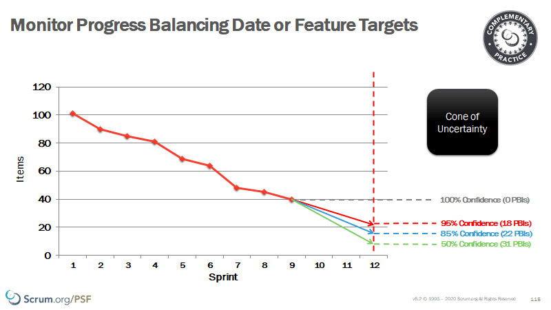
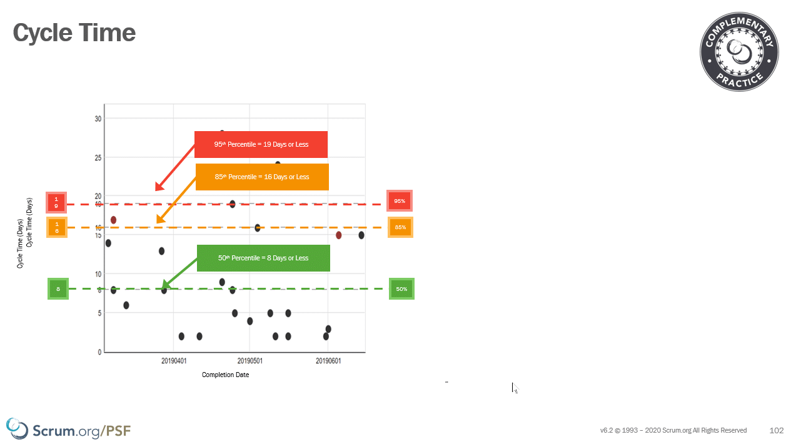

Story Points and velocity have been used for many years in the Scrum community and have been engrained so much in the way that things are done that most folks believe that they are part of Scrum. The accepted wisdom is that Scrum Teams are supposed to use User Stories, Story Points, and Velocity to measure their work.

**Accepted wisdom is wrong!**

Reviewers: [Steve Porter](https://www.scrum.org/steve-porter)

<figure>

{ .post-img }

<figcaption>

"I used to say Story Points set the Agile industry back 10 years. I was wrong. They set the industry back 20 years."-Daniel Vacanti

</figcaption>

</figure>

## Velocity and Story Points are not Scrum

There are a number of things that we collectively believe are required to do Scrum, and these have been perpetrated by the long-running perseverance of trainers teaching to the lowest common denominator and keeping things as simple as possible. There is the general consensus in the trainer community that folks that attend Scrum training are not smart enough to do anything else. However, if you go have a look at the [Scrum Guide](https://nkdagility.com/the-2020-scrum-guide/) and see how many time common things that you believe are mandated in Scrum are referenced:

- Velocity: 0

- Story Points: 0

- Burndown: 0

- User Stories: 0

- Original Estimate: 0

- Bug Count: 0

- Actual Completed: 0

{ .post-img }

The answer to all of these searchers is zero! These are complementary practices that may or may not work within the bounds of your organisational complexity, and all of these are an indication to me that your organisations are only [just starting its evolution towards agility](https://nkdagility.com/blog/evolution-not-transformation-this-is-the-inevitability-of-change/).

## Managing the unknown is hard

It's ok for a team to start with Story Points and Velocity. There are many things that change when a team moves from the traditional project management practices of the past to the empirical practices of the future, and sometimes we need to pick our battles. One such battle is that of story points and velocity and in fact all of the gubbins surrounding it.

Perhaps you need to appease other parts of the organisation that are not yet ready for change. Perhaps you have a long journey and this is just somewhere to start.

**Story Points & Velocity can be a good starting point!**

<figure>

{ .post-img }

<figcaption>

Planning Poker

</figcaption>

</figure>

I am not saying that there is no value in Story Points or Planning Poker. When a team is just starting out they need to keep things simple and iterate towards better outcomes. We often start from typical traditional practices and Planning Poker becomes a good learning point. Story Points use rough sizing as a way to analyze the work and break it down.

Because really, the scores are made up and the points don't matter. It's the conversation that is a valuable thing. The shared understanding that the participants get by having some way to know when they don't understand the same things. **That is awesome.**

However, agile teams try to use Story Points and Velocity for future predictability and this is a fallacy. While I would be OK with a team using it for a while, if an Agile Team is still using Velocity and Story Points after they have 5 or 10 sprints under their belt then I would have serious concerns about their ability to adapt to change and their sincerity towards that change. What I mean is that they just don't understand their work or its nature; This is what I mean by immaturity, and not that something else is a sign of maturity!

Indeed as the Scrum Team using Story Points really has no consistent reference they are just shooting in the dark the same as they were before.

While they have gained an understanding of the goals, they still don't have an understanding of the predictability and thus no confidence in their predictions. We need concrete data to build trust with stakeholders that we know what we are talking about.

**We need confidence!**

<figure>

{ .post-img }

<figcaption>

Velocity

</figcaption>

</figure>

Velocity was a way to assert that confidence with a plot of our delivered story points, and along with some clever calculations we asserted that we were likely to deliver about 20 story points. This was such a wholly improbable assumption that the vast majority of Scrum Teams talk about "carry-over" points and quiz me about how to represent that. Do you re-estimate and stick it on the backlog, does it move to the next sprint?

Scrum Teams have been basing their confidence to stakeholders on an agreed consensus that cant be compared and is susceptible to any change from the makeup of the team from the estimation room.

**We need confidence!**

## Confidence Through Transparency

Confidence is gained by truly understanding the uncertainty of delivery and factoring it into our projections. How sure are you that you will be able to deliver? No really! what is your statistical level of confidence?

<figure>

{ .post-img }

<figcaption>

Confidence in the dace of uncertainty

</figcaption>

</figure>

In the empirical world where more is unknown than known, we don't plan all of the work (it will change) and we cant tell you when things will be done.

**Except when we can!**

- **The Increment is the Confidence of Transparency of the Future** - If we have a Scrum Team then I should be confident in saying that we will have a usable increment at the end of every Sprint. If that is true, then we can have 100% confidence that we can deliver the output from the last Sprint. It works, and it's done!

- **The Product Backlog is the Confidence of Transparency of the Future** - Since we have a backlog that has been ordered by the Product Owner, who is accountable for maximizing the value delivered I can be confident that what we have Done represents the most valuable things that we could have done.

With both of these being true we can have 100% confidence that we have the most valuable items that the business needs to be completed and ready to deploy. Every additional Sprint just adds to the quantity of value.

<figure>

{ .post-img }

<figcaption>

Cycle Time Scatter Plot lets you find your confidence

</figcaption>

</figure>

Using a cycle time scatter plot we can assess and find our confidence levels, and even [create a Service Level Expectation](https://nkdagility.com/the-kanban-guide-for-scrum-teams/#h-service-level-expectation-sle), that allows us to measure progress against.

You can use this range of confidence levels to determine your current levels of predictability, and monitor the effect of changes that you make to your system on it. If you have an 85% confidence level of 16 days and you're on 2-week Sprints then you have a problem.

This data is not hard to collect and find a full list of awesome metrics in the [Kanban Guide for Scrum Teams](https://nkdagility.com/the-kanban-guide-for-scrum-teams/) from Scrum.org.
