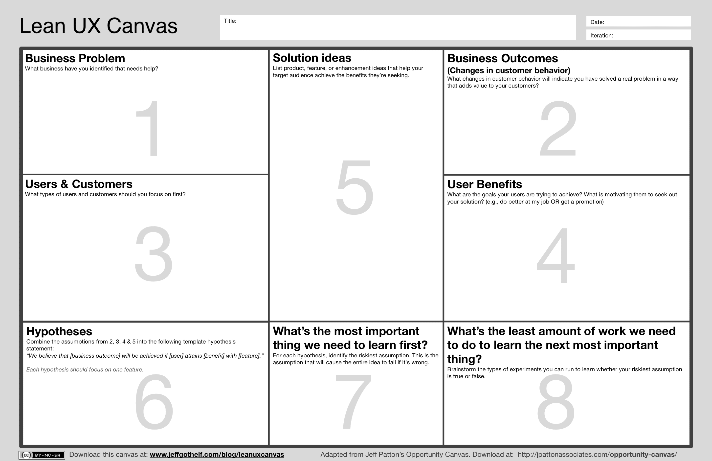

In the [The Evidence-Based Management Guide](https://nkdagility.com/the-evidence-based-management-guide-measuring-value-to-enable-improvement-and-agility/) we talk about the [Intermediate Strategic Goal](https://nkdagility.com/blog/product-goal-is-an-intermediate-strategic-goal/) and I likened that to the [Product Goal](https://nkdagility.com/the-2020-scrum-guide/#commitment-product-goal) in the [2020 Scrum Guide](https://nkdagility.com/the-2020-scrum-guide). If we also think of each Sprint as a tactical move towards fulfilling that [Product Goal](https://nkdagility.com/the-2020-scrum-guide/#commitment-product-goal) then the [Sprint Goal](https://nkdagility.com/the-2020-scrum-guide/#commitment-sprint-goal) becomes an Intermediate Tactical Goal that moves us towards our current Intermediate Strategic Goal.

## Sprint Goal is an Immediate Tactical Goal

The [Sprint Goal is a Commitment for the Sprint Backlog](https://nkdagility.com/the-2020-scrum-guide/#commitment-sprint-goal) and should never be "complete those 10 things" but instead should to describe the Why of the Sprint.

{ .post-img }

Just as the [Product Goal](https://nkdagility.com/the-2020-scrum-guide/#commitment-product-goal) provides the current Strategic direction so the [Sprint Goal](https://nkdagility.com/the-2020-scrum-guide/#commitment-sprint-goal) is the smaller step, the implementation step towards it. The [Product Owner](https://nkdagility.com/the-2020-scrum-guide/#product-owner) is accountable for maximizing the value delivered and should be thinking hard, with the help of the Developers, on what the next tactical outcome they want to try and achieve is.

This [Sprint Goal](https://nkdagility.com/the-2020-scrum-guide/#commitment-sprint-goal) should be high level and I would recommend that using a Lean Canvas to help identify not only the business objective but the behaviour that the [Product Owner](https://nkdagility.com/the-2020-scrum-guide/#product-owner) is trying to create in users or other systems. While I favour the Lean UX Canvas, which we teach in the [Professional Scrum with UX](https://nkdagility.com/training/courses/professional-scrum-with-user-experience-psu-training/), there are many valid options out there to use as a complementary practice in this space.

<figure>

{ .post-img }

<figcaption>

Lean UX Canvas

</figcaption>

</figure>

At a minimum, I would expect a [Product Owner](https://nkdagility.com/the-2020-scrum-guide/#product-owner) to have a hypothesis. A hypothesis is like an assumption, but also with a measure/metric that tells you if you have validated that assumption.

[Product Owners](https://nkdagility.com/the-2020-scrum-guide/#product-owner) are accountable for maximising value and should be looking to not just build features that customers need now, but predict or drive which features that they need now.

### A good Product Owner will build features now that your customers need now.

We should always be working to engage with our users; users don't engage when you build a feature that they will need in 6 months. Instead, we should focus on what will solve an immediate business problem for our users. This will engage them in the process and elicit much more excellent feedback from them.

### A great Product Owner will anticipate the features that customers need now.

The trick for any [Product Owner](https://nkdagility.com/the-2020-scrum-guide/#product-owner) is to figure out where the market is going and build features that drive it, rather than just following it. Having a vision and entrepreneurially iterating towards that vision empirically with many small hypotheses is key to unlocking this level up of Product Ownership.
