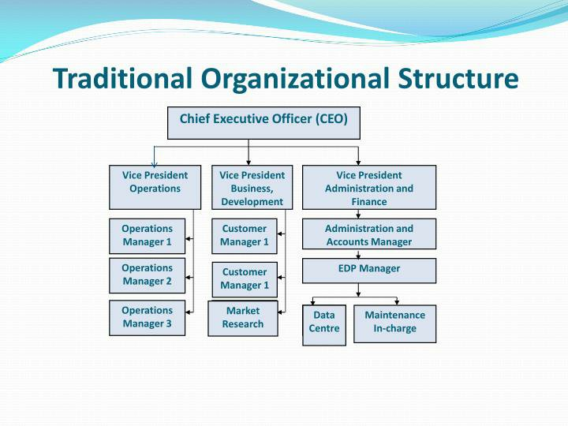
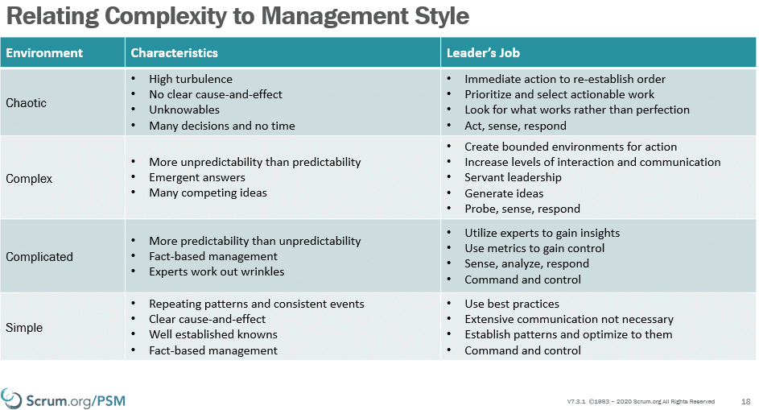
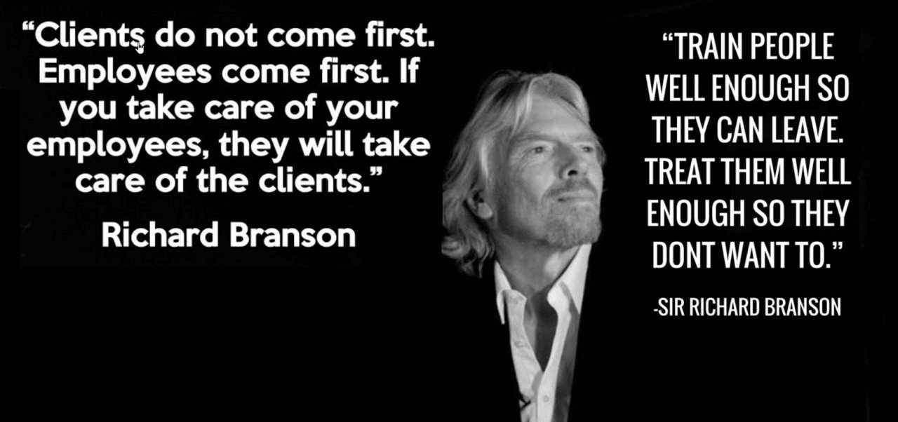

For many people the traditional [project management]() methodologies (see PMI / PRINCE2) are the root of the problems that birthed Waterfall. I assert that this is the tip of the iceberg. These methodologies are just a symptom of a greater problem that has its roots in the changes made during the industrial revolution. These changes, while they generated great amounts of wealth and many jobs around the world,  dehumanised work and destroyed the essence of value and discovery that brought humanity to where it is now. It created processes that turned people into little more than sophisticated robots and enshrined that thinking into the very core of how we do things.

**These practices, which spread like cancer, have been seeded around the world by the Master of Business Administration (MBA). These practices have been calcified in the malignant bureaucracy that can be likened to an iceberg that may very well sink your company.**

Reviewer(s): [Russell Miller PST](https://www.scrum.org/russell-miller)

<figure>

{ .post-img }

<figcaption>

What is Taylorism, and why Waterfall is just the tip of the iceberg!

</figcaption>

</figure>

## What is Taylorism, and why Waterfall is just the tip of the iceberg!

Prior to the industrial revolution, goods were made in small cottage industries and people worked close to their home. Customers were local, and both the producer and the consumer knew each other well. Mastery in ones chosen profession was paramount and rewards for the master craftsman were earned through increased money, or more time to pursue other interests.

{ .post-img }

When the industrial revolution came along, massive mechanisation was needed to produce goods at scale. However the technology of the time was unable to automate at that scale, so the only available "machines" were people. When, in pursuit of higher production volumes, you take away from people their autonomy, mastery, and purpose in your pursuit, you take away their soul. When you take away the essential elements of rewarding work, people become mindless automatons.

> Frederick Winslow Taylor is a controversial figure in management history. His innovations in industrial engineering, particularly in time and motion studies, paid off in dramatic improvements in productivity. At the same time, he has been credited with destroying the soul of work, of dehumanizing factories, making men into automatons.
>
> _Vincenzo Sandrone_

Traditional management practices were born out of the disengagement of the workforce. With the outcome controlled and repeatable, management focuses on best practices and incentivising people to work faster and harder. They wanted to remove thinking from the work since thinking creates ideas, and ideas create deviations from the pre-defigned optimal way of working.

**The thinking goes like this: Ideas and innovation from your workers were a risk to your business and thus must be eliminated. We need to remove thinking!**

<figure>

{ .post-img }

<figcaption>

US Textile Mill

</figcaption>

</figure>

When you remove thinking from work and turn people into automatons:

- **People don't care about the work -** and your workforce disengages, so their interest in the work and empathy for the customer also wains. Your workforce doesn't care about the work, and workers primary concern is no longer the success of the company. They are instead concerned mainly with the output of their repetitive operation and maintaining or increasing their levels of remuneration.

- **People become replaceable cogs -** Indeed the company comes to see an uneducated workforce who just do as they are told as easily replaceable resources. They don't have any discernable skills and the company has many people waiting for those jobs that can be easily slotted in. The company now no longer cares about the individual and they become resources to be allocated and replaced.

These two outcomes result in an erosion of trust between the workers and the company.

<figure>

{ .post-img }

<figcaption>

Lack of trust was inherent to the Tayloristic ideals

</figcaption>

</figure>

These working practices have resulted in:

- **Put people in competency-based groups** - this has not only resulted in isolated silos but also hierarchies within organisations.

- **Create standard practices** - The idea that Best Practices can be created and the best outcomes will result from the use of these practices.

- **Reduced wage based on expected low performance and bonuses offered for increased output** - in the output-driven world, we need our employees to be competing for the jobs so that they toe the line or lose their jobs and the benefits that come with them.

**This was the advent of the age of bureaucracy**.

If you think about the school system in most countries, especially if you are over 30; we all sat in rows, did the same thing at the same time, were forbidden from talking, and teachers used incentive based learning! I assert that there is no difference between this and the treatment of factory workers. **_The modern school system was developed during the industrial revolution to train factory workers._**

<figure>

{ .post-img }

<figcaption>

Kids sitting in rows, no talking, incentive based learning.

</figcaption>

</figure>

The end result is that many people have been trained from an early age to be factory workers. However very few of us will end up as factory workers today. We will more likely be office workers, solving cognitive business problems.

## Is Taylorism ingrained in the way we work today?

If you are lucky enough to work in one of the small numbers of companies that have already transitioned away from departments, hierarchies, headcount, work breakdown, best practices, and individual bonus systems then you are fortunate, or maybe selective.

{ .post-img }

**Most people are not so lucky.**

### The trouble with departments & hierarchies

In the days of the industrial revolution, employees were perceived as untrustworthy. Managers were needed to tell workers what to do and how to do it. As our organisations grew we needed managers to manage the growing number of managers and incentivise those managers to increase productivity in our employees through any means that they could.

> "**Put people in competency based groups**"
>
> The Scientific Management Method

Using the Scientific Management Method the Business Owners should identify each problem domain (e.g. Sales, HR, Marketing, Engineering, Testing) and come up with the "one true way" to do that work within the domain. The Business Owners can then hire managers and workers that will be trained in the "one true way" of doing that work, and minimise deviation from the Business Owners control.

<figure>

{ .post-img }

<figcaption>

Put people into ability-based groups.

</figcaption>

</figure>

And so we created departments so we could centralise training and knowledge on a single topic. If you were hired for sales, you ended up in the sales department: Completely disconnected from the makers, the designers, and the implementers. There would be no need for communications between Sales and the other departments since we have planned all of their work methods and need only follow the script.

As the world became more complex and sales became a creative endeavour the imposed departmental isolation model became a negative impact. Sales personnel started making decisions in the complex world only taking sales concerns into account; that, by design, was all they knew. Creation and delivery had no bearing on closing deals, so they were ignored except in the most general terms. To close the deal and get ones bonus sales personnel only needed to get the customer to sign, it mattered not if you could actually deliver.

**Often the result of this relationship was animosity between the departments, and unhappy customers when either quality, money, time, or features had to suffer.**

An example of this was the Microsoft Azure Platform. Salespeople were measures and bonuses paid based on the amount of Azure that customers bought. This measure resulted in salespeople pushing output over the outcome. They sold millions of dollars of Azure to companies that never used it. This resulted in unhappy customers and declining sales. Customer failed to see the value in what they were buying.

Then Satya Nadella (CEO of Microsoft) changed the measure for Sales from the output based measure to one based on the customer's outcome. Salespeople were no longer bonused based on how much they sold, but instead on how much a customer used. This change was revolutionary for sales of Azure. They were no longer focused on the short term ( to get executives to sign) but on a much longer engagement model with customers. It became critical to encourage customers, with direct help, to move towards [DevOps]() practices. Microsoft provided ( and continued to provide) consultants and coaches to help create better outcomes for customers. This has paid off hugely for Microsoft as they are now the largest cloud computing provider despite starting late.

This seemingly small change in how people are measured changed behaviours greatly. Many salespeople left Microsoft as a direct result as they were only interested in the short term, and not the long term investment in customer success.

Microsoft also restructured how Sales personnel work so rather than it being one huge department each product was responsible for their own Sales, Marketing, Engineering, and Support. With Sales now a skill within the Product teams instead of a separate organisation, Product Groups can leverage the combined knowledge of all disciplines to encourage customers to use more azure.

<figure>

{ .post-img }

<figcaption>

From: Organising for Complexity

</figcaption>

</figure>

**How will you break siloed departments within your organisation and move towards more holistic and aligned Product teams that can deliver value to your customers?**

- Read [The Evidence-Based Management Guide](https://nkdagility.com/the-evidence-based-management-guide-measuring-value-to-enable-improvement-and-agility/)

- Read: [Turn The Ship Around!: A True Story of Turning Followers Into Leaders](https://amzn.to/38Hb0LX)

- Read: [Organize for Complexity: How to Get Life Back Into Work to Build the High-Performance](https://amzn.to/3prBSqc)

### The trouble with Best Practices

In the days of the industrial revolution, employees were perceived as unskilled. Business owners needed to create standard operating procedures for every facet of work within each problem domain. The work of the time existed within the simple space. The work being performed may by categorised as "simple", with relatively few unknowns. Manufacturing created a large volume of pre-defined work in a low variance environment where the outcomes of the work were known before the work was performed. Output was the only control and correlated directly to profitability.

> "Create standard practices and train workers in those practices"
>
> The Scientific Management Method

Since there was a low variability in the work we could plan it all out beforehand, and simply follow that plan. We could hire managers to maintain order and compliance with defined methods, and treat employees as simple replicable cogs.

**Business owners created _best practices_ for creating products and expected everyone else to follow them.**

<figure>

{ .post-img }

<figcaption>

Ralph Stacy Model

</figcaption>

</figure>

As the world became more complicated and we were able to create automation using machinery with software to control it. The simple, low variance work could be automated. This allowed workers to focus on more complex cognitive tasks, but the management practices more suited to repetitive, low-variance work persisted.

Although the work had changed, the belief in predictive planning prevailed. There was a belief that if people just followed the detailed work breakdown and Gant chart, then everything would be fine.

<figure>

{ .post-img }

<figcaption>

Ralph Stacy Model visualised with [Leadership]() styles

</figcaption>

</figure>

**Best Practices, Centers of Excellence, and Innovation Labs are all constructs of the Tayloristic practices designed for simple, low-variance work. These practices seek to exert more control over the new complex modern world of work.**

Even in the simple, low-variance domain, the old Tayloristic practices based on the Scientific Management Method destroy the soul of work. These practices create workers that hate the work, their managers, and the company.

**We need a new way!**

In the simple world, the Toyota Production System is the poster child of innovation and discovering new ways of working. Optimizing the workspace and creating good practices became the job of the employee and they were encouraged to periodically stop and reflect on how to do things better.

In the complex world of Sales, Marketing, and [Software Development]() we also needed new ways of thinking that would power the same ideas from Toyota and [Lean]() into the high variance world of complex cognitive work. This was the birth of the Agile movement with the [Scrum]() Framework (1993), the Agile Manifesto (2001), and later [Kanban]() (2004).

Instead of coming up with best practices, we realise that there are only good practices for the situation at hand. A good practice, today might not be quite so good tomorrow, and thus we need to be a lot more flexible. No longer is the business owner (or manager) the best person to define these practices since they are no longer close to the problem.

> We are uncovering better ways of developing "products" by doing it and helping others do it.
>
> Agile Manifesto, 2001

The best people to make decisions and define practices are those with the most information. Today that is the people doing the complex cognitive work.

We need to accept that our practices are imperfectly defined. With this in mind, we need to push responsibility for defining those practices down to the people doing the work: they have the information required to make better decisions about which actions are more likely to yield the desired outcomes.

- Read: [The Scrum Guide](https://nkdagility.com/the-2020-scrum-guide/)

- Read: [Turn The Ship Around!: A True Story of Turning Followers Into Leaders](https://amzn.to/38Hb0LX)

### The trouble with Task and Bonus systems

In the days of the industrial revolution, employees were perceived to be lazy. It was perceived that revenue was lost due to this lazy, malingering workforce and so business owners needed to figure out how to minimise downtime and maximize output. Since managers were keeping people with the same ability in the same group, and planning everyone's work, the one remaining thing to be controlled was the worker's focus.

> "Reduced wage based on expected low performance and bonuses for increased output"
>
> The Scientific Management Method

Managers used various methods to incentivise workers to work harder and faster:

- **Taylor Differential Piece Work System** -  This system provides for higher rewards to more efficient workers. For different levels of output below and above the standard, different piece rates are applicable.

- **Gantt task and bonus system** - the system consists of paying a worker on a time basis if he does not attain the standard and on piece basis (high rate) if he does.

- **Emerson’s efficiency system** - Under this system minimum time wages are guaranteed, but beyond a certain efficiency level, a bonus in addition to minimum day wages is given

The Task and Bonus system is by far the most prevailing practice today, however, all of these systems were designed to create the same outcome and have a similar negative impact on workers.

Developed by Henry Gantt, the Task and Bonus system is an augmentation to the Taylor Differential piece work system and was intended to pay workers a low wage, since we expect them to have low performance, and then have a bonus that takes them to a potential high wage.

**Taylor, Gantt, and Emerson all created different "Carrot and the Stick" approaches to management.**

There are other ways to try and incentivise people, rather than just how they are remunerated:

- **Employee Of the Month** - The Employee of the Month (EOM) is a type of reward program given out by companies (often to encourage the staff to work harder and more productively).

- **Performance Appraisals** - A performance appraisal, also referred to as a performance review, performance evaluation, (career) development discussion, or employee appraisal is a method by which the job performance of an employee is documented and evaluated. Performance appraisals are a part of career development and consist of regular reviews of employee performance within organizations.

- **Hierarchy Progression** - The idea that job title in some way related to reward, success or expertise.

The idea that you need to dangle a carrot in front of the employees in order to get them to work more efficiently is a logical outcome of the practices we have been discussing throughout this article.

<figure>

{ .post-img }

<figcaption>

The carrot ("equality") and the stick ("Control")

</figcaption>

</figure>

There have been many studies done at universities around the world on financial incentives for employees. All of them agree that higher pay and bonuses only resulted in better performance when the tasks were basic mechanical tasks. More money works for tasks that have a pre-defined set of steps with a single answer.

If a task involved even a small amount of cognitive skills, decisions making, or creativity then more money resulted in **_lower_** performance. This is contrary to the common understanding of wage incentives.

If you are managing people you should pay them enough so that they feel that they are compensated fairly and not struggling to meet their basic needs. You should pay them enough to take the issue of money off the table.

There are three key areas that Leaders need to focus on that will increase the performance of your workforce:

- **Autonomy** , Employees desire to be self-directed. Autonomy increases engagement.

- **Mastery** , The urge to get better at a skill, craft, or discipline.

- **Purpose** , The desire to do something that has meaning and is important.

<figure>

{ .post-img }

<figcaption>

Clients do not come first. Employees come first.

</figcaption>

</figure>

If you and your business only focus on profits without valuing your employees need for autonomy, mastery, and purpose then you may end up with unhappy employees and poor customer service. I don't know about you, but I do not do my best work when I am unhappy!

- Read: [Drive by Dan Pink](https://nkdagility.com/the-kanban-guide/)!

- Read: [Start With Why: How Great Leaders Inspire Everyone To Take Action](https://amzn.to/3nVabFW)

- Read: [The Evidence-Based Management Guide](https://nkdagility.com/the-evidence-based-management-guide-measuring-value-to-enable-improvement-and-agility/)

## The trouble with Taylorism

These Tayloristic practices worked well for employers during the industrial revolution. However, even factory work has progressed in the shadow of the Toyota Production System and the lean movement. People are no longer cogs in a machine that can be replaced at a moments notice. Each employee brings a unique skill or ability to your [product discovery]() and [product development]() story. That story will be unique because of it. These Tayloristic practices kill ingenuity, focus, and enthusiasm.

- [Drive by Dan Pink](https://nkdagility.com/the-kanban-guide/)

- [The Leader′s Guide to Radical Management: Reinventing the Workplace for the 21st Century](https://amzn.to/3poCL2A)

- [Start With Why: How Great Leaders Inspire Everyone To Take Action](https://amzn.to/3nVabFW)

- [Turn The Ship Around!: A True Story of Turning Followers Into Leaders](https://amzn.to/38Hb0LX)

- [Organize for Complexity: How to Get Life Back Into Work to Build the High-Performance](https://amzn.to/3prBSqc)

- [The Scrum Guide](https://nkdagility.com/the-2020-scrum-guide/)

- [The Kanban Guide](https://nkdagility.com/the-kanban-guide/)

- [The Evidence-Based Management Guide](https://nkdagility.com/the-evidence-based-management-guide-measuring-value-to-enable-improvement-and-agility/)

**Foster ingenuity, focus, and enthusiasm and stop killing it with Taylorism. Bring the soul back to the work.**
