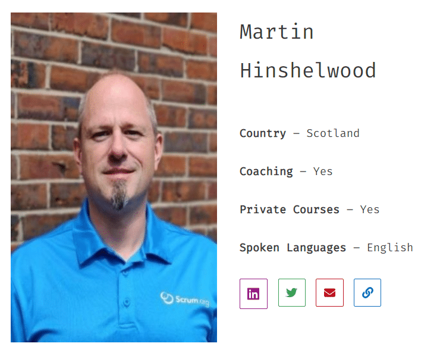

The [Scrum Guide](https://nkdagility.com/the-2020-scrum-guide/) only contains the minimum necessary to create an e**mpirical process control system for managing risk**. The new [Kanban Guide](https://nkdagility.com/the-kanban-guide/) reflects the minimum that you need to do to create a **strategy for optimizing the flow of value through a visual, pull-based system**.

{ .post-img }

With the integration of the [Kanban Guide for Scrum Teams](https://nkdagility.com/the-kanban-guide-for-scrum-teams/) into the world of Scrum.org, I had been waiting for Daniel Vacanti and co to release more around Professional Kanban. It was my very first thought when I attended the beta teach of the [Professional Scrum with Kanban](https://nkdagility.com/training/courses/professional-scrum-with-kanban-training-with-certification/) training in Burlington, Masatusis in January 2018.

**I did not have to wait long.**

Daniel has founded [ProKanban.org](https://prokanban.org/) and collaborated to create, under creative commons, the [Kanban Guide](https://nkdagility.com/the-kanban-guide/). This guide is freely available on [kanbanguides.org](https://kanbanguides.org/) and starts a new era of openness and respect between the Scrum & Kanban communities.

As part of this, I have become the 20th [Professional Kanban Trainer](https://prokanban.org/trainers/) at ProKanban.org and I am now able to teach the [Applying Professional Kanban training](https://nkdagility.com/training/courses/applying-professional-kanban-training-with-certification/) class.

### Becoming a Professional Kanban Trainer

The [journey to become a Professional Kanban Trainer](https://prokanban.org/become-a-trainer/) is documented on the Pro Kanban site and involves applications, interviews, asssessments, and training.

{ .post-img }

If you want to become a trainer then please reach out to them. Daniel and Colleen are amazing.

### Applying Professional Kanban with Certification

In the [Professional Scrum with Kanban](https://nkdagility.com/training/courses/professional-scrum-with-kanban-training-with-certification/) training, we spend the first day on Kanban and then the second on how Kanban interfaces with the Scrum Framework. In [Applying Professional Kanban](https://nkdagility.com/training/courses/applying-professional-kanban-training-with-certification/) training, we spend two whole days on Kanban:

#### Applying Professional Kanban Syllabus

- Kanban theory, principles and practices
- Applying Kanban
- Workflow design and visualization
- How to operate a Kanban system
- How to get started

[Applying Professional Kanban Training with Certification](https://nkdagility.com/training/courses/applying-professional-kanban-training-with-certification/)

#### Professional Scrum with Kanban Syllabus

- Dispelling Common Myths
- Understanding Professional Scrum
- Kanban Theory, Principles and Practices
- Kanban in Practice
- Scrum with Kanban

[Professional Scrum with Kanban Training with Certification](https://nkdagility.com/training/courses/professional-scrum-with-kanban-training-with-certification/)

These two are very different classes that are founded on the same core theory, principals, and practices to create the same outcome. I love teaching Scrum & Kanban together, and I am really looking forward to teaching Kanban on its own!

### Study Guide for Professional Kanban I Assessment

You don't have to take the [Applying Professional Kanban](https://nkdagility.com/training/courses/applying-professional-kanban-training-with-certification/) training to take the assessment. They are decoupled and they have an excellent [Kanban Learning Resources](https://prokanban.org/kanban-learning-resources/) page that will help you get started. I have forked that resource and will be adding some of my own items on the [Study Guide for Professional Kanban](https://nkdagility.com/study-guide-for-professional-kanban/).

**Join us in the world of Professional Kanban!**

