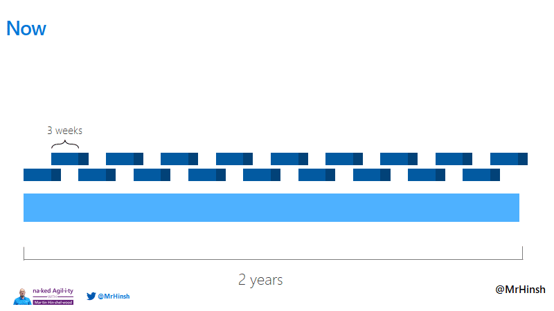
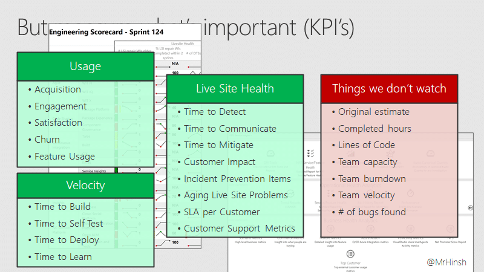

If you were buying a car, or a TV, you as the purchaser would do your best to understand the product that you are buying, the quality tradeoffs, and the capabilities.

<figure>

{ .post-img }

<figcaption>

All [technical debt]() is a risk to the product and to your business.

</figcaption>

</figure>

So why is so much of software opaque to the business? Why does the business have a fire-and-forget mentality and little interest in understanding what they are investing in?

**The modern businesses negligence in understanding their capital investment is in that lack of understanding. You can't hide it in a cost centre forever.**

**Reviewer(s):** [Adam Moss FBCS CITP](https://www.linkedin.com/in/adam-moss/)

## TL;DR;

Every business (receiving entity) requesting a custom solution should expect valuable delivery of the highest possible quality. Your delivery should valuable and work; be free from known defect.

_**All technical debt is risk to the product and to your business.**_

Technical debt is like an unhedged fund! There is no asset securing that risk, no insurance for it. Technical debt is 100% risk.

Since [Product Delivery]() is a capital expenditure the output is an asset of your organisation in the same way that a building or equipment is. All of these assets should be accurately represented on a balance sheet and likely part of your year-end accounts. Part of the worth of your company.

**There is a name given to miss representing an organisational asset, either knowingly or unknowingly, on your corporate accents: fraud.**

## "But, not all debt is bad!"

I hear the phrase "but not all debt is bad" a lot, usually coupled with "some level of debt is manageable" and, as a software developer, it makes me cringe. There is no acceptable level of technical debt.

- **Poorly written or difficult to understand** - if it takes new people weeks to become productive then you likely have a product that is difficult to read, difficult to change, and prone to error.

- **Changing things results in faults** - any time your team turns into a bunch of Plumber's sucking air when you suggest a change you know that part of the system has way too much technical debt.

- **Lack of Automation** - Anything that can be automated should be, anything that cant should be rearchitected so that it can be.

It's important to understand that technical debt does not accumulate linearly. It can take years for the debt to accumulate, and years for it to become a serious problem. It sneaks up on you, and suddenly you are lying bloody on the floor wondering where your wallet is.

## The non-linear accumulation of technical debt

A good example of this is from the Developer Division (DivDev) at Microsoft in developing a product called Team Foundation Server. This commercial product was built using traditional [project management]() practices and delivered on a two-yearly cadence. From 2005 (first beta) until 2012 they worked, successfully delivering a new version every 2 years. Even before 2012 [Leadership](), and engineers, had noticed that things were getting bogged down. Things were just taking longer to deliver than before and by 2012, with circa 600 people working on it, they were delivering just over 24 features to production each year.

<figure>

{ .post-img }

<figcaption>

TFS was delivered on a 2 year cycle.

</figcaption>

</figure>

The gap between their features and competitors was growing, and customer expectations were only able to be met by sacrificing yet more quality for speed. On a two-yearly cadence, it takes four years to deliver on feature requests.

Technical debt had become a serious business problem!

### Paying back the technical debt

Two visionaries at Microsoft, Brian Harry and Aaron Bjork, started to make changes to tackle this problem. They saw that they needed to get closer to the customers need. To do this they had to shorten the feedback loop, and they settled on 3-week Sprints using [Scrum]().

<figure>

{ .post-img }

<figcaption>

Three weeks Sprints instead!

</figcaption>

</figure>

And boy was that hard! Moving to 3-week Sprints created a level of [transparency]() that instilled fear! Fear of failure, fear of being an imposter, fear of being held accountable. Aaron and Brian worked hard to push forward and alleviate those fears so that they could really see what was going on and create an environment where the product delivery teams could do their best work.

<figure>

{ .post-img }

<figcaption>

Azure [DevOps]() Team Feature delivery per year!

</figcaption>

</figure>

It took them many years of hard work paying back the now transparent Technical Debt to get to where they are now. They have decoupled delivery and release, and while they still have a 3-week release cadence most of the work is done within [continuous delivery](). Feedback from customers can be implemented and delivered within hours or days, not months and years.

<figure>

{ .post-img }

<figcaption>

What metrics to watch, and some to not!

</figcaption>

</figure>

This became a game-changer for the whole group and ultimately was rolled out throughout Microsoft changing the company from a large oil tanker to a flotilla of patrol boats looking for opportunities to provide value.

## Technical Debt will always bite back

It’s the compound nature of the debt, its ninja-like hiding ability, and deceptive payback cost that is the risk. You have no idea how deep the rabbit hole goes.

**It's like a sub-prime Mortgage pack: We are making a lot of money now by steaming ahead and running that tightrope of debt vs delivery, but at some point, we are just screwed!**

I just don’t believe that if the business (read CFO) of the receiving entity really understood the risk that technical debt creates that they would ever approve of any level of acceptable debt. If you don't create a culture of quality then we:

- Are not really sure what is done and what is not

- Have no idea what we can do and when it will be done

- Have no idea what even needs to be done

**It’s a Roadkill Burger! It may indeed be tasty at the moment, but you will eventually get sick and die.**
