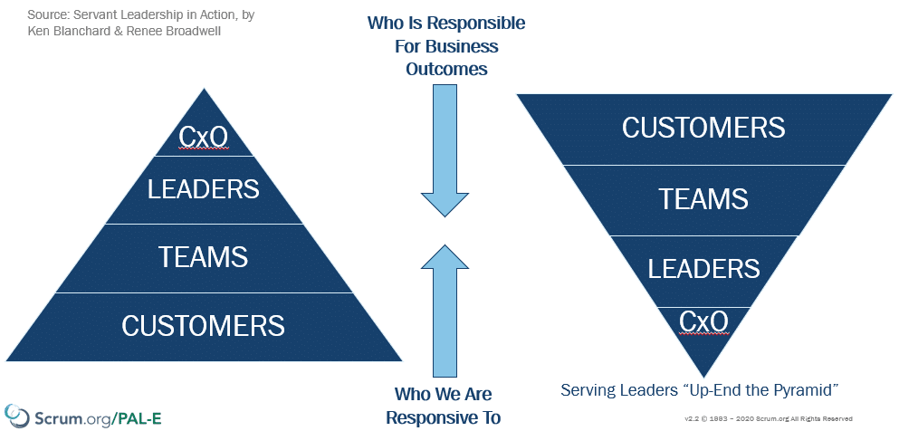
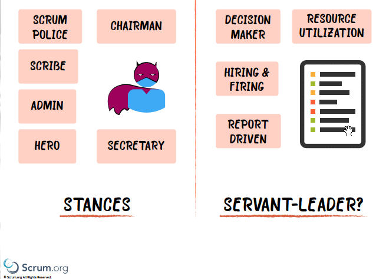

Leadership is not about control, but about inspiring those around you.

## Managers transition to Leaders

As organisations move towards modern management practices there will be less of a need for Managers. However that does not mean that those same people are not needed! Their role is shifting from managing people, to managing effectiveness and leading people!

<figure>

{ .post-img }

<figcaption>

How You Can Achieve Great Relationships and Results; by Ken Blanchard & Renee Broadwell

</figcaption>

</figure>

In a traditional organization, people report to people up the chain of hierarchy.  No matter how important we say our customers are to our company, people (even managers) RESPOND to Who is Above Them. We need to change this and upend the story. CxO's become responsible for clearing obstacles for the Leaders in the organisation to do the same for their teams.

**Lead by example and become the leader that you were meant to to be!**

For more depth read [Good To Great: Why Some Companies Make the Leap... and Others Don't](https://amzn.to/2YJhvJH) and [The Ideal Team Player: How to Recognize and Cultivate The Three Essential Virtues](https://amzn.to/3oNDMke). Or better yet attend a [Professional Agile Leadership Essentials Training with Certification](https://nkdagility.com/PAL) with us.

## The Scrum Master is a Leadership Role

There is a belief that the Scrum Master is the Scrum Team's manager or maybe a Scribe, or even and admin. The Scrum master is not not Report Driven or interested in Resource Utilisation! **They are a leader who provides services to the Scrum Team, the Product Owner, & the Organisation.**

<figure>

{ .post-img }

<figcaption>

Scrum Master Anti-Patterns

</figcaption>

</figure>

I love the story of Turn this Ship around David Marquet

**Ditch the anti-patterns and become the leader that you were meant to to be!**

For more depth read [Drive: The Surprising Truth About What Motivates Us](https://amzn.to/39KE0V2) and [Scrum Mastery: From Good To Great Servant-Leadership](https://amzn.to/3aCot97). Or better yet attend a [Professional Scrum Master with Certification](https://nkdagility.com/training/courses/professional-scrum-master-training-with-certification/) or a [Professional Scrum Master - Advanced with Certification](https://nkdagility.com/training/courses/professional-scrum-master-ii-training-with-certification/) with us.

