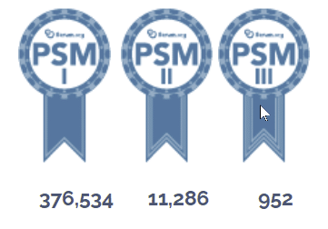

One of my customers is hiring for the Scrum Master Role and asked if I had a handy-dandy Scrum Master Job Spec that they could use. I did not, but there have been a few good ones floating around in the ether so I thought that pulling one together would be a good idea anyway. Here is my best effort to use the existing job postings, and combine them with the latest version of the Scrum Guide.

<figure>

{ .post-img }
<figcaption>Professional Scrum Master</figcaption></figure>

## Hiring a Professional Scrum Master

The Scrum Master is a challenging position to hire for and finding the right person is even more difficult. Ultimately the Scrum Master is accountable for the effectiveness of the Scrum Team. That means that they need to have some level of knowledge of both the relevant business domain to help the Product Owner, as well as enough technical knowledge to help the Scrum Team.

- [Are technical skills required to be a Scrum Master?]()

While there is no need for a Scrum Master to be technical, they do need to understand what effective looks like within the product and the technical domain within which you are creating the product. Ultimately it's worth remembering that certification is not an indication of competence, but may be used as a simple bar to reduce the load on interviews and assert a minimum level of knowledge. At $200 for a PSM I assessment and $250 for the PSM II assessment, and with a reputation in the industry of not being totally easy, these are a no-brainer for any aspiring or experienced Scrum Master. At the time of writing there are more than [350k people with PSM I and 11k people with PSM II](https://www.scrum.org/professional-scrum-certifications/count).

{ .post-img }

## A Scrum Master Job Spec

The [Scrum Master]() is accountable for establishing Scrum as defined in the Scrum Guide. They do this by helping everyone understand Scrum theory and practice, both within the [Scrum Team]() and the organization. The [Scrum Master]() is accountable for the [Scrum Team]()’s effectiveness. They do this by enabling the [Scrum Team]() to improve its practices, within the Scrum framework. [Scrum Masters]() are true leaders who serve the [Scrum Team]() and the larger organization.

### Role Summary

This Scrum Master position is a leadership role that is accountable for the effectiveness of the Scrum Team by:

- Leading, training, and coaching the organization in its Scrum adoption;

- Helping establish empirical product planning for a complex environment;

- Helping find techniques for effective Product Goal definition and Product Backlog management;

- Coaching the team members in self-management and cross-functionality;

- Helping the [Scrum Team]() focus on creating high-value Increments that meet the Definition of Done;

- Causing the removal of impediments to the [Scrum Team]()’s progress;

- Ensuring that all Scrum events take place and are positive, productive, and kept within the timebox.

- Planning and advising Scrum implementations within the organization;

- Helping employees and stakeholders understand and enact an empirical approach for complex work;

- Removing barriers between stakeholders and Scrum Teams.

Should work to build a trusting and safe environment where problems can be raised without fear of blame, retribution, or being judged, with an emphasis of healing and problem-solving.

### Role Requirements

The successful candidate must have the following attributes:

- First level Scrum Master certification (PSM I, CSM, RSM)

- **Excellent Leadership skills;** with a proven track record of assessing the Scrum Maturity of the team and organization and coaching the team to higher levels of maturity, at a pace that is sustainable and comfortable for the team and organization

- **Personify Scrum and Agile;** Providing all support to the team using a servant leadership style and leading by example.

- **Facilitation skills;** Facilitating getting the work done without coercion, assigning, or dictating the work; Facilitating discussion, decision making, and conflict resolution

- **Excellent communication skills;** Assisting with internal and external communication, improving transparency, and radiating information

- **Diverse knowledge of agile mindsets;** an ability to guide and coach the Scrum Team in self-management to fill the intentional gaps of the Agile/Scrum frameworks.

In addition, the successful candidate will have some or all of the following attributes:

- Second level Scrum Master certification (PSM II, CSP)

- Experience playing the Scrum Master role for at least two years for a product development team that was diligently applying Scrum principles, practices, and theory.

- Knowledge of other Agile approaches: XP, Kanban, Crystal, FDD, Less, Nexus, etc

- \[If Software Team\] Knowledge and/or experience with widely successful Agile techniques: User Stories, ATDD, TDD, Continuous Integration, Continuous Testing, Pairing, Automated Testing, Agile Games

- \[Applicable knowledge of the Business used by the team\] **<-- Add your Business Domain Here**

- \[Applicable knowledge of the technologies used by the team\] **<-- Add your Technical Domain Here**

### Role Sucess

If the Scrum Master is successful then the Scrum Team will have the following characteristics:

- Reliable delivery of the quality valuable product.

- Solid understanding of Scrum framework, theory, & values

- Continuous improvement and learning

- Happyness

- Self-sustaining

**I would love to get your feedback and discussion on this job specification so that we can make it better!**

Sources:

- [Scrum Guide | Scrum Guides](https://scrumguides.org/scrum-guide.html#scrum-master)
- [Scrum Master job description | Scrum.org](https://www.scrum.org/forum/scrum-forum/5366/scrum-master-job-description)
- [Scrum Master job description - The Ultimate Description (luis-goncalves.com)](https://luis-goncalves.com/scrum-master-job-description/)
