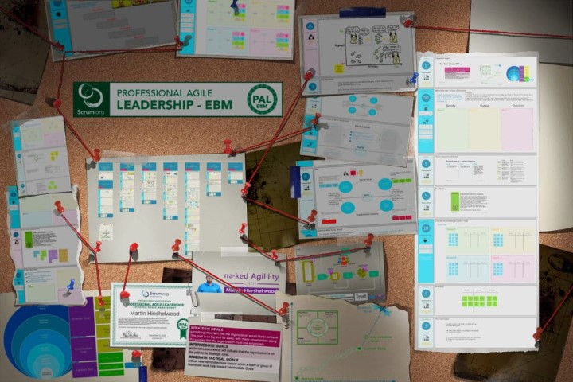
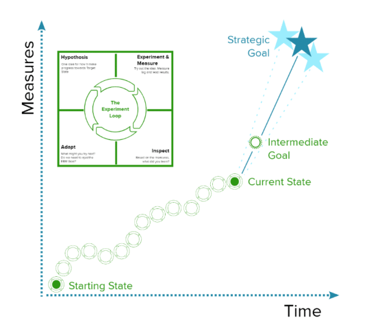
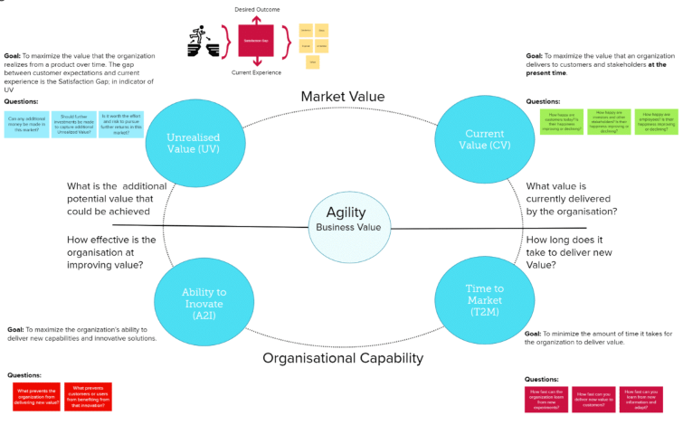

I have been an [accredited Evidence-based Management Expert with Scrum.org](https://www.scrum.org/ebm-experts) for the last 7 years and I have been using the [Evidence-based Management Guide](https://nkdagility.com/the-evidence-based-management-guide-measuring-value-to-enable-improvement-and-agility/) to encourage leaders to make decisions based on evidence instead of gut feel.

For lots of reasons that program had been taking a back burner with Scrum.org over the years. The main reason is that there is a lot of thought and practical evaluation that needs to be done to validate the ideas contained within the guide. My fellow [EBM Experts](https://www.scrum.org/ebm-experts) and I have been evaluating it with customers big and small, from defence to [police services](https://nkdagility.com/blog/professional-organisational-change-ghana-police-service/), and media to [healthcare](https://nkdagility.com/blog/professional-scrum-everyone-organisation/), we have run the numbers, crunched the data and integrated the feedback. It's time to announce the latest course in the Agile Leadership series! A one-day event, the Professional Agile Leadership with Evidence-Based Management Training with Certification (PAL-EBM).

{ .post-img }

A couple of weeks ago I attended one of the first events as well as an additional trainer preparation event Scrum.org calls a Virtual Train the Trainer (vTTT). I have to say that I loved participating in this class.

One of the key value propositions is that this call is not there to give you metrics that you must use. Instead, we encourage businesses to create their own metrics based on your unique context! You need to have metrics but we are not arrogant enough to assume that we have the right ones for you.

## Why do we need a \[types field='code' item='46220'\]\[/types\]?

You would think that we would not have to say to folks that having a Vision and Strategic Goal is a necessity for success, but we do. That Vision and Strategic Goal need to be communicated to everyone that is working on your Product or within your business. Successful organisations do a better job than unsuccessful ones at connecting their employees to that Vision and Goal, at helping them understand how the work they do every day contributes to that vision and goal.

{ .post-img }

Time and again I and my colleagues visit companies that either doesn't have a vision or have one that is not communicated. Even when there is one, and it is communicated the ability for people doing the work to connect to that vision is in question.

**How well do the people doing the work in your company connect with your vision and goal for your product or business?**

Just as the PAL gets you to think about how you lead an organisation, the PAL-EBM gets you to think about how you measure your success!

## Overview of the \[types field='code' item='46220'\]\[/types\] 

\[wpv-post-body view_template="None" suppress_filters="true" item="46220"\]

## Who is the \[types field='code' item='46220'\]\[/types\] for?

\[types field='cource-target-audience' suppress_filters='true' item='46220'\]\[/types\]

## What will you learn in the \[types field='code' item='46220'\]\[/types\]?

\[types field='course-objectives' suppress_filters='true' item='46220'\]\[/types\]

{ .post-img }

## Additional Content

\[wpv-view name="2021-blogpostsbytag" limit="10" wpvposttag="Evidence-Based Management"\]

## Our upcomming classes!

\[wpv-view name="2021-coursescheduleforposts"\]
