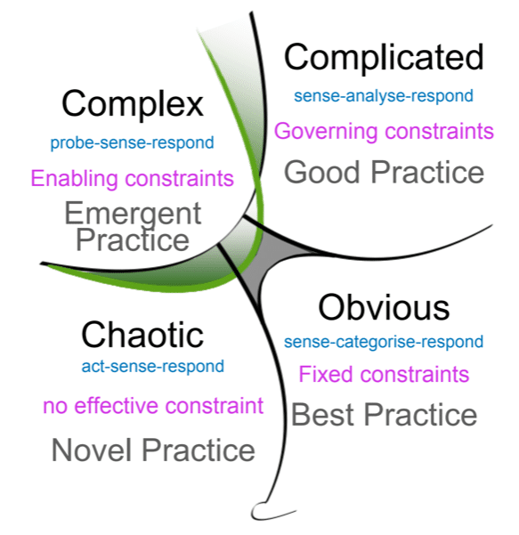

The Product Backlog is a critical asset in Agile product development; it represents a dynamic lean inventory of everything the product needs. For those of us navigating the multifaceted landscape of product development, there is often an impulse to seek an ideal structure for the Product Backlog. The familiar hierarchy of Initiative->Epic->Feature->User Story->Task/Bug is a common schema. However, before embracing this structure as a silver bullet, it’s imperative to critically evaluate the implications of imposing a hierarchy on the Product Backlog and to recognize the nuanced dynamics of working in complex environments. In this article, I will examine the delicate interplay between Product Backlog management and the intrinsic nature of complex systems.

### TLDR;

In conclusion, while the allure of hierarchy in the Product Backlog might be tempting, it is imperative to recognize that this may not be the panacea it seems. Complex product development demands a more nuanced approach. This entails acknowledging the fluid nature of complex environments, valuing emergent practices over best practices, and empowering teams to harness their expertise. By doing so, we move towards creating not just successful products but also fostering a culture that is adaptable, innovative, and resilient in the face of complexity.

### The Illusion of Order: The Lure of Hierarchy

Hierarchy appeals to the human psyche because it seems to present a sense of order and control, especially in the face of complexity. However, this allure of hierarchy can be deceptive. In practice, hierarchy can introduce rigidity, create barriers to communication, and obfuscate what’s genuinely significant in the Product Backlog.

In essence, when the Backlog is cluttered with levels of hierarchy, it diminishes its transparency and malleability. It is critical to appreciate that the Product Backlog should generally encompass **_value_**. This is not to say we should dispense with additional content that provides context or clarification. Indeed, collateral materials such as wikis can be invaluable in offering insights. However, incorporating these directly into the Product Backlog does not add value and instead restrains the Backlog's fluidity and transparency.

### A Primer on Complexity

As a side point, engaging in a dialogue about the nature of complexity is imperative whenever the concept of “best practice” is brought up in discussions. Complexity is not just a buzzword; it’s a theoretical framework for understanding how different system components interact. In complex environments, it is impossible to predict outcomes with certainty due to the interdependencies and interactions among the components. This is a far cry from simple or complicated environments, where cause-and-effect relationships can be determined.

{ .post-img }

In simple environments, “best practices” exist because they offer tried and true methods for known problems. However, there are only emergent practices in complex environments where doing the same thing again can often have very different results. These practices cannot be predicted upfront and may only be effective temporarily. The most pragmatic approach in such environments is to start with a hypothesis, experiment, and be prepared to evolve the practice based on feedback and learning.

### Ghosts from the Past: The Work Breakdown Structure

One of the reasons that hierarchy is so enticing is that it has historical roots in the traditional project management approach known as the Work Breakdown Structure (WBS). The WBS is a hierarchical decomposition of the total scope of work to be carried out by the project team. While the WBS was valuable in certain contexts, its hierarchical nature is not conducive to the Agile philosophy, which values responsiveness to change over following a plan.

{ .post-img }

> A work breakdown structure (WBS) visually organizes project deliverables into different levels based on dependencies. It’s essentially your project plan in a visual form, with your project objective at the top, then dependencies and sub-dependencies below. -Alicia Raeburn, Asana

Interestingly, the very presence of a hierarchy resembling the WBS within the Product Backlog may lead to individuals subconsciously reverting to old habits. This is not surprising as the human psyche finds comfort in familiarity; there is a tendency to revert to what we know. This, however, is akin to trying to fit a square peg in a round hole, as opposed to rethinking the fundamental paradigm of managing work.

A simple question to ask yourself when you open an item on your backlog is this:

> "Does this item from my backlog, on its own, represent some value to the business? Can it be delivered independantly?"

**If the answer is no, it's not a backlog item but a work task!**

### The Flat Landscape: A Paradigm Shift

Instead of obfuscating the Product Backlog with layers of hierarchy, consider streamlining it to encompass just the work pertinent to the team.

You can still employ tags, wikis, and attachments to provide context. This approach liberates team members to structure the Backlog in a way that makes sense to them and is responsive to the fluid nature of complex product development.

I think it's worth highlighting that strategy should inform but not dictate the choices made in organizing the Product Backlog. This is a crucial point. The reason organizations hire skilled individuals is to leverage their expertise and insights. There is a recognition that those closest to the work often have the most meaningful insights into what needs to be done.

### Complexity and Cognition: The Human Factor

In complex product development, human cognition is a significant factor. Individuals and interactions are central to Agile principles. People come with diverse backgrounds, experiences, and perspectives. These differences can be a source of creativity and innovation. By flattening the Product Backlog, we create an environment where the team's cognitive diversity can flourish.

Furthermore, in complex systems, a practice known as sensemaking becomes critical. Sensemaking involves assimilating information, interpreting it, and making informed judgments. A flat Product Backlog supports sensemaking as it reduces cognitive overload and allows individuals to focus on what’s truly important.

### Strategy and Autonomy: The Balancing Act

The relationship between strategy and the Product Backlog is subtle. The strategy should serve as a compass, providing direction and purpose, helping us orienteer to our destination. However, it should not be a straitjacket. The dynamism of complex environments requires that teams have the autonomy to make decisions and adapt as necessary. There needs to be a balance between strategic alignment and autonomy. This balance is vital for harnessing the collective intelligence and creativity of the team.

Ultimately, the goal is to create a resilient, adaptable ecosystem capable of thriving amidst the uncertainties of complex product development. This involves creating flexible structures, fostering a culture that values learning and adaptation, and equipping teams with the autonomy to make decisions.

**_What's in your backlog?_**
