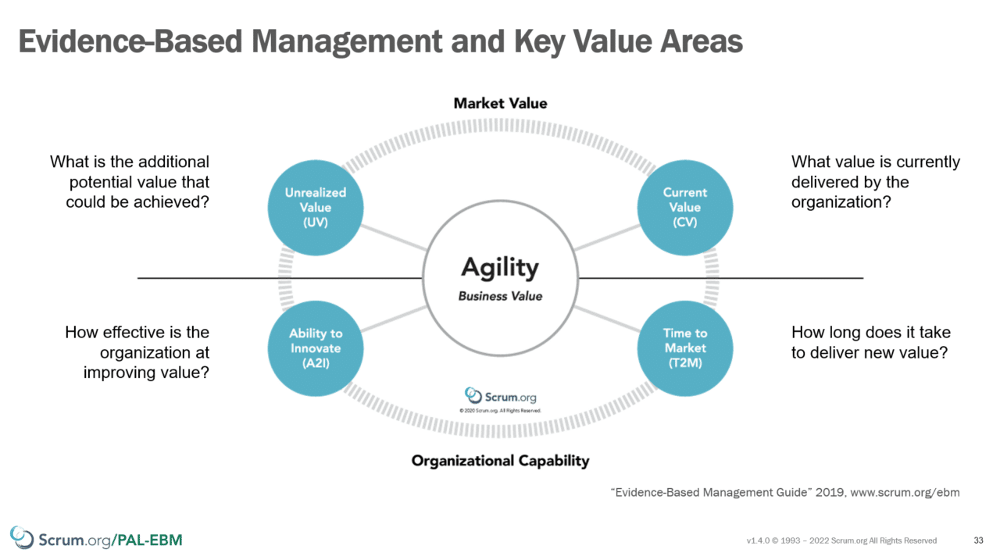

Over the past decade, a recurring query has been echoing in my ears: "How can we normalise Story Points across teams so that we can look across and maybe compare teams?" It's high time we address this.

### TLDR;

Story Points, while subjective, can be a valuable tool for team discussions and understanding. However, they shouldn't be the primary metric for comparing teams or predicting future deliverables. Instead, focus on objective metrics like throughput, to gauge and optimise team performance.

### These are not the metrics that you are looking for!

First and foremost, Story Points are inherently subjective. They're influenced by individual perceptions, making them unsuitable for broad comparisons or future projections. While they might offer a vague direction, they're often misused in planning and measuring.

The essence of agile frameworks like Scrum is value delivery, and the correlation between the subjective nature of story points and their velocity doesn't necessarily equate to the value delivered. There are better choices for teams aiming to optimise their value delivery than relying solely on Story Points and Velocity.

**But is there any value in Story Points?**

Aye, there is. In my experience, Story Points can be a great tool during backlog item refinement. They foster discussions, highlighting what's known and, more importantly, what's not: Outliers during planning poker often signal gaps in understanding.

Tools like Story Points and Planning Poker can be invaluable in understanding when to dissect items further and spark discussions during refinement. I would expect teams to shift more towards right-sizing, ensuring that backlog items are feasible within a Sprint, as they gain more experience and understanding of the product, its domain, and the technology used.

### A Story of Flow and Value

The crux of this discourse lies in two vectors: throughput and value.

- **Throughput** is a tangible measure of items delivered over time.

- **Value**, on the other hand, is a more elusive measure of the anticipated benefits from system changes.

It's straightforward to gauge the throughput of backlog items and their flow. By noting when work enters and exits the system, we can derive the four pivotal flow metrics:

- Throughput

- Cycle Time

- Work Item Age

- Work In Process

{ .post-img }

Such metrics empower us to make informed decisions rooted in tangible data. They allow us to pinpoint potential issues, identify items needing further breakdown, and employ probabilistic forecasting for future projections.

Simultaneously, to truly maximise team output, we must also focus on the value of the work. Given its subjective nature, defining value can be multifaceted. A practical approach is to examine the four primary value areas from evidence-based management practices:

- **Current Value** - Evaluating the existing product's value. Is it meeting customer expectations?

- **Unrealised Value** \- Identifying gaps in your product that could be filled.

- **Time to Market** - Assessing the speed from ideation to user engagement. Dormant value is essentially no value.

- **Ability to Innovate** \- Determining the balance between maintenance and innovation.

{ .post-img }

The ultimate goal is to enhance both throughput and value concurrently. Striking a balance is crucial; we neither want sluggish excellence nor a barrage of mediocrity.
