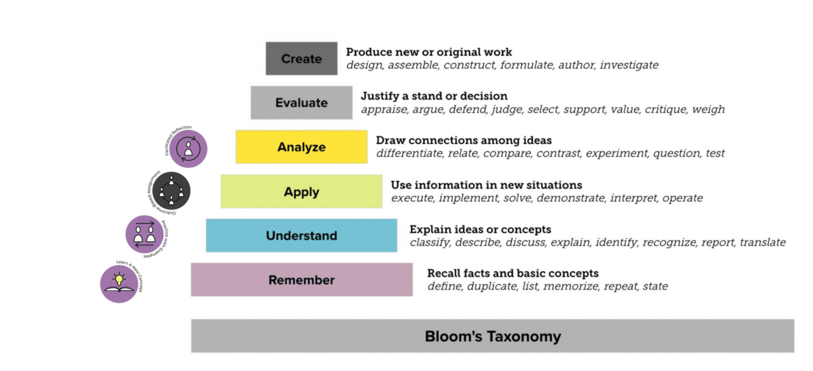
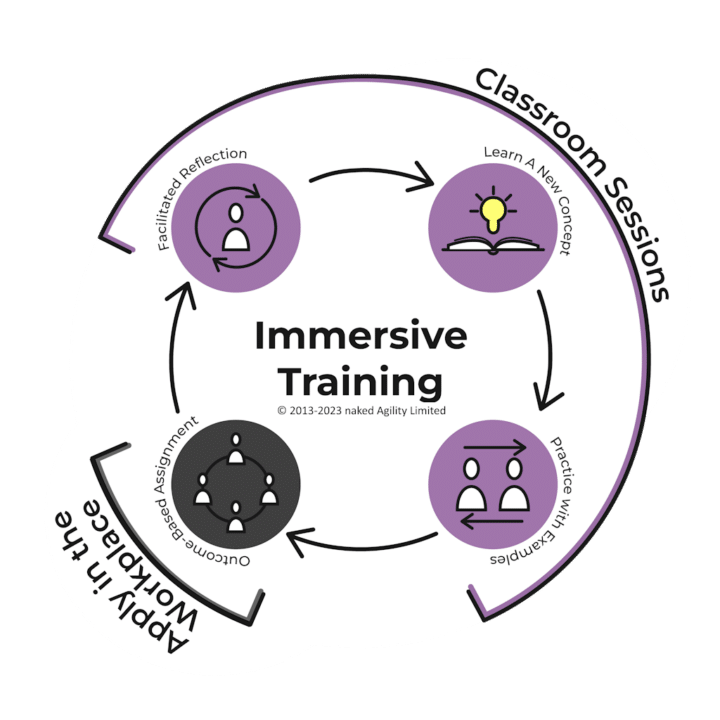

This week, I participated in a [Scrum.org](http://scrum.org/) Webinar hosted by Sabrina Love (Scrum.org Product Owner) as well as my colleagues, [Joanna Płaskonka, Ph.D.](https://www.linkedin.com/article/edit/7140678898370928640/?author=urn%3Ali%3Afsd_profile%3AACoAAAAUzPABQyVbo7yoAY7fK8HpaEwXfTa5iCY#) and [Alex Ballarin](https://www.linkedin.com/article/edit/7140678898370928640/?author=urn%3Ali%3Afsd_profile%3AACoAAAAUzPABQyVbo7yoAY7fK8HpaEwXfTa5iCY#) to discuss the state of learning and how immersive learning is the future of training.

You can watch the video below to hear what we say, but it's also worth framing the problem and the need for change here. I welcome all feedback!

### What is Traditional Training?

Traditional learning is typically delivered over a short period of time, mostly with consecutive sessions, sometimes with a little more space. The idea in the traditional format is to get the participants to a level of understanding/knowledge as quickly as possible.

This typically takes the form of 2 full days of training for your PSM/CSM or other agile class.

{ .post-img }

We have "Learn a new Concept" that enables participants to remember the content and then follow that up with "Practice with Examples" to enable understanding.

{ .post-img}

This would fulfil the first two stages of Bloom's Taxonomy for Teaching, Learning, and Assessment. For some participants, this is enough for them to infer greater learnings, but for most, it is not.

Without a substantive change to the participant's mental models, it is unlikely that the ideas will stick or the seeds germinate into real change.

### What is Immersive Learning?

Immersive learning is typically delivered over a much longer period and may look like a combination of consulting, coaching, and teaching. For example, our immersive programs are delivered one half-day weekly for 8-12 weeks.

Like traditional training, we have "Learn a new Concept" that enables participants to remember the content and then follow that up with "Practice with Examples" to enable understanding. However, we follow up with an "Outcome-based Assignement" that enables the application of things we have taught to their real world of work and a "Facilitated Reflection" where they can Analyse the outcome.

{ .post-img}

In effect, we close the learning loop with empiricism. A feedback loop is created.

{ .post-img}

This would then fulfil an additional two stages of Bloom's Taxonomy and enable, over time, the last two.

### Why is traditional not working?

While traditional learning has been used for many years in many industries, it has a significant and known downside. Most folks only remember a fraction of the content presented to them.

This can be augmented with additional homework to enable more connections with the content but it has little to no additional value and can at times have a negative impact. Every participant is different, and we have experimented with providing watching, reading, and writing content... but there is little apatite for it with participants and very few partake.

Ultimately very little is remembered in the weeks and months that follow a traditional classroom session.

I've been delivering traditional training for over ~13 years, and even with augmentations to the format, I've seen limited value for companies. There needs to be more than training to enable organisations to get the perceived value for most people. This results in an expectations gap where they have trained hundreds of people and have not seen things improve or change.

In the 13 years of traditional training, where I would travel onsite, I have seen it have a palpable impact only twice... both times, it was combined with consulting, coaching... and a little ass-kicking to get things moving.

However, it's only sometimes possible for most trainers to follow up to the depth the customer needs. Perhaps you have another training in another country next week... but this customer needs more help... (pre-pandemic I was travelling 300 days a year with customers. This took little time to follow up).

As we all moved into the pandemic and things moved online, I got breathing space between engagements where I was not in an airport. I was able and willing to engage, collaborate, and coach at my desk. But folks needed more time. The had their day job, their issues, and the mandatory training course from last week or last month needed to be more interesting.

I even offered additional consulting for every student, cumulative for companies with private classes, and still, I am still waiting for something to happen. Less than 5% used it, and I could not get above 6% even with follow-up.

**Queue immersive formats.**

### Why is Immersive Always a Better option?

By bringing the classroom content into the workplace and having participants try or do things from the learning in that environment we have a chance to close the feedback loop and have participants not just gain knowledge and understanding, but also be able to apply, and analyse the outcomes.

{ .post-img}

This would enable double-loop learning, where participants can apply the ideas learned in their own environment and then come back around and make real, lasting changes to their mental model and the mental model of those around them in their environment.

Even this is a rather simplistic linear view, and you could imagine multiple instances of the image above stacked on top of each other and the feedback from the "Outcome -based assignment" that is applied in the workplace not only goes from the previous session to the next, but also to traverse the instances of the sessions to reinforce and continuously update the learning loops.

For example, a participant may try something after session one and then ask to participate in exploratory learning of the outcomes, as they continuously happen in sessions 2, 3, 4, etc.

> My attraction to immersive classes stems from contrasting experiences: the lasting impact of a detailed MongoDB course, complete with weekly homework and a final exam, versus the fleeting memory of a two-day crash course in team management, which left me overwhelmed and fatigued. These experiences have shaped my preference for immersive learning.

This continuous reinforcement and engagement, both from the qualified expert instructor and the other participant peers engaged in similar outcomes, multiplies the effect of the training and embeds new mental models in all of the participants.

{ .post-img}

For double-loop learning to be effective, participants need to be able to make a substantive change to their mental models as they progress through the content. This deeper change and learning is enabled by the application in the workplace and the analysis of what happened and why that comes from the "facilitated reflection".

Double-loop learning is not guaranteed by participating in immersive learning, but it does enable it.

### So, is traditional learning dead?

Traditional two-day classes are of the past, and immersive multi-week classes are of the future. That is not to say that tradition is dead; it will be around for a long time as we transition, but we must transition.

Immersive takes what we learned teaching traditional classes, in Scrumorg's case, for 13 years, and adds more value, learning, and opportunities for change.

**_Immersive learning is the future of Agile and Scrum training, hopefully, all learning._**

### Webinar: Exploring the Different Ways People Learn: A Discussion about Immersive Learning Formats

In this video, [Scrum.org](http://scrum.org/)’s Product Owner Sabrina Love and Professional Scrum trainers [Alex Ballarin](https://www.linkedin.com/in/alexballarin/), [Joanna Płaskonka](https://nkdagility.com/company/people/joanna-plaskonka-phd/), and myself ([Martin Hinshelwood](https://nkdagility.com/company/people/martin-hinshelwood/)) discuss the evolution and effectiveness of immersive learning in Agile environments. We delve into how this approach enhances practical application and reflection, making it a superior method for real-world problem-solving. 🤔💡

Check out the full webcast on [Exploring Immersive Learning in Agile Environments](https://nkdagility.com/blog/exploring-immersive-learning-in-agile-environments/)

### NKDAgility provides immersive learning!

NKDAgility’s Immersion Training reimagines traditional classroom learning. Our approach involves:

- **Incremental Classroom Learning**: Engaging live sessions spread over several weeks, each lasting up to 4 hours. This structure allows learners to understand each concept at a comfortable pace thoroughly.

- **Outcome-Based Assignments**: Assignments linked to each session emphasize practical application and innovation, catering to various skill levels and backgrounds.

- **Facilitated Reflections**: Each class starts with a reflective session where learners discuss their assignment experiences with their Professional Scrum Trainer, fostering peer learning and actionable insights.

This Immersion Training is designed to offer a more interactive, reflective, and practical learning experience, ensuring knowledge acquisition, application, and growth. Join us for a transformative educational journey.

Starting in 2024, we will be running immersive classes in bundles as Learning Journeys that you can book together or on their own! Our 24Q1 bundles are:

- [Professional Scrum Product Owner & Product Backlog Management Skills](https://nkdagility.com/training-courses/scrum-training-courses/professional-scrum-product-owner-pspo-with-certification/pspo-2024-01-17-50822/?ref=scrumorg)

- [Professional Scrum Master & Professional Scrum Facilitation Skills](https://nkdagility.com/training-courses/scrum-training-courses/professional-scrum-master-psm-with-certification/psm-2024-01-17-50838/?ref=scrumorg)

- [Professional Agile Leadership Essentials & Evidence-Based Management (PAL-EBM)](https://nkdagility.com/training-courses/scrum-training-courses/professional-agile-leadership-with-evidence-based-management-pal-ebm-with-certification/pal-ebm-2024-03-08-50867/?ref=scrumorg)

**_On top of a discount of 20% that has been applied to all prices until 31st May 2024, we offer a price-by-country model that has additional discounts automatically applied to all of our classes based on your location._**

[BOOK TODAY](https://nkdagility.com/training-courses/course-schedule/?ref=scrumorg) <– Regional pricing, bulk discounts, & and alumni discounts are available!

_If you are underemployed, we can also create custom payment plans to help you out. Just ask!_

### References

- [Blooms Taxonomy :: Resource for Educators](https://www.bloomstaxonomy.net/)

- [Double-loop learning - Wikipedia](https://en.wikipedia.org/wiki/Double-loop_learning)

- [Duke Study: Homework Helps Students Succeed in School, As Long as There Isn't Too Much | Duke Today](https://today.duke.edu/2006/03/homework.html)

- [Is homework a necessary evil? (](https://www.apa.org/monitor/2016/03/homework)[apa.org](http://apa.org/)[)](https://www.apa.org/monitor/2016/03/homework)

- [Immersive Learning Overview - naked Agility with Martin Hinshelwood (](https://nkdagility.com/training-courses/learning-experiences/immersive-learning-experience/)[nkdagility.com](http://nkdagility.com/)[)](https://nkdagility.com/training-courses/learning-experiences/immersive-learning-experience/)
