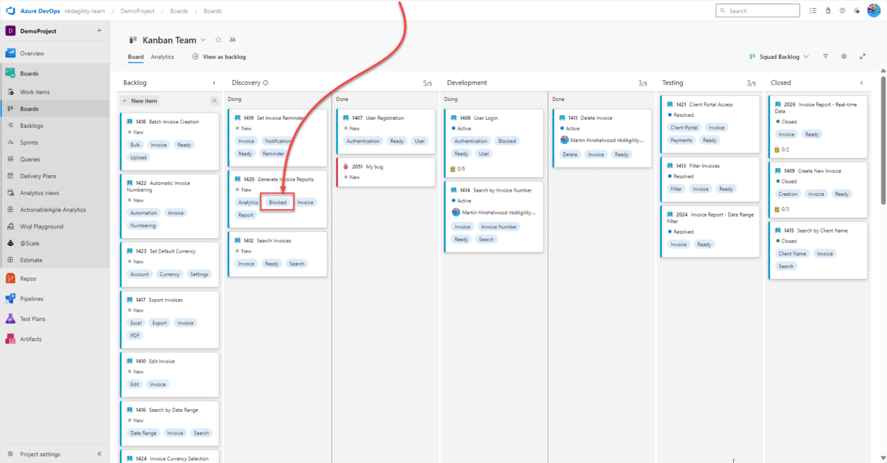

The Boards in Azure [DevOps]() are a powerful tool that your teams can leverage to enable transparent visualization of the current state of [value delivery]().

However, the inclusion of Blocked columns can stealthily erode the very foundations of efficiency these boards are meant to uphold. By obfuscating the state of work-in-progress and breeding a culture of hands-off responsibility, Blocked columns can become the silent saboteurs in your workflow.

{ .post-img }

**Blocked Columns on [Kanban]() Boards Obfuscate Workflow and Undermine Effectiveness:**

Kanban boards serve as the visual representation of the crucial steps involved in knowledge discovery. However, labeling a column as "Blocked" does not align with the essence of this visualization.

> "The nature of a column is that it represents a state an item will flow through. Introducing a Blocked Column would imply that the normal flow of work would involve the vast majority of items to be Blocked before they get done"
>
> [Will Seele | LinkedIn](https://www.linkedin.com/in/wjseele/)

When tasks are relegated to the Blocked column, there is an alarming tendency for team members to disengage from those tasks, erroneously expecting the issues to be resolved by some external force. This mindset breeds several detrimental consequences:

1. **Stagnation of Work Items**: Tasks lodged in the Blocked column tend to remain there indefinitely. As time goes by, these work items become stale and outdated.

2. **Inflation of WIP Limits**: As the Blocked column accumulates more tasks, teams are often tempted to increase their Work In Progress (WIP) limits for the Blocked column. This is a red flag indicating that the team perceives the issue as someone else's responsibility.

3. **Loss of Contextual Information**: When a task is tagged as Blocked, it is essential to understand which stage of the process it is obstructed in, as this guides the necessary action for resolution. By lumping tasks into a generic Blocked column, this critical information is lost.

4. **Loss of Priority Information**: Tasks are typically selected based on their value. However, once a task is shifted to the Blocked column, it is stripped of its priority status, which is vital for efficient workflow management.

5. **Back-and-Forth Movement**: Transferring a task to the Blocked column necessitates moving it back to its original state once the block is cleared. This back-and-forth movement is not only cumbersome but also increases the likelihood of errors and mismanagement.

*It’s imperative to recognize that 'Blocked' is distinct from 'Waiting'.* They are not interchangeable. Especially in workflows that involve approval, legal compliance, risk assessment, or governance considerations, tasks are not Blocked per se, but rather waiting for input or feedback. This waiting period needs to be accurately captured, and the sources of delay must be identified and addressed. Knowledge of these elements and the duration of delays is fundamental in tackling and resolving the root causes.

In light of these pitfalls, it is crucial for teams to approach the use of Blocked columns with caution. Instead, a more efficient approach may involve annotating tasks with specific information about the blockages and keeping them within their respective stages, thereby maintaining [transparency](), accountability, and the integrity of the knowledge discovery steps.

**How do you show that a work item is blocked In [Azure DevOps]()?**

By far the best way to indicate blocked is to use a Blocked tag on your Work Item.

{ .post-img }

You can also increase the transparency by enabling a colour for the tag. Just be careful not to over use it, too many colours can reduce transparency and making it harder to see important information.

{ .post-img }

## **References:**

- [Addendum-to-Kanban-Guide-implementation-options-details-2-1.pdf (kanbanguides.org)](https://kanbanguides.org/wp-content/uploads/2020/10/Addendum-to-Kanban-Guide-implementation-options-details-2-1.pdf) <--Page 15

- [English - Kanban Guides](https://kanbanguides.org/english/)

- [https://prokanban.org/wp-content/uploads/2022/08/thekanbanpocketguide.pdf](https://prokanban.org/wp-content/uploads/2022/08/thekanbanpocketguide.pdf)

- [The Principles of Product Development Flow: Second Generation Lean Product Development](https://www.goodreads.com/book/show/6278270-the-principles-of-product-development-flow)

- [When Will It Be Done?: Lean-Agile Forecasting to Answer Your Customers' Most Important Question by Daniel S. Vacanti | Goodreads](https://www.goodreads.com/book/show/40681093-when-will-it-be-done)
