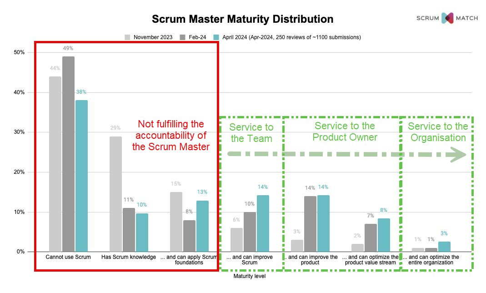

The role of the Scrum Master is pivotal in enabling Agile teams to thrive, yet data from **ScrumMatch**—which validates Scrum Master capabilities through in-person reviews—reveals a concerning reality: the majority of Scrum Masters are not equipped to fulfil the accountability described in the Scrum Guide.

### The Competency Breakdown

According to ScrumMatch, the numbers paint a stark picture:

- **38% are grossly incompetent:** These individuals hold Scrum Master roles but demonstrate no understanding of Scrum principles and have likely never read the Scrum Guide.
- **10% are fundamentally incompetent:** While they may have read the Scrum Guide, they fail to apply its principles effectively and lack the practical skills necessary to lead teams.
- **13% possess only basic competency:** These individuals demonstrate a foundational understanding of Scrum, which should be the minimum expected of any Scrum Team member, not a Scrum Master.

Alarmingly, many of the low-skilled Scrum Masters assessed had been in their roles for over a decade, raising questions about how such gaps in capability have persisted.

This leaves only **39% of Scrum Masters** capable of fulfilling any meaningful aspects of the accountability outlined in the Scrum Guide. Of this group, a mere **3%** are deemed fully capable of meeting all the responsibilities required of the role.

### The Impact of Incompetence

The implications of this competency gap extend beyond individual Scrum Masters. The prevalence of unqualified practitioners contributes to broader organisational challenges, including:

1. **Erosion of Trust in Agile Practices:** Teams and organisations that experience poor outcomes due to ineffective Scrum Masters often develop negative perceptions of Agile methodologies, even if Scrum was never implemented correctly.

2. **Diminished Value Delivery:** Incompetent Scrum Masters fail to provide the leadership and facilitation necessary to help teams deliver value consistently, resulting in disillusionment with Scrum.

3. **Market Corrections:** During the boom times of the agile economy, organisations tolerated lower standards for Scrum Master roles. However, as economic pressures mount, organisations are scrutinising performance more closely, leading to job losses among underqualified Scrum Masters and Agile Coaches.

### A Call to Action

To address this competency crisis and ensure that Scrum Masters can lead their teams and organisations effectively, a multifaceted approach is required:

1. **Raise the Bar for Certification Standards:** Certifications should focus not only on theoretical knowledge but also on the practical application of Scrum principles in real-world scenarios.
2. **Promote Continuous Professional Development:** Initial certification is not enough. Ongoing training, mentorship, and exposure to diverse challenges are essential to mastering the nuances of Scrum.

3. **Invest in Organisational Support:** Organisations must provide environments where Scrum Masters can succeed. This includes fostering a culture that values Scrum principles, empowering Scrum Masters to influence beyond their teams, and aligning processes and structures with Agile values.

4. **Encourage Peer Reviews and Feedback Loops:** Regular feedback from peers and teams can help identify gaps in knowledge or practice and provide opportunities for improvement.

5. **Advocate for Strategic Recognition of the Scrum Master Role:** Companies must treat the Scrum Master accountability as a strategic role rather than an operational or administrative position. This shift in perspective is crucial to attracting and retaining competent professionals.

### The Path Forward

The findings from ScrumMatch highlight a pressing need for action to improve the standards and expectations surrounding the Scrum Master accountability. Addressing this issue is not just about improving individual performance but also about ensuring the credibility and effectiveness of Agile methodologies in driving organisational success.

By raising standards, investing in development, and fostering supportive environments, we can build a community of highly skilled Scrum Masters who can lead teams to deliver exceptional results and sustain the principles of Agile for the long term.

Scrum is more than a framework; it is a mindset that requires dedication, continuous improvement, and a commitment to excellence. The time to act is now.

### Closing Thoughts

The current state of Scrum Mastery is a reflection of years of neglect in upholding rigorous standards and providing continuous learning opportunities. While the challenges are significant, the solutions are within reach. It is up to individuals, organisations, and the broader Agile community to commit to making these changes.

**Let’s build a better future for Agile together.**
