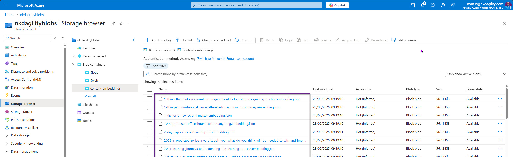
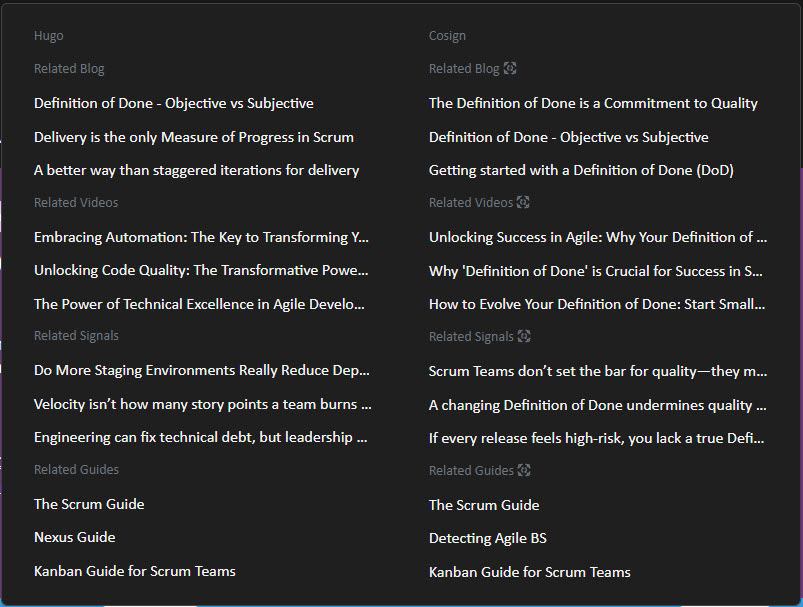

Mid-last year, I transitioned my website to Hugo and since then have been exploring AI-driven content classification. A common feature I have always appreciated is the "related content" recommendation, suggesting to readers what's next or what else might be of interest. Although Hugo’s built-in related content functionality is perfectly serviceable, relying on parameters like tags, keywords, and headings, I believed there was room for something more sophisticated.

In general, for my site, my focus has shifted towards Generative Experience Optimisation (GEO), aiming to enhance the reading experience for both humans and generative AI agents. Unlike traditional Search Engine Optimisation (SEO), GEO optimises content readability and semantic relevance, creating a win-win scenario for both humans and AI. SEO often prioritises keyword density, sometimes compromising readability. GEO, conversely, optimises content clarity for both human understanding and AI comprehension. With this shift, the standard method in Hugo,though efficient for basic needs,felt insufficient.

The challenge was clear: Hugo's built-in related content system, based on static parameters, lacked semantic understanding. It didn't recognise deeper contextual relationships between articles beyond shared tags or keywords.

I initially considered leveraging my existing classification capabilities, but the computation involved would be excessive, approximately 2.56 million API calls for my content catalogue, an impractical approach that would be very expensive and slow.

## Creating an Embeddings Repository

Instead, I opted for a more fun, computationally efficient method: OpenAI Embeddings. Embeddings convert textual content into numerical vectors, capturing semantic meaning and enabling sophisticated comparisons.

The power of embeddings lies in their semantic understanding. Rather than purely lexical comparisons, embeddings identify relationships in meaning. This makes them perfect for establishing truly relevant connections between articles.


The first step was to generate embeddings for each piece of content using OpenAI's Embeddings API. The cost-efficiency of this method was striking; I generated embeddings for around 1,600 content pieces (about 3,876 requests, including debugging) at a minimal total cost of \$0.66.

```powershell
function Get-OpenAIEmbedding {
    param (
        [Parameter(Mandatory)]
        [string]$Content,

        [string]$Model = "text-embedding-3-large",
        # OpenAI API Key
        [string]$OPEN_AI_KEY = $env:OPENAI_API_KEY
    )

    $response = Invoke-RestMethod `
        -Uri "https://api.openai.com/v1/embeddings" `
        -Headers @{
        "Authorization" = "Bearer $OPEN_AI_KEY"
        "Content-Type"  = "application/json"
    } `
        -Body (ConvertTo-Json @{
            input = $Content
            model = $Model
        }) `
        -Method Post

    return $response.data[0].embedding
}
```

To manage these embeddings efficiently, I stored them locally and synced them to Azure Blob Storage, creating a reusable, easily accessible repository. Although the cost was minimal the runtime to get the embedding for 1600 items was non-trivial so I syncing them to cloud storage to significantly reduces processing time for future operations.



AZCopy is your friend here as it's able to minimise the upload/download time.

## Calculating Cosine Similarity

With the embeddings in place, the next task was to calculate the semantic similarity between content items using Cosine Similarity. This algorithm measures the angle between two embedding vectors, returning a similarity score ranging from -1 (completely opposite) to 1 (identical).

```powershell
function Get-EmbeddingCosineSimilarity {
    param (
        [float[]]$VectorA,
        [float[]]$VectorB
    )

    $dotProduct = 0
    $magnitudeA = 0
    $magnitudeB = 0

    for ($i = 0; $i -lt $VectorA.Length; $i++) {
        $dotProduct += $VectorA[$i] * $VectorB[$i]
        $magnitudeA += [Math]::Pow($VectorA[$i], 2)
        $magnitudeB += [Math]::Pow($VectorB[$i], 2)
    }

    if ($magnitudeA -eq 0 -or $magnitudeB -eq 0) {
        return 0
    }

    return $dotProduct / ([Math]::Sqrt($magnitudeA) * [Math]::Sqrt($magnitudeB))
}
```

This step was computationally intensive due to comparing each content item against all others. To manage this, I cached similarity scores above a threshold (0.5 or higher), significantly reducing future computations.

```powershell
{
  "calculatedAt": "2025-05-27T18:44:01.8272803Z",
  "related": [
    {
      "Title": "Mastering Azure DevOps Migration: Navigating Challenges, Solutions, and Best Practices",
      "Slug": "mastering-azure-devops-migration-navigating-challenges-solutions-and-best-practices",
      "Reference": "resources/videos/youtube/_rJoehoYIVA",
      "ResourceType": "videos",
      "ResourceId": "_rJoehoYIVA",
      "Similarity": 0.6808168645512461
    },
    {
      "Title": "Mastering Azure DevOps Migration: A Step-by-Step Guide for Seamless Project Transfers",
      "Slug": "mastering-azure-devops-migration-a-step-by-step-guide-for-seamless-project-transfers",
      "Reference": "resources/videos/youtube/Qt1Ywu_KLrc",
      "ResourceType": "videos",
      "ResourceId": "Qt1Ywu_KLrc",
      "Similarity": 0.6715379090446947
    },
    {
      "Title": "Navigating the TFS to Azure DevOps Migration: Overcoming Compatibility Concerns with Confidence",
      "Slug": "navigating-the-tfs-to-azure-devops-migration-overcoming-compatibility-concerns-with-confidence",
      "Reference": "resources/videos/youtube/qpo4Ru1VVZE",
      "ResourceType": "videos",
      "ResourceId": "qpo4Ru1VVZE",
      "Similarity": 0.6701177401809448
    }
  ]
}
```

This is then stored with the content item and used to get the related content items for any specific content item.

## Integration into Hugo Layout

With similarity scores computed and cached, integrating them into Hugo was straightforward. I updated the Hugo layout to dynamically load the cached similarity scores at build-time, displaying the top 3 related content items for each article. This provided a more meaningful user experience without excessive runtime overhead.



## The Outcomes

The impact of this all remains to be seen, but there is an expectation that beyond the usability enhancements that this brings for human readers, it will also bring enhancements to content analysis by AI agents. These links enable the discoverability of other actually related content which should tickle the AI search algorithms to promote the content more.

The implementation was remarkably successful:

- Enhanced semantic relevance significantly improved user navigation and AI discoverability
- Dramatically reduced computation costs and improved build performance.
- Established a scalable, reusable embeddings infrastructure for future use cases.

As I mentioned, the impact remains to be seen, and I have no idea how often AI crawls the content for updates. However, this will be live on my site by the time you read this.

## Future Improvements and Extensions

If this experiment proves to be successful, there are a number of other ideas that I have for its use:

- **Crosslink Automation**: Embedding dynamic crosslinks directly within article content, enhancing internal linking strategies. This data would allow me to pick, say, the top 3 most relevant contact items and use a semantic call to inject the links on relevant content..
- **Classification Filtering**: Using embeddings to pre-filter classification tasks, significantly reducing ongoing costs. Instead of making 160 expensive calls to AI for a new post, I can run this first and find the ones that are more likely to be valuable.

## Conclusion

Using embeddings to enhance related content has provided a practical and scalable improvement to my site's content classification. It aligns perfectly with my goal of optimising the experience for both human readers and AI systems. While the true impact of this approach will become clearer over time, the initial implementation already shows significant promise for improving relevance and efficiency.
