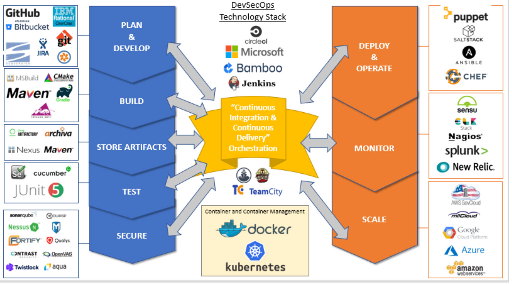
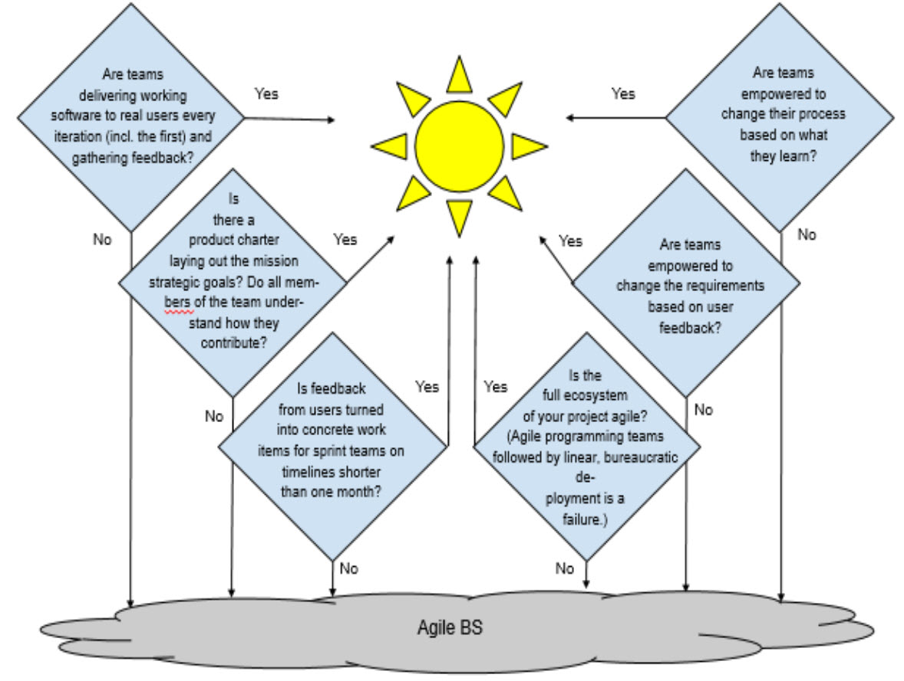

# DIB Guide: Detecting Agile BS

**Version 0.4**
_Last modified: 3 Oct 2018_

Agile is a buzzword of software development, and so all DoD software development projects are, almost by default, now declared to be “agile.” The purpose of this document is to provide guidance to DoD program executives and acquisition professionals on how to detect software projects that are really using agile development versus those that are simply waterfall or spiral development in agile clothing (“agile-scrum-fall”).

## Principles, Values, and Tools

Agile adherents profess certain key “values” that characterise the culture and approach of agile development. The DIB developed its own guiding maxims that roughly map to these values:

| **Agile Value**                                       | **DIB Maxim**                                                                                         |
| ----------------------------------------------------- | ----------------------------------------------------------------------------------------------------- |
| Individuals and interactions over processes and tools | “Competence trumps process”                                                                           |
| Working software over comprehensive documentation     | “Minimise time from program launch to deployment of simplest useful functionality”                    |
| Customer collaboration over contract negotiation      | “Adopt a DevSecOps culture for software systems”                                                      |
| Responding to change over following a plan            | “Software programs should start small, be iterative, and build on success ‒ or be terminated quickly” |

### Key flags that a project is not really agile:

- Nobody on the software development team is talking with and observing actual users using the actual code.
  _(Note: PEOs and commanding officers don’t count unless they use the code.)_
- No continuous user feedback (bug reports, assessments). One-time requirements gathering doesn’t count.
- Focus on “meeting requirements” is placed above delivering something useful quickly.
- Stakeholders (dev, test, ops, security, contracting, end-users, etc.) are working in silos.
- End-users are absent during development phases like release planning and UAT.
- Manual processes persist where automation (testing, CI/CD) is viable.

### Common Tools Used in Agile Teams

_Note: Tools are illustrative; no endorsement implied._

- **Version Control**: Git, ClearCase, Subversion
- **Repo Hosting**: BitBucket, GitHub
- **CI**: Jenkins, CircleCI, TravisCI
- **Configuration Management**: Chef, Ansible, Puppet
- **Containers**: Docker
- **Orchestration**: Kubernetes, Docker Swarm
- **Issue Tracking**: Jira, Pivotal Tracker

### DevSecOps Stack Diagram

_Illustrates modern tooling from plan, develop, build, test, secure, deploy, monitor, and scale._

## Questions to Ask Programming Teams

- **How do you test your code?**
  _Wrong answers_: “We have a testing organisation”, “OT\&E is responsible”
  _Advanced_: Tools used for unit, regression, functional, security, deployment certification?
- **How automated are your pipelines (dev, test, security, deploy)?**
  _Advanced_: CI/CD tooling? Infrastructure as code?
- **Who are your users and how do you interact with them?**
  _Advanced_: Feedback loops, issue tracking tools, comms back to users?
- **What is your release cycle time?**
  _Advanced_: Platform support? Containerisation? Config management tooling?

## Questions for Program Management

- How many programmers are in the org that owns budget and milestones?
  _Wrong answers_: “We don’t know”, “It depends...”
- What dev/ops metrics do you track? How are they used?
- What have you learned in your last three sprint cycles? What actions were taken?
  _Wrong answers_: “What’s a sprint cycle?”, “Waiting on approval...”
- Who receives working code each sprint? Can we talk to them?
  _Wrong answer_: “We don’t deploy directly to users”

## Questions for Customers and Users

- How do you communicate with the developers?
  Have they observed your teams? Asked insightful questions?
- How do you request features or report bugs?
  Do you receive responses? Are you involved in prototype feedback?
- How long does it take for your requested features to be delivered?

## Questions for Program Leadership

- Are teams delivering working software to real users every iteration?
- Is there a product charter with clear goals? Do all team members understand their role in that vision?
- Is user feedback converted into backlog items within one month?
- Can teams modify requirements based on user feedback?
- Can teams improve their own process?
- Is the **entire** ecosystem agile, or is it bottlenecked by waterfall deployment?

_If the team is truly working in an agile way, the answer to all the above should be “yes.”_

## Graphical Summary

_Decision flow showing how to identify Agile BS: asking if teams deliver software, gather feedback, adapt process and requirements, and operate as part of a full agile ecosystem._

## References

- [DIB Ten Commandments on Software](https://media.defense.gov/2018/Apr/22/2001906836/-1/-1/0/DEFENSEINNOVATIONBOARD_TEN_COMMANDMENTS_OF_SOFTWARE_2018.04.20.PDF)
- [DIB Metrics for Software Development](https://media.defense.gov/2018/Jul/10/2001940937/-1/-1/0/DIB_METRICS_FOR_SOFTWARE_DEVELOPMENT_V0.9_2018.07.10.PDF)
- [DIB Do’s and Don’ts of Software](https://media.defense.gov/2018/Oct/09/2002049593/-1/-1/0/DIB_DOS_DONTS_SOFTWARE_2018.10.05.PDF)
