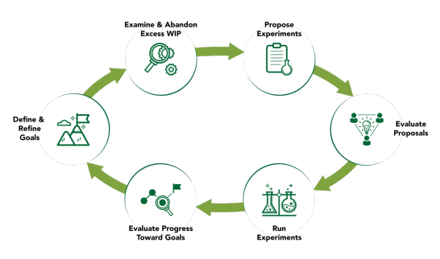

## INVESTING FOR BUSINESS AGILITY

**USING EVIDENCE-BASED PORTFOLIO MANAGEMENT TO ACHIEVE BETTER BUSINESS OUTCOMES**
_SCRUM.ORG | MARCH 2020_

---

## Introduction

Organizations who seek to improve their competitiveness by being more responsive to change often turn to agile approaches to improve their responsiveness. While many organizations have reaped the rewards of agility at the team level, their traditional management practices impede deeper change that would enable true business agility. Agile principles and practices must spread beyond the Scrum Team in order for organizations to achieve the dramatic improvement that they seek in their business results.

Clearing the way for greater success requires organizations to examine the way they invest in innovation and quantify success. Organizations that think they simply need to deliver faster, without considering what they are delivering, are missing the greatest benefit of agility: rapidly trying out ideas, discarding those that don’t work, enhancing those that do, and uncovering new ideas from customers, employees, partners, and stakeholders. Being able to change investment strategies, quickly, based on new information, separates the companies with winning products and happy customers from those companies who are mere footnotes in the history of their industry.

Evidence-Based Portfolio Management (EBM-PM) applies lean and agile principles to the challenge of investing to derive the greatest business benefit. It uses rapid delivery of small increments of value to run experiments, gather information, and adapt investment decisions based on evidence from the market. It sets clear aspirational goals to aid alignment and commitment and lets the people closest to the customer develop creative solutions that create real, measurable value.

## The Way We Usually Invest is Wasteful

Rather than improving the benefits reaped from an organization’s investments, traditional portfolio management practices increase risk and impair the organization’s ability to pivot when new events arise:

- Solutions are disconnected from outcomes. Organizations build a lot of things without clearly understanding the problem it will solve, or the opportunity that it will address. They undertake work with only vague notions of the outcomes they are trying to achieve.
- Estimates are based on conjectures. From these vague proposals, the people who will have to deliver the solutions are asked to make unexamined guesses about cost and schedule based on minimal information, under extreme and artificial time pressure, during the annual budgeting process. Despite all manner of caveats, the estimates are enshrined in the portfolio management system, where they become non-negotiable commitments.
- People are trapped by dictated solutions and coerced estimates. They are stuck in a vicious time-pressured cycle in which they can never take time to truly understand the problem or opportunity or devise solutions that might better hit the mark. As a result, they spend time and effort building things that may have no value to customers, with limited ability to change course if they find evidence that customers need a very different solution.
- Solutions are crippled by early lock-in. When organizations view all change as bad, they limit their ability to learn from new information. Organizations can learn by delivering partial solutions early and frequently, but only when they overcome their bias for locked-down, change-managed plans.
- Organizations are crippled by infrequent, exhaustive, and exhausting planning. Opportunities arise continuously, so when large tranches of funding are locked-in by relatively long-term (annual or longer) budgeting processes, opportunities that occur at other points in the year are often foregone. As a result, the organization lacks flexibility to respond to new opportunities. When new and better opportunities do arise, the change management overhead is so intense that rapid response to new opportunities is nearly impossible unless the sponsor is willing to spend a lot of political capital.
- Risks are amplified by delay and denial. When the size of investments is huge, the risk of failure can be paralyzing, leaving budgets that are always “in discussion”. The opportunity eventually slips away when organizations require a high-fidelity plan that will meet all needs and address all risks, before it will invest the money to proceed. A better solution is to fund experiments to learn more, while adapting continuously to new information.

## EBM-PM Principles

EBM-PM seeks to improve business results by reducing waste and over-investment in work that adds little or no business value. It reduces risk by investing in small increments, and then monitoring the results of these on frequent intervals. The basic principles that guide this work are easy to understand:

1. **Experimenting Beats Comprehensive Planning.** Improving business impact requires delivering products and services that help customers achieve better outcomes, within a window of opportunity, for a reasonable price, at an acceptable level of cost. Since the world is uncertain, you can’t plan what customers need upfront, or what they are willing to pay, and since you can’t predict what customers will need, you can’t predict how much it will cost. This is why you need to work iteratively and empirically in order to achieve superior business results. Running focused experiments is the only way to move ahead in an uncertain world.

2. **Making Smaller Bets Reduces Avoidable Loss.** Funding product or service development in a series of experiments lets organizations test new ideas quickly, allowing the ideas that won’t work to be identified quickly. This lets you focus on the ideas that are more likely to produce better results. Betting only a small amount minimizes the amount of effort you’ve “wasted” going down the wrong path when an idea proves to be unworkable.

3. **Working on Fewer Things at a Time Finishes Them Faster.** Organizations generally have more ideas than they have capacity to pursue. When the organization tries to work on more ideas than it has capacity, they force teams to multi-task, which causes the teams to lose focus, and become less effective:

   - Each initiative takes longer to deliver because teams lose effectiveness when they switch contexts between different initiatives
   - Delaying value realization or feedback on value delivered deprives the organization of information it needs to make course-correcting decisions
   - Delaying feedback causes organizations to waste time and money on things that later prove to be valueless once they get feedback

Working on fewer things at a time, eliminating multi-tasking, helps organizations focus so that they finish everything faster than they would if they took on more work.

## How to Apply EBM-PM to Achieve Better Business Outcomes

EBM-PM builds upon Scrum.org’s empirically-based continuous improvement approach called Evidence-Based Management (EBM). EBM-PM uses a continuous feedback loop to help an organization realize its goals more effectively.

## Why Budgeting Should Be Separated from Investing

Many organizations combine budgeting with making investment decisions; they first see how many ideas, and how much they will cost, to determine how much they should spend on those ideas. The main problem with this approach is that at the time budget decisions need to be made, the costs and benefits of “ideas” is largely conjecture, and more planning effort does not improve the quality of the estimates. Organizations spend a lot of time and effort without producing very much benefit.

The amount of money organizations budget for product development and project work is largely constrained by other business concerns such as profitability, business goals, and the availability of people with the right skills. When setting budgets, a better place to start is to ask themselves, “what is the maximum amount we can afford to spend and still meet our profitability goals?” and base their budgets on that. This is not to say that they will spend that amount, but only that they could spend it.

Budgets determine how many teams an organization can fund. Teams are the engines of work in a modern organization, and the number of teams an organization has determines how much work can be accomplished. Teams, here, refers to both individual teams, teams-of-teams, and value-stream-based organizations of virtual teams. Regardless, whether teaming is physical or virtual, teams possess both the expertise and capacity to identify and deliver the means of achieving goals established by the strategic planning process.

Deciding what to spend it on is a different matter and is the focus of the Innovation Investment Cycle.

## Define & Refine Goals

EBM focuses on four kinds of measures:

- **Current Value (CV)**
- **Time-to-Market (T2M)**
- **Ability to Innovate (A2I)**
- **Unrealized Value (UV)**

Goals should target closing a gap between Current and Unrealized Value. Organizational goals are generally expressed in terms of closing some gap between the Current Value and Unrealized Value, usually focusing on the value that customers experience. Closing this gap requires improving the outcomes that customers experience.

Goals should be strategic and measurable. You will have lots of intermediate targets that you think you need to achieve en route to achieving the greater goal, things like, “Consolidate cloud platforms”, or “Reduce operating expenses by 30%”, but these are things that you want to achieve on the way to achieving something greater, like, “Improve product affordability by 30%, to reach more customers”. If you are struggling with understanding the goal in customer terms, ask, “what is the single elevating benefit to a customer if we achieve this tactical target?”

Goals will continuously evolve. They will change as the organization obtains new information about competitive threats and customer opportunities. As your insights evolve based on this new information, you will want to revisit your goals, reordering them, adding new goals, and possibly removing goals that no longer are worth pursuing.

Goals need to be continuously ordered and re-evaluated. As the goals evolve, based on new information, organizations need to re-evaluate their relative importance. Organizations should keep a Goal Backlog and continually refine it by identifying new goals, shifting the relative importance of existing goals, and removing goals that are no longer relevant.

## Examine & Abandon Excess WIP

Eliminate all work that you can’t connect to your goals. Pet projects and random ideas have a way of sprouting like weeds, and even once-valuable work can lose its way or become less relevant over time. By working on them, you are taking away from making progress on something more important. In addition, goals change over time as well, and goals that were once important may no longer matter.

To ensure that your investments are contributing to your current goals, periodically take a look at everything you are doing, making sure that your work-in-progress is still contributing to advancing you toward your goals. For work that isn’t, kill it quickly, and focus on the work that will help you make progress toward your goals. Using people and resources that were being spent on non-goal work, look for places where you can contribute to achieving your goals faster. It doesn’t matter how much you have spent on something, the only important thing is what the work will enable you to achieve, and whether you have more important goals to reach.

## Propose Experiments

Because teams are closest to the work itself, they are best able to identify ideas that might enable the organization to make progress toward their goals; this is sometimes referred to as utilizing “bottom-up intelligence”. Framing these next steps as experiments with expected measures will make it easier to evaluate the experiment’s success when they start gathering data on its effectiveness.

The proposals for these experiments need to express several elements:

- The goal toward which the experiment is working
- The groups of people that the experiment is targeting, and the outcomes the experiment hopes to improve for them
- The thing that the experiment is going to produce (such as a feature or some process improvement)
- The measures and values (including decision thresholds) that will show that the outcomes were improved

Teams only propose new work when they have capacity. This prevents them from working on more than one thing at a time, which improves their focus, and reduces lost time and effort due to task-switching.

It’s worth noting that teams do not pull work that others define for them, nor are they assigned work. They consider the organization’s goals and propose work that expresses where they feel they can best contribute to reaching some goal.

## Using Outcome-Based Product Release Roadmaps

When working with defined products, organizations sometimes need to see where experiments are heading over time, so that they can understand the possible implications of going down a particular path. As an example, a team might propose that to improve customer experience for an application, they want to redesign the user interface in a series of steps, each of which would be expressed as an experiment, with the results measured. If, at any step, they fail to get the hoped-for results, they might abandon the entire series of planned improvements.

Expressing these experiments as a series of features that are planned for each release would make it hard, if not impossible, to see the real goal. As a result, an outcome-based product release roadmap is a more beneficial way to express the intent of the proposed work:

| Release     | Goal     | Beneficiaries     | Targeted Outcome | Evidence Target | Threshold  |
| ----------- | -------- | ----------------- | ---------------- | --------------- | ---------- |
| `<release>` | `<goal>` | `<target groups>` | `<outcomes>`     | `<measures>`    | `±<value>` |

During the Innovation Investment Cycle, Product Teams propose changes to their roadmap when they propose experiments, and based on the results of their experiments, they adjust their roadmap accordingly.

## Evaluate Proposals

Working together, executives responsible for guiding investments, and the teams who make proposals, evaluate where the organization should “place its bets”. Since the proposals typically only cover what the team will work on for the next 1-4 weeks, discussions focus on the goals the teams want to contribute to, what they will do to move the organization closer to the goal, and how everyone will know if their experiments are successful (or not).

These discussions should not take long, since the investment interval is so short, and they do not delve into details about what the team will build, but focus on the reasoning behind the proposed experiment, and the sort of evidence that they will collect to show progress toward their goal.

In some cases, a team may not feel it can effectively contribute to the most important goal for the organization, and then the discussion shifts to whether they work on less important goals, or whether they need to propose some different experiment that will contribute to the organization’s top goal.

## Run Experiments

Running the experiments is, quite simply, just Scrum; nothing else is required. When planning their Sprints, teams will want to think about how they will measure the success of individual Product Backlog Items, and they will need to build measurement into the product itself to collect the results that they will need to prove out their experiments.

In many cases, the only way to really gauge the value of an idea is to put it in front of customers; stakeholders, no matter how knowledgeable, are no substitute. As a result, building feedback collection mechanisms into the product release are especially important tools for validating hypotheses and guiding future investments.

## Evaluate Progress Toward Goals

The investment-evaluate cycle allows organizations to inspect progress toward goals on a regular interval, and to adapt both roadmaps and goals. The length of this interval will vary from organization to organization; to be effective, it should be at least quarterly, but organizations faced with great uncertainties or changing markets should look for ways to improve this cycle to every 1-4 weeks.

These inspections involve all teams who are contributing to a goal, as they provide the ability to inspect results achieved and adapt the plans for the next step. Involving all teams contributing to a goal provides the teams with a way to identify cross-team dependencies that they need to work on when they plan.

Based on information gained by running experiments and delivering product Increments to customers, as well as new evidence, executives and teams look at the results they achieved to collectively decide if they should keep going down the path described by the Product Roadmap, to adapt the roadmap, or to adapt the Goal. With these adaptations, the investment cycle begins again.

## Conclusion

Linking investments to goals, measuring progress against those goals, and then inspecting and adapting both goals and investments, based on feedback, is the key to true business agility, and provides important benefits:

- Guiding investments based on goals and letting teams propose experiments that seek toward those goals provides a better way to align work with business objectives by making goal pursuit the singular focus of the organization.
- Frequently re-evaluating funding based on best available evidence gives organizations a better way to balance competing demands, to more effectively manage risk, and to redirect their teams to go after better opportunities when they present themselves.
- Letting teams propose experiments and limiting their work to their available capacity leverages bottom-up intelligence and improves flow by reducing context-switching and team-level multi-tasking.

Getting started requires only picking a small but strategically important part of your business, one that is beset with complexity and uncertainty, and applying the Innovation Investment Cycle ideas described above.

© 2020 Scrum.org. All Rights Reserved.
