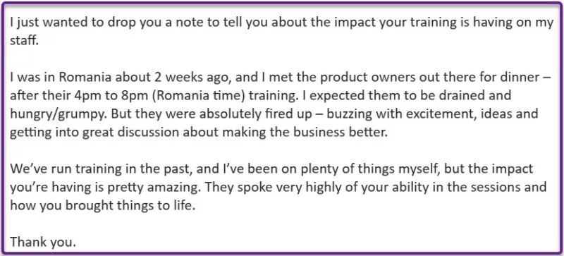
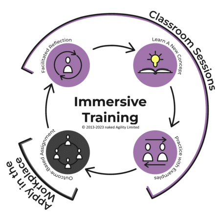

We have already had great success with our immersive learning classes, with the 8-week Professional Scrum Product Owner gaining high acclaim not only from the students but also from their managers and leaders:

Five of the participants were from this one company, and the message above was from the CEO! I loved the experience, but I love the feedback even more.

Below, you will find our 24Q1 schedule and the awesome classes and bundles that we are bringing and *we have added a 20% discount on all classes until April 2024!*

**Extending the Learning Process**

Our courses are traditionally interactive 2-day learning experiences within a classroom setting, emphasizing valuable, hands-on outcomes. Immersion Training offers a refreshing alternative, breaking the class into shorter sessions across several weeks. This format not only extends learning into real-world business applications but also incorporates reflective sessions for continuous improvement, making it a highly effective and practical approach.

- **Incremental Classroom Learning**: In Immersion Training, classes are concise, live sessions spanning several weeks. Each session introduces and practices a new concept, allowing students to digest the material at a comfortable pace and ensuring a deep understanding before moving forward. Sessions are capped at 4 hours to keep learners engaged and to foster an effective learning environment.
- **Outcome-Based Assignments**: These assignments, tied to each classroom session, are designed to apply the concepts learned directly. They focus on outcomes rather than outputs, catering to various backgrounds and skill levels. The emphasis is on innovation and boundary-pushing, not just completion, making the assignments relevant for both new and seasoned learners.
- **Facilitated Reflections**: After the initial session, each class starts with a reflection period. Here, students and their Professional Scrum Trainer discuss the assignments, sharing challenges and successes. These sessions are vital for learning, encouraging peer interaction and actionable feedback, and fostering collective growth and understanding.

Starting in 2024, we will be running immersive classes in bundles as Learning Journeys that you can book together, or

1. [Professional Scrum Product Owner & Product Backlog Management Skills](https://nkdagility.com/training-courses/scrum-training-courses/professional-scrum-product-owner-pspo-with-certification/pspo-2024-01-17-50822/)
2. [Professional Scrum Master & Professional Scrum Facilitation Skills](https://nkdagility.com/training-courses/scrum-training-courses/professional-scrum-master-psm-with-certification/psm-2024-01-17-50838/)
3. [Professional Agile Leadership Essentials & Evidence-Based Management (PAL-EBM)](https://nkdagility.com/training-courses/scrum-training-courses/professional-agile-leadership-with-evidence-based-management-pal-ebm-with-certification/pal-ebm-2024-03-08-50867/)

[BOOK TODAY](https://nkdagility.com/training-courses/course-schedule/) _**<-- Bulk discount available & alumni discounts apply!**_

You can get them on their own or as a bundle, public or private!

Yours in agile excellence,

\-MrHinsh

**Martin Hinshelwood** Professional Scrum Trainer, Professional Kanban Trainer, & Microsoft MVP: DevOps

naked Agility with Martin Hinshelwood | [https://nkdagility.com](https://nkdagility.com/) +44 7493 404 468| [https://wa.me/447493404468](https://wa.me/447493404468)

---

## Upcoming Training Classes

_**20% DISCOUNT ON ALL CLASSES UNTIL 31ST MARCH 2024!**_

Find a class and location near you, or [search](https://nkdagility.com/training/course-schedule/?scope=Public) for more classes. [Contact us](https://nkdagility.com/company/general-inquiries/) if you don't find what you want or want a private class for your organization.

\[wpv-view name="2022-CourseSchedule-Newsletter" limit="8"\]

Find a class and location near you, or [search](https://nkdagility.com/training/course-schedule/?scope=Public) for more classes. [Contact us](https://nkdagility.com/company/general-inquiries/) if you don't find what you want or want a private class for your organization.

## What have we been up to?

A short list of our blogs, videos, and webcasts!

#### Recent Blog Posts

\[wpv-view name="2023-NewsletterBlogPostList" limit="5"\]

Are there any blog posts that you would like me to write?

#### Recent Videos

\[wp-rss-aggregator template="newsletter-list" feeds="nkdagility-youtube" limit="5"\]

#### The Future of Work in Scotland Webcasts

\[wp-rss-aggregator template="newsletter-list" feeds="future-of-work-scotland-youtube" limit="5"\]

#### Agile Actually Podcast

\[wp-rss-aggregator template="newsletter-list" feeds="agile-actually" limit="5"\]

## What classes are right for you

All of [our classes](https://nkdagility.com/training/) are listed on our site, but here is a list of classes based on who you are or would like to be!

#### **Everyone** - Working in an evolving company

\[wpv-view name="2023-CourseCatalogByAudience-Newsletter" type="1" ids="10045" limit="5"\]

#### **Scrum Masters**

Courses to help Scrum Masters and Delivery Managers improve their skills

\[wpv-view name="2023-CourseCatalogByAudience-Newsletter" type="1" wpvrelatedto="44705" limit="5"\]

#### **Developers / Scrum Teams**

Courses to help all members of the Scrum Team improve their skills

\[wpv-view name="2023-CourseCatalogByAudience-Newsletter" type="1" wpvrelatedto="44700" limit="5"\]

#### **Product Owners / Product Managers**

training to help product managers improve their abilities.

\[wpv-view name="2023-CourseCatalogByAudience-Newsletter" type="1" wpvrelatedto="44704" limit="5"\]

#### **Managers**

Manage Scrum Teams indirectly.

\[wpv-view name="2023-CourseCatalogByAudience-Newsletter" type="1" wpvrelatedto="44706" limit="5"\]

_Contact me directly if you would like to schedule a private course at your organization._
