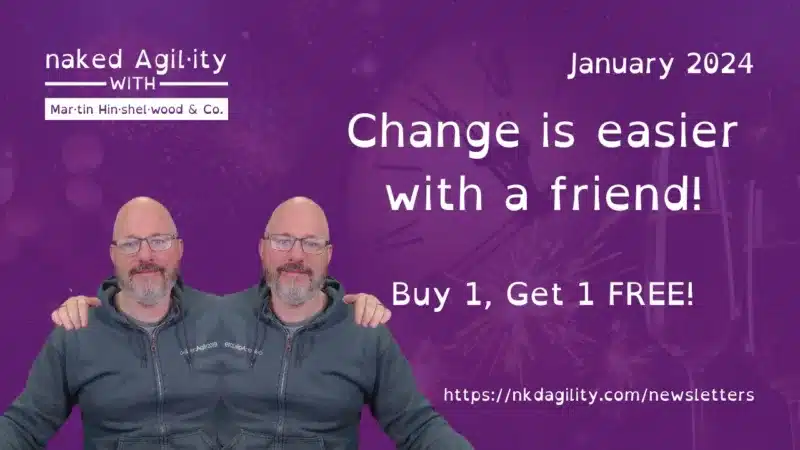

**Kickstart 2024 with Our Unmissable Scrum Training Offer: Buy 1, Get 1 FREE!**

As the new year unfolds, it's time to double up on success! For the entire month of January, enrol in any of our Scrum training courses and bring a colleague, friend, or team member along for absolutely FREE! It's the perfect opportunity to elevate your Agile skills and boost your team's performance.

We have **six** amazing options for you that all come with a free friend with "Buy 1, Get 1 FREE"!

1. [Professional Agile Leadership](https://nkdagility.com/training-courses/scrum-training-courses/professional-agile-leadership-essentials-pal-e-with-certification/pal-e-2024-01-12-50834/) \[8 weeks\]
2. [Professional Agile Leadership + Evidence-Based Management](https://nkdagility.com/training-courses/scrum-training-courses/professional-agile-leadership-essentials-pal-e-with-certification/pal-e-2024-01-12-50834/) \[12 weeks\]
3. [Professional Scrum Master](https://nkdagility.com/training-courses/scrum-training-courses/professional-scrum-master-psm-with-certification/psm-2024-01-17-50838/) \[8 weeks\]
4. [Professional Scrum Master + Facilitation Skills](https://nkdagility.com/training-courses/scrum-training-courses/professional-scrum-master-psm-with-certification/psm-2024-01-17-50838/) \[12 weeks\]
5. [Professional Scrum Product Owner](https://nkdagility.com/training-courses/scrum-training-courses/professional-scrum-product-owner-pspo-with-certification/pspo-2024-01-17-50822/) \[8 weeks\]
6. [Professional Scrum Product Owner + Backlog Management Skills](https://nkdagility.com/training-courses/scrum-training-courses/professional-scrum-product-owner-pspo-with-certification/pspo-2024-01-17-50822/) \[12 weeks\]

You can also book just the skills courses as well! You will need to click through for prices as we apply a [price-by-country](https://nkdagility.com/training-courses/prices-by-country/) model to enable equality of opportunity for folks worldwide. From an additional 10% for the UK and Netherlands to 60% for Ghana and Palestine, it automatically applies based on your country!

\-MrHinsh

_P.S. Hurry, the exclusive 20% discount offer is valid for a limited time only! Enrol today and start your journey to becoming a Product Owner, Scrum Master or Agile Leader. Your future self will thank you!_

**Martin Hinshelwood** Professional Scrum Trainer, Professional Kanban Trainer, & Microsoft MVP: DevOps

naked Agility with Martin Hinshelwood | [https://nkdagility.com](https://nkdagility.com/) +44 7493 404 468| [https://wa.me/447493404468](https://wa.me/447493404468)

---

## Upcoming Training Classes

_**20% DISCOUNT ON ALL CLASSES UNTIL 31ST MARCH 2024!**_

Find a class and location near you, or [search](https://nkdagility.com/training/course-schedule/?scope=Public) for more classes. [Contact us](https://nkdagility.com/company/general-inquiries/) if you don't find what you want or want a private class for your organization.

\[wpv-view name="2022-CourseSchedule-Newsletter" limit="8"\]

Find a class and location near you, or [search](https://nkdagility.com/training/course-schedule/?scope=Public) for more classes. [Contact us](https://nkdagility.com/company/general-inquiries/) if you don't find what you want or want a private class for your organization.
