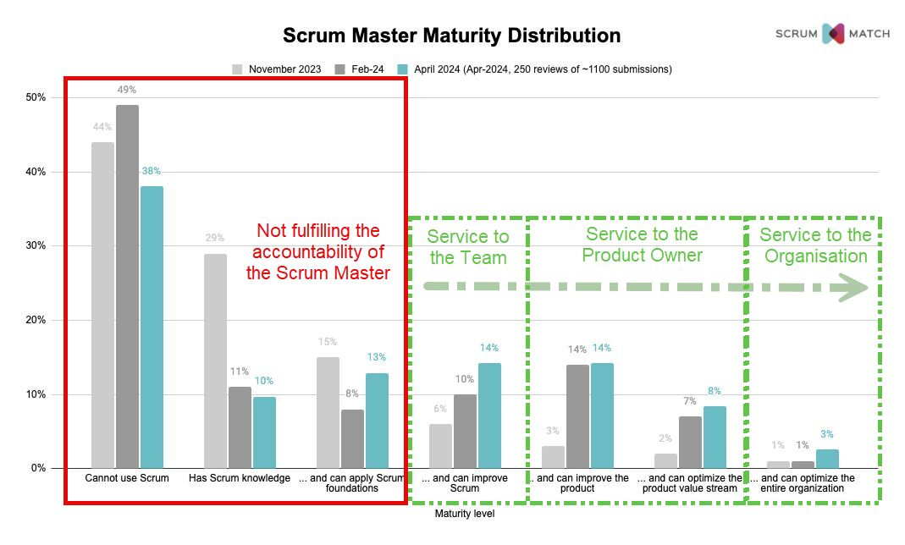

🚨 The majority of Scrum Masters are not fit for their position! 🚨

According to data from ScrumMatch (which validates Scrum Master capability with in-person reviews), most Scrum Masters lack the necessary knowledge and understanding of Scrum to effectively lead their teams.

📊 The numbers tell a chilling story:

- ❌ 38% are grossly incompetent: These individuals, despite holding Scrum Master roles, have no understanding of Scrum and likely haven't even read the Scrum Guide.
- ❌ 10% are also incompetent: They've read the Scrum Guide but can't apply its principles effectively and yet still apply for Scrum Master roles.
- ⚠️ 13% can apply Scrum at a basic level: This is not sufficient for a Scrum Master and should be the minimum expected of any Scrum Team member.

😨 Worse many of the low skilled Scrum Masters assessed had been in the role for a decade or more!

And that's 61% of Scrum Masters? Alarmingly, some are even celebrating being part of this group, mistakenly believing it makes them a good hire.
🚫 It does not.

✅ This leaves only the top 39% (just over one-third) of Scrum Masters able to fulfil any aspect of the accountability described in the Scrum Guide, with a mere 3% able to fulfil it entirely.

📉 This is why Agile Coaches and Scrum Masters are losing their jobs: In the boom times of the agile economy, these incompetent individuals were overlooked, but now, as times are tougher, the wheat is being separated from the chaff. 🌾

Let's strive for better standards and ensure our Scrum Masters are truly equipped to lead! 💪 hashtag#ScrumMastery hashtag#AgileLeadership hashtag#ContinuousImprovement
